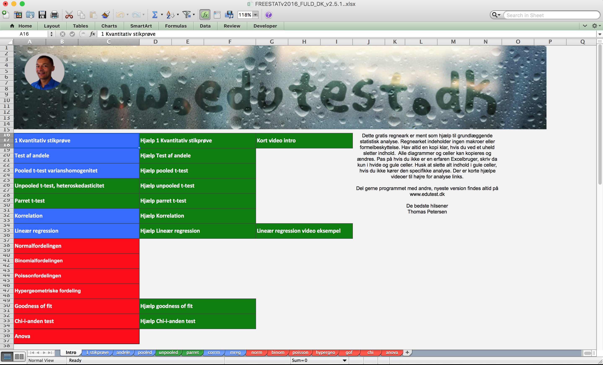
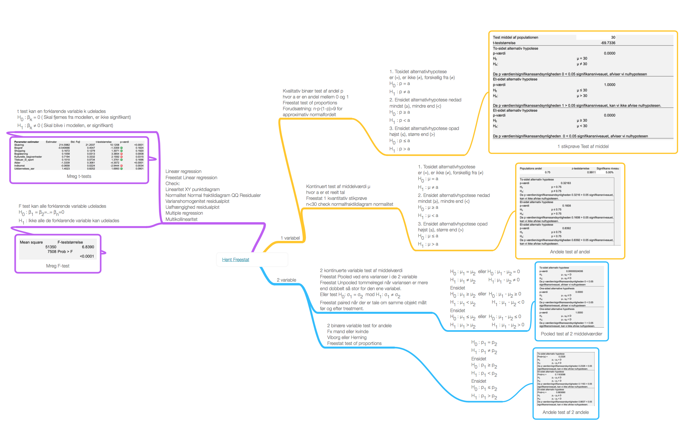

```{r start,echo=FALSE,warning=FALSE,include=FALSE}
#pacman autoload evt. manglende pakker
if (!require("pacman")) install.packages("pacman")
pacman::p_load(timeDate, DT,plotly,rio,exams,e1071,WriteXLS,readxl,maps,knitr,kableExtra,ggplot2,openxlsx,quantmod,highcharter,forecast,ape,rdrop2,fpp) #load various packages
```

# Indledning 
					
<!-- BEGIN PROTECT-->
<!-- <meta name="robots" content="noindex, nofollow"> -->
<!-- <META HTTP-EQUIV="CACHE-CONTROL" CONTENT="NO-CACHE"> -->
<!-- <style> -->
<!-- .Sentry_blanket { -->
<!-- background-color:#FFFFFF; -->
<!-- position:absolute; -->
<!-- z-index: 9001; /*ooveeerrrr nine thoussaaaannnd*/ -->
<!-- top:0px; -->
<!-- left:0px; -->
<!-- width:105%; -->
<!-- height:10000px; -->
<!-- padding:20px; -->
<!-- } -->
<!-- </style> -->
<!-- <script language="JavaScript" type="text/JavaScript"> -->
<!-- /* BEGIN Editable Settings: ///////////////////////////////////////////////////////////*/ -->
<!-- PpLID = "36813, 39445,38854,38855,36811,36812"; /* Makes this page viewable by only members of one or more PayPal plans, enter one Ppl ID or more than one separated by commas */ -->
<!-- pageLevel = 0; /* Access Level required to view this page   */ -->
<!-- SingleOut = 0; /* Makes this page viewable by only one member, enter their account number  */ -->
<!-- /* END Editable Settings: ////////////////////////////////////////////////////////////*/ -->
<!-- Sentry_ID = 22367; -->
<!-- </script> -->
<!-- <script type="text/javascript" src="https://www.sentrylogin.com/sentry/scripts/Sentry_pAJAX.js"></script> -->
<!-- <noscript> -->
<!-- <meta http-equiv="refresh" content="0; url=https://www.sentrylogin.com/sentry/noscript.asp"> -->
<!-- </noscript> -->
<!-- <div id="Sentry_noJS" class="Sentry_blanket">Sentry Page Protection</div> -->
<!-- <div id="Sentry_redirecting" class="Sentry_blanket" style="display:none;">Please Wait...</div> -->
<!-- <script language="JavaScript" type="text/JavaScript"> -->
<!-- if(window.onload){ -->
<!--   window.onload = SentryProtect; -->
<!-- } -->
<!-- else if(document.body.onload){ -->
<!--   document.body.onload = SentryProtect; -->
<!-- } -->
<!-- else{ -->
<!--   SentryProtect(); /* call it here  */ -->
<!-- } -->
<!-- </script> -->
<!-- END PROTECT -->


  

Dette er undervisningsmaterialer og opgaver til faget statistik, for erhvervsakademierne. 


<div class="Keats">

Orley Ashenfelter en Princeton økonom udviklede i 1980'erne en statistik model til forudsigelse af vinpriser baseret på nedbør, solskinstimer og andre klimadata. Hele den etablerede vinverden var i oprør, ved en præsentation i Christie's vinafdeling, blev han buhet ud. Robert Parker den verdenskendte vinkender udtalte "Det svarer til en filmanmelder der ikke ser filmen, men udelukkende baserer sin anmeldelse på instruktøren og skuespilleren". Orley udtalte, lang tid før det var muligt for vinseksperterne, at 1989 Bordeux ville blive århundredets vin, uanset den kun havde ligget 3 måneder på fade. Flere analyser har siden vist Orleys model er langt mere præcis eksperterne. Meget få vinkendere har anerkendt kvaliteten af Orleys model, men deres forecasts ligger nu langt tættere på modellens forudsigelser.

</div> 
Bogen er opbygget med en del praktiske eksempler.

Der er i nogle afsnit knapper med spørgsmål og svar, man kan klikke på disse og se om man kan nå frem til de rigtige løsninger.

Bogen er bygget op så kapitlerne beskriver fanerne i Freestat programmet. Man kan se og hente excelfiler direkte ved at klikke på links.

I alle brancher i den finansielle sektor spiller statistik en rolle. 

Bankerne sammensætter investeringsporteføljer, der minimerer risikoen (variansen), ved aktiver der har lav eller negativ samvariation (kovarians). Cykliske aktier som FL Smidth har fx. lav samvariation med en ikke cyklisk aktie som Novo.

Forsikringsselskaberne beregner præmier for forsikringstageren, baseret på statistike sandsynligheder for at en hændelse indtræffer. Modellerne kan være meget specifikke, en indboforsikring kan fx. være baseret på ikke bare postnummer, boligform, men også etage.

Finansielle virksomheder underlagt finanstilsynet, bruger modeller til beregning af risiko baseret på statistisk analyse.

Mægleren beregner udbudspriser, udfra en multipel lineær regressionsmodel, der indeholder variable som størrelse, energimærke, tagtype etc.


<a></a>

## Freestat basisversion
Man kan få beregnet deskriptorerne i et utal af programmer heriblandt Freestat basis et gratis program, der kan hentes ved at [klikke her.](https://www.dropbox.com/s/th8q95lf864npie/FREESTATfin.xlsx?dl=1) Freestat basis, kan gennemføre de mest almindelige statistiske analyser. 

## Freestat fuld version
Har du købt adgang til premium abbonnementet, er der en del ekstra analyser, derfor bør du hente Freestat premium versionen. Seneste version af programmet kan [hentes her.](https://www.dropbox.com/s/a2jztexbxfzcli0/FREESTAT.xlsx?dl=1)

Du kan finde flere resourcer bagerst i bogen under materialer ved at [klikke her.](https://s.tepedu.dk/materialer.html)


Der findes opgaver quizzes og yderligere resourcer på [www.edutest.dk](http://www.edutest.dk)  

Min gode ven Benjamin Tejlbjerg har lavet en super hjemmeside med gymnasie matematik og statistik [http://www.mathhx.dk](http://www.mathhx.dk/?q=node/117). Siden er gratis og god til at genopfriske basisbegreber indenfor statistik, vi kommer ikke i dybden med disse begreber her.


<a href="http://bit.ly/mindmapfreestat"></a>
 
Denne online bog rettes og opdateres løbende med nye videoer opgaver og quizzes, der tages forbehold for tryk og tastefejl, men alle fejl eller uklarheder I måtte finde rettes med fluks. Forslag til forbedringer modtages med kyshånd.


***Noterne er kun til personligt brug. Alle rettigheder forbeholdes. Fotografisk eller anden gengivelse af eller kopiering eller anden udnyttelse, er uden forfatterens skriftlige samtykke forbudt ifølge dansk lov om ophavsret.***
<br>
<br>

