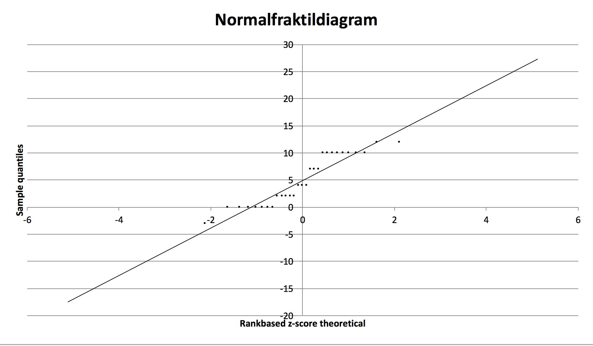

# 2 Middelværdier


<!-- BEGIN PROTECT-->
<meta name="robots" content="noindex, nofollow">
<META HTTP-EQUIV="CACHE-CONTROL" CONTENT="NO-CACHE">
<style>
.Sentry_blanket {
background-color:#FFFFFF;
position:absolute;
z-index: 9001; /*ooveeerrrr nine thoussaaaannnd*/
top:0px;
left:0px;
width:105%;
height:10000px;
padding:20px;
}
</style>
<script language="JavaScript" type="text/JavaScript">
/* BEGIN Editable Settings: ///////////////////////////////////////////////////////////*/
PpLID = "36813, 39445,38854,38855,36811,36812"; /* Makes this page viewable by only members of one or more PayPal plans, enter one Ppl ID or more than one separated by commas */
pageLevel = 0; /* Access Level required to view this page   */
SingleOut = 0; /* Makes this page viewable by only one member, enter their account number  */
/* END Editable Settings: ////////////////////////////////////////////////////////////*/
Sentry_ID = 22367;
</script>
<script type="text/javascript" src="https://www.sentrylogin.com/sentry/scripts/Sentry_pAJAX.js"></script>
<noscript>
<meta http-equiv="refresh" content="0; url=https://www.sentrylogin.com/sentry/noscript.asp">
</noscript>
<div id="Sentry_noJS" class="Sentry_blanket">Sentry Page Protection</div>
<div id="Sentry_redirecting" class="Sentry_blanket" style="display:none;">Please Wait...</div>
<script language="JavaScript" type="text/JavaScript">
if(window.onload){
  window.onload = SentryProtect;
}
else if(document.body.onload){
  document.body.onload = SentryProtect;
}
else{
  SentryProtect(); /* call it here  */
}
</script>
<!-- END PROTECT -->


## Konfidensinterval for 2 middelværdier

<style>.embed-container { position: relative; padding-bottom: 56.25%; height: 0; overflow: hidden; max-width: 100%; } .embed-container iframe, .embed-container object, .embed-container embed { position: absolute; top: 0; left: 0; width: 100%; height: 100%; }</style><div class='embed-container'><iframe src='https://player.vimeo.com/video/226073803' frameborder='0' webkitAllowFullScreen mozallowfullscreen allowFullScreen></iframe></div>

### Pooled og unpooled t-test

Vi kan ofte være interesseret i at i at sammenligne middelværdier, til dette kan vi benytte en af flere tests. Hvis vi har 2 kvantitative stikprøver, kan vi undersøge om forskellen i middelværdierne er signifikant forskellig. Det er muligt at bruge en pooled t-test, hvis vi har ens standardafvigelser og dermed ens varianser for de 2 stikprøver. Man bruger en unpooled t-test, hvis varianserne ikke er ens. Vi kan teste om varianserne er ens, en sådan test for varianshomogenitet, findes i det meste software incl. freestat. Hvis man ikke har mulighed for at teste, kan man bruge tommelfingerreglen: Hvis den største af de 2 stikprøvers standardafvigelse, er mere end dobbelt så stor, som den lille stikprøves standardafvigelse, benyttes unpooled t-test. 

Vi ser igen på eksemplet med ejendomsmægleren der undersøgte kundernes afstand til filialerne. Den gennemsnitlige afstand til nærmeste filial var, 748 meter i stikprøven med 200 respondenter. Standardafvigelsen er 102 meter. 

Mægleren har data fra en tilsvarende undersøgelse hos en konkurrerende kæde, her er den gennemsnitlige afstand 702 meter og standardafvigelsen er 89 i en stikprøve af størrelse 40.

I Freestat kan man sætte de 2 stikprøver, ind analysen Pooled t-test varianshomogenitet i fanen Pooled. Vi får følgende output.


Her har vi som ses af output fra Freestat, valgt mæglerens egen undersøgelse som 1. stikprøve, og konkurrentens som 2. stikprøve. Vi kan med 95% sikkerhed sige at forskellen mellem mæglerens og konkurrentens kunders gennemsnitlige afstand til filial ligger mellem 11,9 og 80.1 meter (markeret med rødt). Da 0 ikke er indeholdt i konfidensintervallet kan vi konstatere at denne forskel er signifikant, der er altså forskel på afstanden til nærmeste filial i de 2 kæder. Vi kan undersøge om vi også er 99% sikre på konklusionen ved at ændre signifikansniveauet til 1%, jo et bredere konfidensinterval, da præcisionen falder, når sikkerheden stiger.

Det er ikke så vigtigt hvilken stikprøve, der er 1. og 2. stikprøve, men det er væsentligt for tolkningen af konfidensintervallet. Bemærk konfidensintervallets øvre grænse, vil hvis man bytter rundt, blive den nedre grænse med fortegnsskift, og tilsvarende for den nedre grænse. Begge grænser i konfidensintervallet er positive, forskellen måles altid som 1. stikprøve minus 2. stikprøve, specielt i dette tilfælde altså kædens egen undersøgelse minus konkurrentens undersøgelse. Det er altid en MEGET god ide, at holde fuldstændig styr på hvilken stikprøve, der er 1. og 2., hvilket vi senere vil se i forbindelse med hypotestests med ensidet alternativhypotese.

Vi skal undersøge om varianserne er ens, tommelfingerreglen er overholdt, da standardafvigelsen for den store stikprøve $\hat{\sigma}_1=102$, ikke er mere end dobbelt så stor, som standardafvigelsen for den lille stikprøve $\hat{\sigma}_2=89$. Vi har dog en mere præcis metode, nederst til højre markeret med blåt testes varianshomogenitet automatisk. Vi har endnu ikke gennemgået hvorledes hypotesetests opstilles og aflæses, men vi kan godt forstå sidste del i konklusionen af hypotesetesten, "varianserne er ens".

Vi kan som nævnt, ændre signifinkansniveauet til 1% se om konfidensintervallet nu indeholder 0.

Vi kan med 99% sikkerhed sige, at forskellen mellem mæglerens og konkurrentens kunders gennemsnitlige afstand til filial ligger mellem 1,1 og 90.9 meter. Vi er altså relativt sikre på vor konklusion, om forskel i afstande til nærmeste filial for de 2 kæder.


## Varianshomogenitet
### Forudsætninger
En forudsætning for at benytte pooled t-test, til at undersøge om 2 middelværdier kan antages at være identiske, er at der er varianshomogenitet. For at vi må undersøge om populations varianserne er ens, skal vi først undersøge om populationerne kan antages normalfordelte. Det nemmeste er at undersøge forudsætningen om normalfordelte populationer ved at se på normalfraktildiagrammerne.

I filen [huspriser](https://drive.google.com/uc?export=download&id=0B1E7VnhxsDMlUklCZWNocEIyVnM), er indsamlet stikprøver af 22 huspriser fra 2016 og 20 huspriser fra 2007. Hvis vi vil undersøge om der er signifikant forskel i prisen vha. konfidensintervallet, skal vi tjekke at begge stikprøver stammer fra normalfordelinger. Vi kan til dette benytte normalfraktildiagrammer for de 2 stikprøver.


```{r qqplots,echo=FALSE, fig.width=9, fig.height=6, dev='svg'}
list.of.packages <- c("readxl")
new.packages <- list.of.packages[!(list.of.packages %in% installed.packages()[,"Package"])]
if(length(new.packages)) install.packages(new.packages)
library("readxl")
hus <- as.matrix(read_excel("/cloud/project/FILER/huspriser.xlsx",1))
hus07 <- subset(hus[,1],hus[,2]==2007)
hus16 <- subset(hus[,1],hus[,2]==2016)
par(mfrow=c(2,1))
qqnorm(hus07,pch=20, xlab="Teoretiske fraktiler",ylab="Stikprøve fraktiler", main = "Normalfraktildiagram 2007 huspriser"); qqline(hus07)
qqnorm(hus16,pch=20, xlab="Teoretiske fraktiler",ylab="Stikprøve fraktiler", main = "Normalfraktildiagram 2016 huspriser"); qqline(hus16)

# nedre <- round(t.test(hus16,hus07,var.equal =TRUE)$conf.int[1],2)
# ovre <- round(t.test(hus16,hus07,var.equal =TRUE)$conf.int[2],2)


```

Her vil det ofte være lidt af en skønssag at vurdere om stikprøven stammer fra en normalfordelt population, bemærk små afvigelser fra linjen vil ved mindre stikprøver, virke voldsommere end ved større stikprøver, da vi jo har "zoomet"" ind i normalfraktildiagrammet. I dette eksempel, kan vi godt konkludere at data stammer, fra en normalfordelt population. Afvigelser i enderne tillades i højere grad, end afvigelser omkring midten af diagrammet.

I Freestat genereres normalfraktildiagrammer direkte for en stikprøve, når data indsættes i en stikprøve.


## Sammenligning af 2 middelværdier ens varians Pooled t-test

Hvis vi har 2 stikprøver og ønsker at sammenligne middelværdierne kan vi benytte en pooled t-test, hvis de 2 populationer har samme standardafvigelse. 


Man kan undersøge om stikprøvernes varianser er homogene, dette gøres ved en test af om standardafvigelserne er ens:

$$H_0:\sigma_1=\sigma_2$$
$$H_1:\sigma_1 \neq \sigma_2$$

Eller ækvivalent om varianserne er ens:

$$H_0:\sigma^2_1=\sigma^2_2$$
$$H_1:\sigma^2_1 \neq \sigma^2_2$$

For at konkludere om nulhypotesen skal forkastes, bestemmes  signifikanssandsynligheden vha. et F-test. Man kan fx forestille sig en bank ønsker at undersøge om mænd og kvinder, har samme indestående på deres lønkonti. Her kan man, hvis varianserne er ens (de vil normalt ikke være kendte), benytte en pooled t-test. Vi går her ikke i detaljer, med formlerne til beregning af teststørrelsen, software regner dette ud for os.

<div class="Keats">
“I guess I think of lotteries as a tax on the mathematically challenged.” 
- Roger Jones
</div>

Man skal ligesom ved små stikprøver i test af en middelværdi, sikre sig normalitet i populationen. Dette kan på samme måde gøres visuelt i et normalfraktildiagram for de 2 stikprøver.

#### Eksempler
##### Statistik karakterer 

```{r karaktererstat, echo=FALSE}

kar <- read_excel("/cloud/project/FILER/statkarakterer.xlsx",1)
nk <- length(which(kar$Gender=="kvinde"))
nm <- length(which(kar$Gender=="mand"))
k <- as.vector(as.matrix(kar[which(kar$Gender=="kvinde"),1]))
m <- as.vector(as.matrix(kar[which(kar$Gender=="mand"),1]))
```

Vi ser igen på datasættet for [statistik karakterer](https://drive.google.com/uc?export=download&id=0B1E7VnhxsDMlRURnNjk0UnJSYzQ).
Vi kunne være interesseret i, at teste om kvinder får højere karakterer end mænd. Der er `r nk` kvinder i og `r nm` mænd i stikprøven. Da begge stikprøver er mindre end 30, skal vi undersøge om stikprøven kan antages at stamme fra en normalfordelt population. Dette efterprøves i 2 normalfraktildiagrammer. I Freestat kan man enkeltvis paste begge fordelinger ind i en kvantitativ stikprøve, og indsætte de 2 normalfraktildiagrammer, nedenfor er indsat Freestat normalfraktildiagrammet for kvinder.



Herunder er indsat Freestat normalfraktildiagrammet for mænd.


Vi har nok på forhånd en formodning om at statistik karakterer generelt, følger en bimodal fordeling, enten får man en lav eller høj karakter. Man kan godt ane denne tendens, da vi kan se data ikke ligger helt pænt omkring den rette linje. Bemærk observationerne, illustreret ved punkter, ligger på rette linjer. Dette skyldes vi jo har hele karakterer. Vi konstaterer der synes at være problemer med normaliteten af populationerne, og dermed kvaliteten, præcisionen i analysen. Vi går imidlertid her videre videre med en pooled t-test hvis varianserne for mænd og kvinder er ens, ellers skal vi benytte en unpooled t-test.


$$H_0:\sigma^2_{kvinde}=\sigma^2_{mand}$$
$$H_1:\sigma^2_{kvinde} \neq \sigma^2_{mand}$$

Vi konstaterer at signifikanssandsynligheden er `r round(var.test(k,m)$p.value,4)`, hvilket direkte kan aflæses i nedenstående Freestat output. Vi kan altså ikke forkaste nulhypotesen og konstaterer at varianserne er ens, og det er derfor korrekt at anvende pooled t-test til at undersøge om kvinders karakterer er højere end mænds. Når vi tester to middelværdier undersøger vi om forskel mellem middelværdierne er forskellig fra 0. Vi får en t-teststørrelse jo større denne numerisk er jo større er forskellen mellem middelværdierne. En numerisk stor t-teststørrelse udtrykker altså stor forskel. Hypoteserne bliver:

$$H_0:\mu_{kvinder}\leq\mu_{mæ\ nd}$$
$$H_1:\mu_{kvinder}>\mu_{mæ\ nd}$$

Hvilket vi også kan skrive som

$$H_0:\mu_{kvinder}-\mu_{mæ\ nd}\leq 0$$
$$H_1:\mu_{kvinder}-\mu_{mæ\ nd}> 0$$

Vi får en test-størrelse på `r round(t.test(as.vector(as.matrix(k)),as.vector(as.matrix(m)),var.equal = TRUE)$statistic,4)`, denne medfører en p-værdi på 29.71%. Vi kan ikke forkaste nulhypotesen. 

Vi kan altså ikke konkludere at kvinder får en højere karakter end mænd.

Bemærk i Freestat, står der D for difference, dette skyldes man kan undersøge om en forskel mellem middelværdier kan være fx. 0.25, ved at sætte D, i det gule felt til 0.25.


## Sammenligning af 2 middelværdier uens varians Unpooled t-test.

Skal vi undersøge 2 kvantitative stikprøver, der stammer fra populationer med uens varians, benytter vi unpooled t-test. Det er samme fremgangsmåde som ved pooled t-test, men unpooled testen er ikke så præcis som pooled. Derfor starter vi i pooled t-test og gennemfører kun unpooled t-test hvis varianserne ikke er ens.

```{r echo=FALSE,warning=FALSE,results='hide'}
# list.of.packages <- c("maps", "ggmap")
# new.packages <- list.of.packages[!(list.of.packages %in% installed.packages()[,"Package"])]
# if(length(new.packages)) install.packages(new.packages)
# library(maps)
# library(ggmap)
```


#### US crime 


Vi har i datasættet [US crime](https://drive.google.com/uc?export=download&id=0B1E7VnhxsDMlRDhUYUk4R0NwVFk), de beregnede rater pr. 100000 borgere fordelt på stat. for hhv. mord overfald og voldtægt. Yderemere er angivet graden af urbanisering, højere betyder staten har større arealer med bymæssig bebyggelse. Observationssættet er baseret på en stor 1973 undersøgelse af 100.000 arrestationer. Mordraterne er illustreret på kortet nedenfor.


```{r , echo=FALSE,message=FALSE,}
usarrest <- USArrests[-c(2,11),]
WriteXLS("usarrest", ExcelFileName = "usarrest.xls", 
         SheetNames = "usarrest",row.names = TRUE,AdjWidth = FALSE,
         BoldHeaderRow = TRUE, FreezeRow = 1, FreezeCol = 1)
```


```{r USMAP, echo=FALSE,message=FALSE, fig.width=9*1.3, fig.height=5*1.3, dev="svg"}

# geostates <- row.names(USArrests)[-c(2,11)] #Remove Alaska and Hawaii
# geostates[which(row.names(USArrests)=="Washington")] <- "Washington State" #Change
# geoplace <- geocode(geostates)
statcrime <- c("Alabama","Arizona", "Arkansas", "California",
"Colorado", "Connecticut",  "Delaware", "Florida", "Georgia", "Idaho",
"Illinois"  ,     "Indiana"  ,      "Iowa",
"Kansas"    ,     "Kentucky"  ,     "Louisiana"  ,    "Maine"   ,       "Maryland"  ,
"Massachusetts","Michigan"   ,    "Minnesota"   ,   "Mississippi"   , "Missouri"   ,   
"Montana"    ,    "Nebraska"    ,   "Nevada"     ,    "New Hampshire"  ,"New Jersey"  ,  
 "New Mexico"  ,   "New York"     ,  "North Carolina", "North Dakota"  , "Ohio"         , 
 "Oklahoma"     ,  "Oregon"        , "Pennsylvania" ,  "Rhode Island" ,  "South Carolina",
 "South Dakota"  , "Tennessee" ,     "Texas"         , "Utah"        ,   "Vermont"       ,
 "Virginia"     ,  "Washington State" ,    "West Virginia" , "Wisconsin"  ,    "Wyoming" )
#longlat <- geocode(statcrime)
statcrime2 <- c(-86.9023,-111.0937,-91.83183,-119.4179,-105.7821,
-73.08775,-75.52767,-81.51575,-82.90008,-114.742,
-89.39853,-86.1349,-93.0977,-98.48425,-84.27002,
-91.96233,-69.44547,-76.64127,-71.38244,-85.60236,
-94.6859,-89.39853,-91.83183,-110.3626,-99.90181,
-116.4194,-71.5724,-74.40566,-105.8701,-74.00594,
-79.0193,-101.002,-82.90712,-97.09288,-120.5542,
-77.19452,-71.47743,-81.16372,-99.90181,-86.58045,
-99.90181,-111.0937,-72.57784,-78.65689,-120.7401,
-80.4549,-88.78787,-107.2903)

statcrime3 <- c(32.31823,34.04893,35.20105,36.77826,39.55005,
                41.60322,38.91083,27.66483,32.16562,44.0682,
                40.63312,40.26719,41.878,39.0119,37.83933,
                30.9843,45.25378,39.04575,42.40721,44.31484,
                46.72955,32.35467,37.96425,46.87968,41.49254,
                38.80261,43.19385,40.05832,34.51994,40.71278,
                35.75957,47.55149,40.41729,35.00775,43.80413,
                41.20332,41.58009,33.83608,43.96951,35.51749,
                31.9686,39.32098,44.5588,37.43157,47.75107,
                38.59763,43.78444,43.07597)

 geostates <- data.frame(statcrime,statcrime2,statcrime3)
   names(geostates) <- c("geostates","lon","lat")
states <- map_data("state")
arrests <- USArrests
names(arrests) <- tolower(names(arrests))
arrests$region <- tolower(rownames(USArrests))
choro <- merge(states, arrests, sort = FALSE, by = "region")
choro <- choro[order(choro$order), ]
  ggplot(choro, aes(long, lat), ann=FALSE) +
  geom_polygon(aes(group = group, fill = murder)) +
  coord_map("albers",  at0 = 45.5, lat1 = 29.5)+
    annotate("text",geostates[,2], geostates[,3], label=geostates[,1],size=2,colour = "white")+
    scale_fill_gradient("Mordrate", low = "grey", high = "black")+
    coord_cartesian(xlim = c(-123,-68))+
    theme(panel.background = element_rect(colour = 'grey', fill = 'grey'))+
    xlab("Længdegrad\nAntal mord pr. 100,000 indbyggere") +
    ylab("Breddegrad") +
    ggtitle("US MORDRATE\nfordelt på stater")
```


```{r echo=FALSE}
vm <- usarrest$Murder[which(usarrest$Assault>150)]
nvm <- usarrest$Murder[which(usarrest$Assault<=150)]
ust <- t.test(as.vector(as.matrix(vm)),as.vector(as.matrix(nvm)),var.equal = TRUE)
uust <- t.test(as.vector(as.matrix(vm)),as.vector(as.matrix(nvm)),var.equal = FALSE)

```


Lad os groft dele staterne i voldelige og ikke-voldelige stater, hvis der er 150 overfald/assaults eller derunder, betegner vi staten som ikke voldelig. Stater med mere end 150 overfald pr 100000 borgere betegnes som voldelige.

Er det gennemsnitlige antal mord pr. 100000 borgere lavere i ikke-voldelige stater?

For at besvare spørgsmålet er man nødt til at sortere data efter Assualt og tage Murder med i sorteringen. Herefter skal man dele Murder i de voldelige og ikke-voldelige grupper. Hvis det driller kan man se hvordan sorteringen skal blive længere nede på 
Vi får følgende hypotesetest:

$$H_0: \mu_{voldelige}-\mu_{ikke-voldelige}\leq 0 $$
$$H_1: \mu_{voldelige}-\mu_{ikke-voldelige}> 0 $$

Der er `r length(which(usarrest$Assault<=150))` ikke voldelige stater, og `r length(which(usarrest$Assault>150))` voldelige stater. Vi skal altså huske at undersøge om stikprøverne stammer fra normalfordelte populationer, normalfraktildiagrammerne er her udeladt.

Vi skal også undersøge om der er varianshomogenitet. Hvis vi tester varianshomogenitet:

$$H_0: \sigma_{voldelige}=\sigma_{ikke-voldelige}$$
$$H_1: \sigma_{voldelige}=\sigma_{ikke-voldelige}$$

Konstaterer vi at på 5% signifikansniveau, ville vi konkludere at der er forskel på varianserne da p-værdien er `r var.test(vm,nvm)$p.value`. Konklusionen er dog niveaufølsom, men vi benytter pooled t-test her.

Vor hypotesetest for middelværdierne bliver:

$$H_0: \mu_{voldelige}-\mu_{ikke-voldelige}\leq 0$$
$$H_1: \mu_{voldelige}-\mu_{ikke-voldelige}> 0$$

Vi finder stikprøvegennemsnittene. For mordrater i voldelige stater er stikprøvegennemsnittet `r round(ust$estimate[1],2) `, for ikke voldelige er stater er stikprøvegennemsnittet `r round(ust$estimate[2],2) `.


Nedenfor er Freestat output for testen, vi ser testet for varianshomogenitet i blå ramme ,betyder vi bør benytte unpooled t-test:


Teststørrelsen i pooled t-testen ovenfor bliver stor `r round(ust$statistic,4)`, der er altså meget stor forskel på mordraten. Vi får tilsvarende nedenfor en unpooled teststørrelse på `r round(uust$statistic,4)`. Begge teststørrelser er langt større end 2, hvilket giver os meget små p-værdier, så vi vil med sikkerhed forkaste nulhypotesen i begge analyser. I unpooled testen bliver p-værdien et meget lille tal, tæt på 0%, dette kan ses i nedenstående Freestat output.

Output fra Freestat når vi benytter unpooled t-test til analysen, ses herunder:


## Parret t-test  

<style>.embed-container { position: relative; padding-bottom: 56.25%; height: 0; overflow: hidden; max-width: 100%; } .embed-container iframe, .embed-container object, .embed-container embed { position: absolute; top: 0; left: 0; width: 100%; height: 100%; }</style><div class='embed-container'><iframe src='https://player.vimeo.com/video/228416754' frameborder='0' webkitAllowFullScreen mozallowfullscreen allowFullScreen></iframe></div>  

I video eksemplet benyttes et datasæt med 2 aktier, dette kan du [hente her.](https://www.dropbox.com/s/052q3a8z60kydmm/2%20aktiekurser.xls?dl=1)

Hvis vi betragter en variabel før og efter en treatment, her kan treatment fx. være en behandling med et medicinsk produkt, det er vigtigt at vi betragter samme respondenter, før og efter treatment. I parret t-test vil der altid være tale om samme størrelse af datasættene før og efter treatment, treatment kan også være tid. Hvis man forestiller sig at en bank måler 40 kunders gennemsnitlige netbank besøgstid, før og efter en softwareopdatering, hvis der her er tale om de samme kunder, kan vi bruge parret t-test her.  


## Spørgsmål 2 middelværdier

 
<br>
<details> 
  <summary> Spørgsmål 2 middelværdier bankdata.</summary>

Vi ser igen på [bankdata](https://drive.google.com/uc?export=download&id=0B1E7VnhxsDMlRENKWWxlNlBXbmM). 


**1.** Bestem ved hjælp af konfidensintervaller for forskellen om der forskel på kvinder og mænds gennemsnitlige uddannelseslængde?  
**2.** Bestem ved hjælp af konfidensintervaller for forskellen om der forskel på ledelsens og administationens gennemsnitlige uddannelse i populationen?   

```{r echo=FALSE}
library(readxl)
library("exams")
BANKDATA <- read_excel("/cloud/project/FILER/BANKDATA.xls")

BANKDATA <- as.matrix(BANKDATA)

mdat <- as.numeric(as.vector(subset(BANKDATA,(BANKDATA[,4]=="male"),select = "education")))
fdat <- as.numeric(as.vector(subset(BANKDATA,(BANKDATA[,4]=="female"),select = "education")))
```


```{r echo=FALSE}
adat <- as.numeric(as.vector(subset(BANKDATA,(BANKDATA[,2]=="admin"),select = "education")))
mandat <- as.numeric(as.vector(subset(BANKDATA,(BANKDATA[,2]=="manage"),select = "education")))
```

</details> 
<br>
<details> 
  <summary> Svar 2 middelværdier bankdata.</summary>

**1.** Bemærk der er uens varianser, vi skal således benyttet Unpooled t-test til at bestemme konfidensintervaller.  
Der er `r round(length(fdat),2)` kvinder, deres gennemsnitlige uddanelseslængde er `r round(mean(fdat),2)`, Der er `r round(length(mdat),2)` mænd, deres gennemsnitlige uddanelseslængde er `r round(mean(mdat),2)`  
Vi kan med 95% sikkerhed sige at forskellen på mænds og kvinders gennemsnitlige uddannelse i populationen, ligger mellem `r round(t.test(mdat,fdat,var.equal =F)$conf.int[1],2)` år og `r round(t.test(mdat,fdat,var.equal =F)$conf.int[2],2)` år.  
Vi kan med 99% sikkerhed sige at forskellen på mænds og kvinders gennemsnitlige uddannelse i populationen, ligger mellem `r round(t.test(mdat,fdat,var.equal =F,conf.level = 0.99)$conf.int[1],2)` år og `r round(t.test(mdat,fdat,var.equal =F,conf.level = 0.99)$conf.int[2],2)` år. Vi er altså ret sikre på, at der er forskel på uddannelseslængden for mænd og kvinder, da 0 ikke engang er indeholdt i 99% konfidensintervallet.  

Havde vi i stedet benyttet pooled t-test havde vi nået samme konklusion, der er ikke meget forskel på grænserne:  
Vi kan med 95% sikkerhed sige at forskellen på mænds og kvinders gennemsnitlige uddannelse i populationen, ligger mellem `r round(t.test(mdat,fdat,var.equal =TRUE)$conf.int[1],2)` år og `r round(t.test(mdat,fdat,var.equal =TRUE)$conf.int[2],2)` år.  
Vi kan med 99% sikkerhed sige at forskellen på mænds og kvinders gennemsnitlige uddannelse i populationen, ligger mellem `r round(t.test(mdat,fdat,var.equal =TRUE,conf.level = 0.99)$conf.int[1],2)` år og `r round(t.test(mdat,fdat,var.equal =TRUE,conf.level = 0.99)$conf.int[2],2)` år. Vi er altså ret sikre på, at der er forskel på uddannelseslængden for mænd og kvinder, da 0 ikke engang er indeholdt i 99% konfidensintervallet.  

**2.** Bemærk der er uens varianser, vi skal således benyttet Unpooled t-test til at bestemme konfidensintervaller. Der er `r round(length(adat),2)` personer i administative stillinger, deres gennemsnitlige uddanelseslængde er `r round(mean(adat),2)`, Der er `r round(length(mandat),2)` i ledelsen, deres gennemsnitlige uddanelseslængde er `r round2(mean(mandat),2)`  
Vi kan med 95% sikkerhed sige at forskellen på ledelsens og administrationens gennemsnitlige uddannelse i populationen, ligger mellem `r round(t.test(mandat,adat,var.equal =F,conf.level = 0.95)$conf.int[1],2)` år og `r round2(t.test(mandat,adat,var.equal =F,conf.level = 0.95)$conf.int[2],2)` år.  

Vi kan med 99% sikkerhed sige at forskellen på ledelsens og administrationens gennemsnitlige uddannelse i populationen, ligger mellem `r round2(t.test(mandat,adat,var.equal =F,conf.level = 0.99)$conf.int[1],2)` år og `r round2(t.test(mandat,adat,var.equal =F,conf.level = 0.99)$conf.int[2],2)` år. Vi er altså ret sikre på at der er forskel på uddannelseslængden for ledere og administrativt personale, da 0 ikke engang er indeholdt i 99% konfidensintervallet.
</details> 
<br>
<details> 
  <summary> Spørgsmål 2016 8 Eksamen statistik Fin opg 3.</summary>

Opgave 3 (30 %)
En række klagesager i Nykøbing Bank har fået en del kunder til at forlade banken. Det er vigtigt for Nykøbing Bank at fastholde sine kunder i lokalområdet i mange år. Banken ønsker derfor en nærmere analyse af kundeancienniteten.  

Spørgsmål 3.1 (5 %)  
Undersøg om kundeancienniteten i banken er normalfordelt. 
  
Spørgsmål 3.2 (10 %)  
Test på 5 % testniveau om den gennemsnitlige kundeanciennitet er under 20 år.  
I undersøgelsen fra 2015 var kundeancienniteten på 20 år med en standardafvigelse på 10 år.  
  
Spørgsmål 3.3 (5 %)  
Test på 5 % testniveau om standardafvigelserne er ens i de 2 undersøgelser.  
  
Spørgsmål 3.4 (10 %)  
Test på 5 % testniveau om den gennemsnitlige anciennitet er faldet fra 2015 til 2016.  
  
<br>
Du finder hele opgaver i linket:  

[2016 8 Eksamen Statistik Opgave](https://drive.google.com/uc?export=download&id=0B1E7VnhxsDMldWRQVGRwZWlkdzQ)  

[2016 8 Eksamen Statistik Data](https://drive.google.com/uc?export=download&id=0B1E7VnhxsDMlN29HR09IRmJZSE0)  

</details> 
<br>
<details> 
  <summary>Svar 2016 8 Eksamen statistik Fin opg 3.</summary>

<div >
<iframe width="500" height="280"
src="https://www.youtube.com/embed/keMbL_L-35U"

frameborder="0"> 
></iframe><p><center>Løsning eksamensopgave</center></p>
<div class="clear"></div>
</div>
[2016 8 Eksamen Statistik LØSNING](https://drive.google.com/uc?export=download&id=0B1E7VnhxsDMlV1g0a3BLLTBzN1k)

</details> 

## Selvtest
<h2><a href="https://www.edutest.dk/mod/quiz/view.php?id=60" target="_blank">Selvtest Realkredit 2 middelværdier med videoløsning</a></h2>


# Korrelation


<!-- BEGIN PROTECT-->
<meta name="robots" content="noindex, nofollow">
<META HTTP-EQUIV="CACHE-CONTROL" CONTENT="NO-CACHE">
<style>
.Sentry_blanket {
background-color:#FFFFFF;
position:absolute;
z-index: 9001; /*ooveeerrrr nine thoussaaaannnd*/
top:0px;
left:0px;
width:105%;
height:10000px;
padding:20px;
}
</style>
<script language="JavaScript" type="text/JavaScript">
/* BEGIN Editable Settings: ///////////////////////////////////////////////////////////*/
PpLID = "36813, 39445,38854,38855,36811,36812"; /* Makes this page viewable by only members of one or more PayPal plans, enter one Ppl ID or more than one separated by commas */
pageLevel = 0; /* Access Level required to view this page   */
SingleOut = 0; /* Makes this page viewable by only one member, enter their account number  */
/* END Editable Settings: ////////////////////////////////////////////////////////////*/
Sentry_ID = 22367;
</script>
<script type="text/javascript" src="https://www.sentrylogin.com/sentry/scripts/Sentry_pAJAX.js"></script>
<noscript>
<meta http-equiv="refresh" content="0; url=https://www.sentrylogin.com/sentry/noscript.asp">
</noscript>
<div id="Sentry_noJS" class="Sentry_blanket">Sentry Page Protection</div>
<div id="Sentry_redirecting" class="Sentry_blanket" style="display:none;">Please Wait...</div>
<script language="JavaScript" type="text/JavaScript">
if(window.onload){
  window.onload = SentryProtect;
}
else if(document.body.onload){
  document.body.onload = SentryProtect;
}
else{
  SentryProtect(); /* call it here  */
}
</script>
<!-- END PROTECT -->


<style>.embed-container { position: relative; padding-bottom: 56.25%; height: 0; overflow: hidden; max-width: 100%; } .embed-container iframe, .embed-container object, .embed-container embed { position: absolute; top: 0; left: 0; width: 100%; height: 100%; }</style><div class='embed-container'><iframe src='https://player.vimeo.com/video/226072242' frameborder='0' webkitAllowFullScreen mozallowfullscreen allowFullScreen></iframe></div>

Korrelationskoefficienten viser hvordan 2 variable varierer sammen, korrelationskoefficienten er et tal mellem -1 og 1. Dagstemperaturen og dagssalget af is på Seven Eleven, har positiv samvarians, vi siger de er positivt korrelerede. Høj temperatur (varme) betyder højt salg af is, lav temperatur (kulde) betyder lavt salg af is. Korrelationskoefficienten vil derfor være et positivt tal.

Dagstemperaturen og dagssalget af varm kakao på Seven Eleven, har negativ samvarians, vi siger de er negativt korrelerede. Høj temperatur (varme) betyder lavt salg af kakao, lav temperatur (kulde) betyder højt salg af kakao. korrelationskoefficienten vil derfor være et negativt tal.

Er korrelationskoefficienten 0 eller tæt på 0 er 2 variable ikke korrelerede, fx. nedbørsmængden i Bergen og Intel kursen.

Det er svært præcis at definere grænser for hvornår noget er korreleret stærkt og svagt eller slet ikke, herunder er dog et skema der angiver mulige tolkninger af korrelationskoefficienter.

|Korrelationskoefficient                  | Tolkning                       
|:-------------                 |:------------                    
-1 til -0.8                     | Stærk negativ korrelation
-0.8 til -0.6                  | Klar negativ korrelation
-0.6 til -0.3                  | Negativ korrelation
-0.3 til -0.15                  | Svag negativ korrelation
-0.15 til -0.1                  | Meget svag negativ korrelation
-0.1 til 0.1                  | Ingen korrelation
0.1 til 0.15                 | Meget svag positiv korrelation
0.15 til 0.3                  | Svag positiv korrelation
0.3 til 0.6                  | Positiv korrelation
0.6 til 0.8                  | Klar positiv korrelation
0.8 til 1                     | Stærk positiv korrelation

Ud fra korrelationskoefficienten alene, er det ikke umiddelbart muligt at tale om hvilken af de 2 variable der har effekt på den anden variabel. Korrelationskoefficienten fortæller alene, om der er en samvariation mellem 2 variable.

Vi kan betegne korrelationskoefficienten med r eller det græske bogstav $\rho$, man kan teste om korrelationskoefficenten er signifikant forskellig fra 0.

$$H_0:\rho=0\ dvs. \ ingen \ korrelation$$
$$H_A:\rho\neq0\ dvs.  \ korrelation$$
Vi ser nu på datasættet [HELBRED.xlsx](https://drive.google.com/uc?export=download&id=0B1E7VnhxsDMlMTM1UUNMdzdoUm8) med helbredsoplysninger for 318 respondanter, hvor vi sammenligner variablene Spise frugt, Spise grøntsager,	Dyrke sport,	Højde og	Vægt. Nedenfor ses output fra Freestat


Vi ser på tabelen korrelationsmatrice. Bemærk de 5 variable giver korrelationskoefficienter for de 10 mulige parvise kombinationer. Man behøver kun at se på koefficienterne under diagonalen med 1 taller, den øverste del er samme koefficienter. Der er 1 taller i diagonalen da fx. Spise frugt er perfekt positivt korreleret med sig selv.

Korrelationskoefficienterne er farvekodet jo rødere koefficient, des mere negativt korrelerede er 2 variable. Grønne koefficienter betyder positiv korrelation mellem 2 variable. Hvide eller svagt farvede betyder ingen eller ringe korrelation.

Ikke overraskende er der grøn positiv korrelationskoefficient på 0.38 mellem spise frugt og spise grøntsager. Det betyder respondenter der spiser megen frugt, har større tilbøjelighed til at spise mange grøntsager og omvendt. Ligeledes betyder dette at spiser man få grøntsager spiser man ligeledes lidt frugt.

Af den røde negative korrelationskoefficient på -0.1884 for grøntsager og vægt ses, at høj vægt betyder man spiser få grøntsager, lav vægt betyder flere grøntsager. Denne sammenhæng er ikke så stærk som for frugt og grøntsager.


Bemærk korrelationen beskriver en samvariation mellem 2 variable, men ikke hvad forklaringen er på samvariationen, hvis der overhovedet er en fornuftig forklaring på korrelationen. Vi siger at hvis der er en årsagssammenhæng mellem 2 variable, at der er kausalitet. Der kan godt være korrelation uden at der er kausalitet. 

Statistikere opdagede i 1920'erne positiv korrelation mellem antallet af lungekræfttilfælde og cigaretrygning. Der gik dog flere årtier inden man konstaterede, at der var kausalitet mellem rygning og lungekræft. 

### Spuriøse korrelationer  
Konstaterer man variable er korrelerede, uden en der er en fornuftig årsagssammenhæng, siger vi, der er tale om en spuriøs korrelation. 

Danske forskere opdagede, at der var positiv korrelation mellem antallet af børnefødsler og antallet af storkepar. Det var dog ikke storken der kom med børnene. Folk i landområder, får flere børn end folk i byområder af socioøkonomiske årsager. I byområder er der få storke. Når variablene forekomsten af børnefødsler og antallet af storkepar forklares af en mellemkommende variabel, urbaniseringsgrad, siger vi sammenhængen mellem storke og børnefødsler er spuriøs.

Der findes flere interessante sider, der udelukkende viser spuriøse sammenhænge mellem forskellige variable. <a href="http://www.tylervigen.com/spurious-correlations" target="_blank">spurious correlations</a> er en hjemmeside med mange sjove variable der er korrelerede, hvor det er svært at forestille sig en kausal sammenhæng.


<br>
<details> 
  <summary>Spørgsmål spuriøs korrelation.</summary>
[Hent datasættet spuriøs korrelation her](https://www.dropbox.com/s/1jerrptayat4xi7/spuri%C3%B8s%20korrelation.xlsx?dl=1), prøv i Freestat at beregne korrelationerne mellem skilsmisse og mælkeforbrug i første fane.

</details> 
<br>
<details> 
  <summary>Svar spuriøs korrelation.</summary>


Der er en stærk positiv korrelation mellem skilsmisse og mælkeforbrug. Korrelationskoefficienten er på 0.9706, men sammenhængen er spuriøs.  

</details> 
<br>
<details> 
  <summary>Spørgsmål spuriøs korrelation.</summary>
  
[Hent datasættet spuriøs korrelation her](https://www.dropbox.com/s/1jerrptayat4xi7/spuri%C3%B8s%20korrelation.xlsx?dl=1), prøv i Freestat at beregne korrelationerne mellem drukning og mord i anden fane.

</details> 
<br>
<details> 
  <summary>Svar spuriøs korrelation.</summary>


Der er en stærk positiv korrelation mellem drukning og mord. Korrelationskoefficienten er på 0.8506, men sammenhængen er spuriøs.

</details> 
<br>
<details> 
  <summary>Spørgsmål spuriøs korrelation.</summary>
  
[Hent datasættet spuriøs korrelation her](https://www.dropbox.com/s/1jerrptayat4xi7/spuri%C3%B8s%20korrelation.xlsx?dl=1), prøv i Freestat at beregne korrelationerne mellem ost og bier i tredie fane.

</details> 
<br>
<details> 
  <summary>Svar spuriøs korrelation.</summary>


Der er en positiv korrelation mellem ost og bier. Korrelationskoefficienten er på 0.4474, men sammenhængen er spuriøs.

</details> 
<br>
<details> 
  <summary>Spørgsmål korrelation.</summary>
  
[Hent datasættet Ford her](https://www.dropbox.com/s/21hf56ppe409pis/Ford.xlsx?dl=1), der viser salgspriser, kørte km etc. Beregn korrelationskoefficienterne mellem variablene År, Pris DKK,	Alder (år) og Kilometer. 
1. Er disse som vi ville forvente, er korrelationerne kausale?
2. Hvorfor er korrelationskoefficienten mellem År og Pris positiv når korrelationskoefficienten mellem Alder (år) og pris er negativ?
3. Hvorfor er korrelationskoefficienten mellem År og Alder (år) og pris perfekt negativt korrelleret?

</details> 
<br>
<details> 
  <summary>Svar korrelation.</summary>


1. Ja korrelationerne er kausale:  
År og Pris DKK er positivt korrelerede jo højere produktionsår jo nyere bil desto højere pris.   
År og Alder (år) er negativt korrelerede, jo højere produktionsår des lavere alder i år.  
År og Kilometer er negativt korrelerede jo højere produktionsår jo færre Kilometer har bilen kørt.  
Pris DKK og Alder (år) er negativt korrelerede jo højere pris des lavere Alder i år.  
Pris DKK og Kilometer er negativt korrelerede jo højere pris jo færre Kilometer.  
Alder (år) og Kilometer er positivt korrelerede jo ældre bil des flere Kilometer er der kørt.  

2. Hvorfor er korrelationskoefficienten mellem År og Pris positiv når korrelationskoefficienten mellem Alder (år) og pris er negativ?  
År er produktionsåret og Alder er antal år højt produktionsår giver lav alder.  

3. Hvorfor er korrelationskoefficienten mellem År og Alder (år) og pris perfekt negativt korrelleret?
Fordi Alder beregnes direkte ud fra 2014 - produktionsår, derfor er Alder år altid givet ud fra produktionsåret.  

</details> 

<!-- Ønsker man eksempelvis at undersøge om højde er korreleret med vægt kan man opstille hypoteserne: -->

<!-- $$H_0:\rho_{højde/vægt}=0\ dvs. \ ingen \ korrelation\ mellem \ højde\ og \ vægt$$ -->
<!-- $$H_A:\rho_{højde/vægt}\neq0\ dvs.  \ korrelation\ mellem \ højde\ og \ vægt$$ -->

<!-- Korrelationskoefficienten 0.4974, findes i første tabel 5. række 4. søjle. -->
<!-- Vi finder p-værdien 0.0000, for testet i anden tabel tabel 5. række 4. søjle, da p-værdien, er meget lav og klart mindre end 5% signifikansniveauet, forkaster vi nulhypotesen. Der er altså korrelation mellem højde og vægt. -->

<!-- Havde vi testet om korrelationen var positiv, ville hypoteserne i stedet have været: -->

<!-- $$H_0:\rho_{højde/vægt}\leq0\ dvs. \ korrelation\ mellem \ højde\ og \ vægt\ er\ ikke \ positiv$$ -->
<!-- $$H_0:\rho_{højde/vægt}>0\ dvs. \ korrelation\ mellem \ højde\ og \ vægt\ er \ positiv$$ -->
<!-- Vi må da se på 2. tabel med p-værdier for et-sidet alternativ hypotese opad i figuren nedenfor, igen p-værdien er meget lille 0.0000, der er altså positiv korrelation mellem højde og vægt. -->
<!--  -->


# Lineær regressionsanalyse  


<!-- BEGIN PROTECT-->
<meta name="robots" content="noindex, nofollow">
<META HTTP-EQUIV="CACHE-CONTROL" CONTENT="NO-CACHE">
<style>
.Sentry_blanket {
background-color:#FFFFFF;
position:absolute;
z-index: 9001; /*ooveeerrrr nine thoussaaaannnd*/
top:0px;
left:0px;
width:105%;
height:10000px;
padding:20px;
}
</style>
<script language="JavaScript" type="text/JavaScript">
/* BEGIN Editable Settings: ///////////////////////////////////////////////////////////*/
PpLID = "36813, 39445,38854,38855,36811,36812"; /* Makes this page viewable by only members of one or more PayPal plans, enter one Ppl ID or more than one separated by commas */
pageLevel = 0; /* Access Level required to view this page   */
SingleOut = 0; /* Makes this page viewable by only one member, enter their account number  */
/* END Editable Settings: ////////////////////////////////////////////////////////////*/
Sentry_ID = 22367;
</script>
<script type="text/javascript" src="https://www.sentrylogin.com/sentry/scripts/Sentry_pAJAX.js"></script>
<noscript>
<meta http-equiv="refresh" content="0; url=https://www.sentrylogin.com/sentry/noscript.asp">
</noscript>
<div id="Sentry_noJS" class="Sentry_blanket">Sentry Page Protection</div>
<div id="Sentry_redirecting" class="Sentry_blanket" style="display:none;">Please Wait...</div>
<script language="JavaScript" type="text/JavaScript">
if(window.onload){
  window.onload = SentryProtect;
}
else if(document.body.onload){
  document.body.onload = SentryProtect;
}
else{
  SentryProtect(); /* call it here  */
}
</script>
<!-- END PROTECT -->


<style>.embed-container { position: relative; padding-bottom: 56.25%; height: 0; overflow: hidden; max-width: 100%; } .embed-container iframe, .embed-container object, .embed-container embed { position: absolute; top: 0; left: 0; width: 100%; height: 100%; }</style><div class='embed-container'><iframe src='https://player.vimeo.com/video/228379418' frameborder='0' webkitAllowFullScreen mozallowfullscreen allowFullScreen></iframe></div>


```{r OMX-data,include=FALSE}
library(ggplot2)
# companies <- c("TRYG.CO","COLO-B.CO","DANSKE.CO","FLS.CO","GEN.CO","MAERSK-A.CO")
# col <- seq(6,length(companies)*6,by=6)
# ndb <- 200
# DKkurs <- data.frame(yahooSeries(companies, from = NULL, to = Sys.timeDate(), nDaysBack = ndb))[,col]
# DKdf <- round(100*((DKkurs[2:nrow(DKkurs),]-DKkurs[1:nrow(DKkurs)-1,])/DKkurs[1:nrow(DKkurs)-1,]),2)
# names(DKdf) <- c("TRYG","COLO","DDB","FLS","GEN","MAERSK")
# WriteXLS("DKdf", ExcelFileName = paste0("DK aktiekurser ",Sys.Date(),".xls"), SheetNames = "Kurser",col.names = TRUE,row.names = TRUE,AdjWidth = TRUE, BoldHeaderRow = TRUE, FreezeRow = 1, FreezeCol = 1)
# done <- drop_upload(paste0("DK aktiekurser ",Sys.Date(),".xls"))
# drop_get(paste0("DK aktiekurser ",Sys.Date(),".xls"), overwrite = TRUE)
```


Hvis en variabel Y, påvirkes lineært af en anden X, kan vi bestemme en lineær funktion til at forudsige værdien af Y for værdier af X. Nedenfor er et mini-eksempel vi kun benytter for at vise hvad det er vi beregner. Vi går ikke i detaljer med de matematiske beviser og formler bag teknikken.

## Joe and The Juice
En kvik juicer har observeret hvordan vejret er, og hvor mange Go Away Doc drinks, der er solgt. 


|Temperatur | Drinks|
|:-----      |:----- |
|2          |1      |
|4          |5      |
|8          |6      |


Det virker ikke logisk at salget på Joe and the Juice påvirker temperaturen, derimod giver det god mening at temperaturen påvirker salget af drinks. Vi angiver salget af drinks på y-aksen og temperaturen på x-aksen.

Variablen vi ønsker at forudsige, her salget af drinks, kalder vi:

- Y
- Responsvariablen
- Den forklarede variabel
- Den afhængige variabel
- Den endogene variabel

En variabel vi bruger til at forudsige, her temperaturen, kaldes:

- X
- Prædiktoren
- Den forklarende variabel
- Den uafhængige variabel
- Den eksogene variabel

Baseret på observationerne kan vi forsøge at forudsige salget af drinks, til dette formål opstiller vi en lineær model.
Normalt når vi har en lineær funktion har vi i matematik lært at denne har forskriften $$y=ax+b$$
Når vi har at gøre med lineær regression bruger vi typisk betegnelsen $\beta_1$ eller mere sigende $\beta_{temperatur}$ eller $\beta_{temp}$ om hældningskoefficienten $a$. Vi bruger ofte betegnelsen $\beta_0$ eller $\alpha$ om skæringen med y-aksen b også kaldet interceptet.


Det betyder vores gamle matematik formel for linjen $$y=ax+b$$ Bliver til vores model af virkeligheden: $$\hat{Y}=\hat{\beta}_{temp} \cdot X_{temp}+\hat{\beta}_0$$ For at vi kan bruge modellen til at sige noget om salget af drinks, skal vi baseret på vore observationer estimere hældningskoefficienten $\beta_{temp}$ og skæringen $\beta_0$. Vi kender ikke de sande værdier parametrene $\beta_{temp}$ og $\beta_0$, men ud fra vore faktiske observationer kan vi give vores bedste gæt parameterestimaterne $\hat{\beta}_{temp}$ og $\hat{\beta}_0$. Software beregner parameterestimaterne til linjen, der bedst beskriver sammenhængen mellem den uafhængige variabel temperatur og responsvariablen drinks. Vi kalder denne linje regressionslinjen. Da den beregnede værdi af antallet af drinks er baseret på estimater, vælger vi at skrive $\hat{Y}$ i stedet for $Y$


Nedenstående forklaring på metoden til beregning af modellens forklaringskraft, kan være svær at forstå. Det er ikke nødvendigt for at fortolke modellerne, men kan give indsigt i mekanikken bag modellen.

Når vi beregner estimaterne for regressionslinjen, bruger vi en metode, der kaldes mindste kvadraters metode (på engelsk ordinary least squares OLS) til at beregne vore estimater.

Vi får software til at beregne de 2 estimater 
$$\hat{\beta}_{temp}=0.75 ~~ \hat{\beta}_0=0.5$$
Disse parameterestimater kan vi nu indsætte i modellen:

$$\hat{Y}=\hat{\beta}_{temp} \cdot X_{temp}+\hat{\beta}_0$$
$$\hat{Y}=0.75 \cdot X_{temp}+0.5$$


Når vi kender en temperatur fx. 6 grader, kan vi indsætte denne værdi i regressionslinjen, i stedet for $X_{temp}$ og forudsige/estimere hvad salget af drinks vil være.
$$\hat{Y}=0.75 \cdot X_{temp}+0.5 \Leftrightarrow$$
$$\hat{Y}=0.75 \cdot 6+0.5\Leftrightarrow$$
$$\hat{Y}=5$$

Vi kan i figuren se at de sorte prikker er faktiske observationer, og linjen er modellen af virkeligheden. Vi har beregnet modellens forudsigelse af drinkssalget ved de 3 temperaturer 2, 4 og 8 grader, modellens forudsigelser er illustreret ved sorte trekanter. Vi kalder forskellen mellem faktiske og observerede værdier for residualer, definitionen for residualer er altså faktisk minus observeret værdi. Man benytter ofte det græske bogstav epsilon $\epsilon$ til at betegne residualerne. For at have et mål for hvor stor forskellen mellem modellen og de faktiske observationer er samlet set, bruger vi summen af de kvadrerede residualer SSR.
Residualer af observerede salg af drinks beregnes som: $$SSR=(1-2)^2+(5-3.5)^2+(6-6.5)^2=1+2.25+0.25=3.5$$ Vi kalder værdien for summen af kvadrerede residualer på engelsk SSR sums of squared residuals, de 3 kvadrerede residualer er illustreret som de 3 grå kvadrater i figuren nedenfor.


```{r joereg1,echo=FALSE,fig.width=9, fig.height=9,dev="svg"}
Drinks <- c(1,5,6)
Temperatur <- c(2,4,8)
joe <- data.frame(Drinks,Temperatur)
ggplot(joe, aes(x=Temperatur, y=Drinks)) +
  geom_point(shape=16,size=3)+
  geom_smooth(method=lm, se=FALSE, color="black",lwd=0.5)+
  #geom_hline(yintercept=4)+
  annotate("text", label = "(8,6)", x = 8.2, y = 6, size = 3, colour = "black")+
  ggtitle("Go away doc drinks\nsalg pr. periode")+
  annotate("rect", xmin = 2, xmax =3 , ymin = 1, ymax = 2,  alpha = .2)+
  annotate("rect", xmin = 4, xmax =5.5 , ymin = 3.5, ymax = 5,  alpha = .2)+
  annotate("rect", xmin = 7.5, xmax =8 , ymin = 6, ymax = 6.5,  alpha = .2)+
  geom_point(x=2,y=2,shape=17,size=3)+
  geom_point(x=4,y=3.5,shape=17,size=3)+
  geom_point(x=8,y=6.5,shape=17,size=3)+
  annotate("text", label = "(2,2)\nForudsagt drinkssalg 2", x = 2.1, y = 2, size = 3,hjust = 0)+
  annotate("text", label = "(4,3.5)\nForudsagt drinkssalg 3.5", x = 4.1, y = 3.5, size = 3,hjust = 0)+
  annotate("text", label = "(2,1)\nFaktisk drinkssalg 1", x = 2.1, y = 1, size = 3,hjust = 0)+
  annotate("text", label = "(4,5)\nFaktisk drinkssalg 5", x = 4.1, y = 5, size = 3,hjust = 0)+
  annotate("text", label = "(8,6.5)", x = 8.1, y = 6.5, size = 3,hjust = 0)+
  geom_segment(x=2,xend=2,y=1,yend=2,lty=2)+
  annotate("text", label = "Residualen=1-2=-1", x = 1.9, y = 1,angle = 90,hjust = 0, size = 3, colour = "black")+
  geom_segment(x=2,xend=2,y=1,yend=2,lty=2)+
  geom_segment(x=8,xend=8,y=6.5,yend=6,lty=2)+
  annotate("text", label = "Residualen=1-2=-1", x = 1.9, y = 1,angle = 90,hjust = 0, size = 3, colour = "black")+
  geom_segment(x=4,xend=4,y=3.5,yend=5,lty=2)+
  annotate("text", label = "Residualen=5-3.5=1.5", x = 3.9, y = 3.5,angle = 90,hjust = 0, size = 3, colour = "black")+
  geom_point(x=2,y=6.2,shape=17,size=3)+
  annotate("text", label = "Forudsagt salg af drinks ifølge modellen",x=2,y=6.2,size=3,hjust=-0.065)+
  geom_point(x=2,y=6.4,shape=16,size=3)+
  annotate("text", label = "Faktisk salg af drinks",x=2,y=6.4,size=3,hjust=-0.12)+
  geom_segment(x=1.9,xend=2.08,y=6,yend=6,lty=2)+
  annotate("text", label = "Residualen = faktisk salg - forudsagt salg",x=2,y=6,size=3,hjust=-0.06)+
  annotate("text", label = "Summen af arealerne SSR = 1 + 2.25 + 0.25 = 3.5",x=2,y=5.8,size=3,hjust=-0.06)+
  annotate("text", label = "Regressionslinjens ligning er:\ny = 0.75x + 0.5",x=6,y=5,size=4,hjust=-0.2)+
  annotate("text", label = "Arealet er\n1*1=1",x=2.1,y=1.6,size=3,hjust=0)+
  annotate("text", label = "Arealet er\n1.5*1.5=2.25",x=4.1,y=4.5,size=3,hjust=-0.2)+
  annotate("text", label = "Arealet er\n0.5*0.5=0.25",x=7.4,y=6.25,size=3,hjust=0)
```

Hvis der ikke er en lineær sammenhæng mellem temperatur og drinkssalg, og regressionslinjen derfor ikke kan bruges til at forklare salget, så kan vi i stedet benytte det observerede gennemsnitlige salg af drinks. Vi beregner det gennemsnitlige salg af drinks i stikprøven som $\frac{1+5+6}{3}=\frac{12}{3}=4$. Vi beregner nu de summen af de kvadrerede afvigelser fra det gennemsnitlige observerede salg af drinks som:
$$SST=(1-4)^2+(5-4)^2+(6-4)^2=9+1+4=14$$ 

Vi kalder værdien for summen af kvadrerede afvigelser total på engelsk SST sums of squared total, de 3 kvadrerede afvigelser er illustreret som de 3 grå kvadrater i figuren nedenfor.

<div class="Keats">
<b>Ekstrapolation</b> 
To statistikere flyver fra København til New York. En time inde i flyvningen meddeler piloten, man har mistet en motor, der er dog ikke grund til bekymring, der er stadig 3 tilbage, rejsetiden vil dog blive 11 i stedet for 9 timer.

Lidt efter meddeler piloten, at man har mistet yderligere en motor, der er dog stadig 2 tilbage, men rejsetiden vil nu være 15 timer.

Noget senere vender piloten tilbage 3. motor har også sat ud, nu vil det tage 22 timer at nå frem.

Hvorpå den ene statistiker udbryder "Fandens! hvis den sidste motor sætter ud, vil vi være i luften i evigheder"
</div>

Vi kan vise hvor godt responsvariablen forklares ud fra den forklarende variabel i modellen, vha. forholdet mellem SSR og SST. Er SSR og SST næsten ens, vinder vi ikke meget ved at beskrive responsvariablen Y ud fra den forklarende variabel X. SST vil aldrig være mindre end SSR, da en linje med tilpasset hældningskoefficient altid vil beskrive  observationerne mindst ligeså godt som en vandret linje. Vi beskriver modellens forklaringskraft ud fra R-kvadreret som er defineret som 

$$1-\frac{SSR}{SST}=1-\frac{3.5}{14}=1-0.25=0.75$$

Vi kan udtrykke dette som at 75% af variationen i responsvariablen - Drinks solgt kan forklares ved variationen i den forklarende variabel - Temperatur. Denne forklaringskraft afhænger dog af om der er nok observationer, og at disse viser at hældningen på den rette linje er signifikant forskellig fra 0. Er hældningen på linjen 0, betyder det, at man sælger samme antal drinks ligegyldigt hvordan vejret er. Vi bør have flere observationer end de kun 3 vi benytter i dette minieksempel. 


```{r joereg2,echo=FALSE,fig.width=9, fig.height=9 ,dev="svg"}
Drinks <- c(1,5,6)
Temperatur <- c(2,4,8)
joe <- data.frame(Drinks,Temperatur)
ggplot(joe, aes(x=Temperatur, y=Drinks)) +
  geom_point(shape=16,size=3)+
  #geom_smooth(method=lm, se=FALSE, color="black",lwd=0.5)+
  geom_hline(yintercept=4)+
  annotate("text", label = "(8,6)", x = 8.2, y = 6, size = 3, colour = "black")+
  ggtitle("Go away doc drinks\nsalg pr. periode")+
  annotate("rect", xmin = 2, xmax =5 , ymin = 1, ymax = 4,  alpha = .2)+
  annotate("rect", xmin = 4, xmax =5 , ymin = 4, ymax = 5,  alpha = .2)+
  annotate("rect", xmin = 6, xmax =8 , ymin = 6, ymax = 4,  alpha = .2)+
  geom_point(x=2,y=4,shape=17,size=3)+
  geom_point(x=4,y=4,shape=17,size=3)+
  geom_point(x=8,y=4,shape=17,size=3)+
  annotate("text", label = "(2,4)", x = 2.1, y = 4, size = 3,hjust = 0)+
  annotate("text", label = "(4,4)", x = 4.1, y = 4, size = 3,hjust = 0)+
  annotate("text", label = "(2,1)\nFaktisk drinkssalg 1", x = 2.1, y = 1, size = 3,hjust = 0)+
  annotate("text", label = "(4,5)\nFaktisk drinkssalg 5", x = 4.1, y = 5, size = 3,hjust = 0)+
  annotate("text", label = "(8,4)", x = 8.1, y = 4, size = 3,hjust = 0)+
  geom_segment(x=2,xend=2,y=1,yend=4,lty=2)+
  annotate("text", label = "Afvigelse=1-4=-3", x = 1.9, y = 2,angle = 90,hjust = 0, size = 3, colour = "black")+
  geom_segment(x=2,xend=2,y=1,yend=4,lty=2)+
  geom_segment(x=4,xend=4,y=4,yend=5,lty=2)+
  annotate("text", label = "Afvigelse=5-4=1", x = 3.9, y = 4.2,angle = 90,hjust = 0, size = 3, colour = "black")+
  geom_segment(x=8,xend=8,y=4,yend=6,lty=2)+
  annotate("text", label = "Afvigelse=6-4=-2", x = 8.1, y = 4.6,angle = 90,hjust = 0, size = 3, colour = "black")+
  
  geom_point(x=2,y=6.2,shape=17,size=3)+
  annotate("text", label = "Gennemsnitligt salg af drinks i stikprøven",x=2,y=6.2,size=3,hjust=-0.065)+
  geom_point(x=2,y=6.4,shape=16,size=3)+
  annotate("text", label = "Faktisk salg af drinks",x=2,y=6.4,size=3,hjust=-0.12)+
  geom_segment(x=1.9,xend=2.08,y=6,yend=6,lty=2)+
  annotate("text", label = "Afvigelsen = faktisk salg - gennemsnitligt salg",x=2,y=6,size=3,hjust=-0.06)+
  annotate("text", label = "Summen af arealerne SST = 9 + 1 + 4 = 14",x=2,y=5.8,size=3,hjust=-0.06)+
  annotate("text", label = "R-kvadreret = 1 - SSR / SST = 1 - 3.5 / 14 = 0.75",x=2,y=5.6,size=3,hjust=-0.06)+
  #annotate("text", label = "Regressionslinjens ligning er:\ny = 0.5 + 0.75x",x=6,y=5,size=4,hjust=-0.2)+
  annotate("text", label = "Arealet er\n3*3=9",x=3.1,y=2.6,size=3,hjust=0)+
  annotate("text", label = "Arealet er\n1*1=1",x=4.1,y=4.5,size=3,hjust=-0.2)+
  annotate("text", label = "Arealet er\n2*2=4",x=6.8,y=5,size=3,hjust=0)
```


Her har vi kun en forklarende variabel temperatur, vi kalder derfor specielt analysen for simpel lineær regression. Vi vil senere se på analyse vha. lineær regression med flere forklarende variable, denne analysetype kalder vi for multipel lineær regression.

## Freestat output lineær regression Joe and The Juice
Vi kan få software til at beregne output for os, i Freestat kan fanen mreg, benyttes til lineær regression. Vi skal altid taste værdier for responsvariablen Y i **I-søjlen** husk overskift. Vi sætter en eller flere forklarende variable i de efterfølgende søjler. 


I cellen **C11** ses SSR som vi tidligere regnede ud til at være 3.5.  
I cellen **C12** ses SST som vi tidligere regnede ud til at være 14.  
I cellen **B3** ses R-kvadreret som vi tidligere regnede ud til at være 0.75.  
I cellen **B15** ses estimatet for parameteren $\beta_0$ altså $\hat{\beta}_0$.  
I cellen **B16** ses estimatet for parameteren $\beta_{temp}$ altså $\hat{\beta}_{temp}$.  
I cellerne **I3-I5** har vi de faktiske værdier.  
I cellerne **G3-G5** har vi de forventede eller forudsagte værdier.  
I cellerne **H3-H5** har vi residualerne, dette er faktisk minus forudsagt.  

Vi nævnte tidligere at modellen her egentlig er fjollet lille, dette resulterer i at den ikke kan bruges til noget, da den ene forklarende variabel ikke er signifikant. 

Vi opstiller et t-test, for at afgøre om teperaturen har en effekt:  

$$H_0:\beta_{temp}=0 \ Den\ forklarende\ variabel\ er\ ikke\ signifikant$$$$H_1:\beta_{temp}\neq 0 \ Den\ forklarende\ variabel\ er\ signifikant$$ 

Nulhypotesen betyder at vi ikke kan afvise at hældningen på regressionslinjen er 0, hvilket betyder at den vil være vandret. Hvis regressionslinjen er vandret har temperaturen ingen effekt på salget, salget vil jo være konstant ifølge modellen.  

Alternativhypotesen siger derimod at den ene forklarende variabel er signifikant forskellig fra 0. Det vil altså sige at temperaturen har effekt på drinkssalg.  

I cellen **D16** ses t-teststørrelsen for testet af $\beta_{temp}$, er teststørrelsen cirka mindre end -2 eller større end 2, får vi en p-værdi der er mindre end 0.05.  
I cellen **E16** ses p-værdien for testet, her er p-værdien større end 0.05, hvilket betyder, vi kan ikke forkaste nulhypotesen. Vi kan altså ikke afvise at $\beta_{temp}=0$, hvilket vil sige temperaturen påvirker ikke salget af drinks signifikant. Havde vi haft en større stikprøvestørrelse, er det muligt, vi havde kunnet konkludere at hældningen $\beta_{temp}$, var signifikant forskellig fra 0.  


## Forudsætninger lineær regression.

<style>.embed-container { position: relative; padding-bottom: 56.25%; height: 0; overflow: hidden; max-width: 100%; } .embed-container iframe, .embed-container object, .embed-container embed { position: absolute; top: 0; left: 0; width: 100%; height: 100%; }</style><div class='embed-container'><iframe src='https://player.vimeo.com/video/228381611' frameborder='0' webkitAllowFullScreen mozallowfullscreen allowFullScreen></iframe></div>

Der er 4 forudsætninger, der skal være opfyldt for at kvaliteten af vor lineære regressionsmodel er god. Linearitet, varianshomogenitet, uafhængighed residualer og normalitet residualer. Vi kan undersøge om de 4 forudsætninger er opfyldt, ved at se på 3 forskellige plots et linjetilpasningsplot, et residualplot og et normalfraktildiagram.  Et linjetilpasningsplot er et xy-punktdiagram hvor regressionslinjen er indtegnet. De 3 plots tegnes automatisk, når man genererer en lineær regressionsmodel i Freestat.

### Linearitet
For at benytte lineær regression, er den vigtigste forudsætning, at der er en lineær sammenhæng mellem den forklarende variabel X og responsvariablen Y. Er der ikke en lineær sammenhæng, kan vi ikke beskrive sammenhængen ved en lineær regressionsmodel. Herunder er nogle eksempler på linjetilpasningsplots, hvor der er problemer med forudsætningen om lineraritet.

I de fire røde linjetilpasningsplots, er der problemer med linearitet. Responsvariablen i plot 1 og 2, kunne bedre beskrives ved en parabel. Modellerne over- og undervurderer konsekvent værdien af y. Hvis forudsætningen om linearitet, ikke er opfyldt er det alvorligt, vi ser af figurerne at modellen ikke vil beskrive responsvariablen korrekt. Responsvariablen i plot 3 og 4 kunne synes at følge en eksponentiel eller polynomisk udvikling. Bemærk man kan ikke umiddelbart ud fra r-kvadereret og p-værdien for F- og t-testet, konstatere at der er problemer med linearitetsantagelsen. Vi kan imidlertid let se der er problemer med lineariteten i linjetilpasningsplots.

```{r pol1,echo=FALSE,fig.width=9, fig.height=18 ,dev="svg"}
par(mfrow=c(4,1))
x <- sort(rnorm(125,200,100))
y <- 0.01*(x-250)^2+400+rnorm(125,0,30)
plot(x,y ,xlab="x forklarende variabel",ylab="y responsvariablen",pch=19)
rect(par("usr")[1], par("usr")[3], par("usr")[2], par("usr")[4], col = "orangered")
grid(col = "white",lty =1)
points(x,y,pch=19)
abline(lm(y ~ x))
a <- round(lm(y ~ x)$coef[1],2)
b <- round(lm(y ~ x)$coef[2],2)
r2 <- round(summary(lm(y ~ x))$r.squared,2)
pv <- round(summary(lm(y ~ x))$coefficients[8],4)
title(main = list("Linjetilpasningsplot 1, 125 observationer\nForudsætningen om linearitet er ikke opfyldt", cex = 1.25, col = "black", font = 4))
legend("topright",
       cex = .95,
       title=paste("Regressionslinjen",a,"+",b,"x R kvadreret",r2),
       paste("R kvadreret",r2),
       paste("P-værdi",pv),
       horiz=TRUE,
       bg="grey96")


x <- sort(rnorm(125,200,100))
y <- 0.01*(x-250)^2+400+rnorm(125,0,30)
plot(x,y ,xlab="x forklarende variabel",ylab="y responsvariablen",pch=19)
rect(par("usr")[1], par("usr")[3], par("usr")[2], par("usr")[4], col = "orangered")
grid(col = "white",lty =1)
points(x,y,pch=19)
abline(lm(y ~ x))
a <- round(lm(y ~ x)$coef[1],2)
b <- round(lm(y ~ x)$coef[2],2)
r2 <- round(summary(lm(y ~ x))$r.squared,2)
pv <- round(summary(lm(y ~ x))$coefficients[8],4)
title(main = list("Linjetilpasningsplot 2, 125 observationer\nForudsætningen om linearitet er ikke opfyldt", cex = 1.25, col = "black", font = 4))
legend("topright",
       cex = .95,
       title=paste("Regressionslinjen",a,"+",b,"x R kvadreret",r2),
       paste("R kvadreret",r2),
       paste("P-værdi",pv),
       horiz=TRUE,
       bg="grey96")


x <- rnorm(125,100,10)
y <- 1.1^x+rnorm(125,0,2000)
plot(x,y ,xlab="x forklarende variabel",ylab="y responsvariablen",pch=19)
rect(par("usr")[1], par("usr")[3], par("usr")[2], par("usr")[4], col = "orangered")
grid(col = "white",lty =1)
points(x,y,pch=19)
abline(lm(y ~ x))
a <- round(lm(y ~ x)$coef[1],2)
b <- round(lm(y ~ x)$coef[2],2)
r2 <- round(summary(lm(y ~ x))$r.squared,2)
pv <- round(summary(lm(y ~ x))$coefficients[8],4)
title(main = list("Linjetilpasningsplot, 125 observationer\nForudsætningen om linearitet er ikke opfyldt", cex = 1.25, col = "black", font = 4))
legend("topright",
       cex = .95,
       title=paste("Regressionslinjen",a,"+",b,"x R kvadreret",r2),
       paste("R kvadreret",r2),
       paste("P-værdi",pv),
       horiz=TRUE,
       bg="grey96")

x <- sort(rnorm(125,100,10))
y <- 1.1^x+rnorm(125,0,4000)
plot(x,y ,xlab="x forklarende variabel",ylab="y responsvariablen",pch=19)
rect(par("usr")[1], par("usr")[3], par("usr")[2], par("usr")[4], col = "orangered")
grid(col = "white",lty =1)
points(x,y,pch=19)
abline(lm(y ~ x))
a <- round(lm(y ~ x)$coef[1],2)
b <- round(lm(y ~ x)$coef[2],2)
r2 <- round(summary(lm(y ~ x))$r.squared,2)
pv <- round(summary(lm(y ~ x))$coefficients[8],4)
title(main = list("Linjetilpasningsplot 4, 125 observationer\nForudsætningen om linearitet er ikke opfyldt", cex = 1.25,  col = "black", font = 1))
legend("topright",
       cex = .95,
       title=paste("Regressionslinjen",a,"+",b,"x R kvadreret",r2),
       paste("R kvadreret",r2),
       paste("P-værdi",pv),
       horiz=TRUE,
       bg="grey96")


```


I de 4 linjetilpasningsplots nedenfor er problemet, at der tilsyneladende ikke er en lineær sammenhæng mellem den forklarende og responsvariablen. Vi kan her se ud fra R-kvadreret, at modellens forklaringskraft er meget lav for de 4 linjetilpasningsplots. Her giver det således ikke mening at beskrive responsvariablen ud fra den forklarende variabel.  

```{r scatter2,echo=FALSE,fig.width=9, fig.height=18 ,dev="svg"}
par(mfrow=c(4,1))
x <- sort(rnorm(500,100,10))
y <- rnorm(500,4000,4000)
plot(x,y ,xlab="x forklarende variabel",ylab="y responsvariablen",pch=19)
rect(par("usr")[1], par("usr")[3], par("usr")[2], par("usr")[4], col = "orangered")
grid(col = "white",lty =1)
points(x,y,pch=19)
abline(lm(y ~ x))
a <- round(lm(y ~ x)$coef[1],2)
b <- round(lm(y ~ x)$coef[2],2)
r2 <- round(summary(lm(y ~ x))$r.squared,4)
pv <- round(summary(lm(y ~ x))$coefficients[8],4)
title(main = list("Linjetilpasningsplot 5, 500 observationer\nForudsætningen om linearitet er ikke opfyldt", cex = 1.25,
                  col = "black", font = 4))
legend("topright",
       cex = .95,
       title=paste("Regressionslinjen",a,"+",b,"x R kvadreret",r2),
       paste("R kvadreret",r2),
       paste("P-værdi",pv),
       horiz=TRUE,
       bg="grey96")


x <- sort(rnorm(125,100,10))
y <- rnorm(125,4000,4000)
plot(x,y ,xlab="x forklarende variabel",ylab="y responsvariablen",pch=19)
rect(par("usr")[1], par("usr")[3], par("usr")[2], par("usr")[4], col = "orangered")
grid(col = "white",lty =1)
points(x,y,pch=19)
abline(lm(y ~ x))
a <- round(lm(y ~ x)$coef[1],2)
b <- round(lm(y ~ x)$coef[2],2)
r2 <- round(summary(lm(y ~ x))$r.squared,2)
pv <- round(summary(lm(y ~ x))$coefficients[8],4)
title(main = list("Linjetilpasningsplot 6, 125 observationer\nForudsætningen om linearitet er ikke opfyldt", cex = 1.25,
                  col = "black", font = 4))
legend("topright",
       cex = .95,
       title=paste("Regressionslinjen",a,"+",b,"x R kvadreret",r2),
       paste("R kvadreret",r2),
       paste("P-værdi",pv),
       horiz=TRUE,
       bg="grey96")


x <- sort(rnorm(125,100,10))
y <- rnorm(125,4000,4000)
plot(x,y ,xlab="x forklarende variabel",ylab="y responsvariablen",pch=19)
rect(par("usr")[1], par("usr")[3], par("usr")[2], par("usr")[4], col = "orangered")
grid(col = "white",lty =1)
points(x,y,pch=19)
abline(lm(y ~ x))
a <- round(lm(y ~ x)$coef[1],2)
b <- round(lm(y ~ x)$coef[2],2)
r2 <- round(summary(lm(y ~ x))$r.squared,2)
pv <- round(summary(lm(y ~ x))$coefficients[8],4)
title(main = list("Linjetilpasningsplot 7, 125 observationer\nForudsætningen om linearitet er ikke opfyldt", cex = 1.25, col = "black", font = 4))
legend("topright",
       cex = .95,
       title=paste("Regressionslinjen",a,"+",b,"x R kvadreret",r2),
       paste("R kvadreret",r2),
       paste("P-værdi",pv),
       horiz=TRUE,
       bg="grey96")

x <- sort(rnorm(125,100,10))
y <- rnorm(125,4000,4000)
plot(x,y ,xlab="x forklarende variabel",ylab="y responsvariablen",pch=19)
rect(par("usr")[1], par("usr")[3], par("usr")[2], par("usr")[4], col = "orangered")
grid(col = "white",lty =1)
points(x,y,pch=19)
abline(lm(y ~ x))
a <- round(lm(y ~ x)$coef[1],2)
b <- round(lm(y ~ x)$coef[2],2)
r2 <- round(summary(lm(y ~ x))$r.squared,2)
pv <- round(summary(lm(y ~ x))$coefficients[8],4)
title(main = list("Linjetilpasningsplot 8, 125 observationer\nForudsætningen om linearitet er ikke opfyldt", cex = 1.25, col = "black", font = 4))
legend("topright",
       cex = .95,
       title=paste("Regressionslinjen",a,"+",b,"x R kvadreret",r2),
       paste("R kvadreret",r2),
       paste("P-værdi",pv),
       horiz=TRUE,
       bg="grey96")
```

I de 4 linjetilpasningsplots 9 til 12, nedenfor er forudsætningen om linearitet opfyldt, bemærk p-værdierne alle er mindre end 5% samt R kvadreret er relativt høj.  

```{r scatter1,echo=FALSE,fig.width=9, fig.height=18 ,dev="svg"}
par(mfrow=c(4,1))
x <- rnorm(125,100,10)
xa <- runif(125,1.1,1.3)
y <- xa*x+100
plot(x,y ,xlab="x forklarende variabel",ylab="y responsvariablen",pch=19)
rect(par("usr")[1], par("usr")[3], par("usr")[2], par("usr")[4], col = "lawngreen")
grid(col = "white",lty =1)
points(x,y,pch=19)
abline(lm(y ~ x))
a <- round(lm(y ~ x)$coef[1],2)
b <- round(lm(y ~ x)$coef[2],2)
r2 <- round(summary(lm(y ~ x))$r.squared,2)
pv <- round(summary(lm(y ~ x))$coefficients[8],4)
title(main = list("Linjetilpasningsplot 9, 125 observationer\nForudsætningen om linearitet er opfyldt", cex = 1.25,  col = "black", font = 1))
legend("topright",
       cex = .95,
       title=paste("Regressionslinjen",a,"+",b,"x R kvadreret",r2),
       paste("R kvadreret",r2),
       paste("P-værdi",pv),
       horiz=TRUE,
       bg="grey96")


x <- rnorm(125,100,10)
xb <- rnorm(125,0,4)
y <- -.5*x+xb
plot(x,y ,xlab="x forklarende variabel",ylab="y responsvariablen",pch=19)
rect(par("usr")[1], par("usr")[3], par("usr")[2], par("usr")[4], col = "lawngreen")
grid(col = "white",lty =1)
points(x,y,pch=19)
abline(lm(y ~ x))
a <- round(lm(y ~ x)$coef[1],2)
b <- round(lm(y ~ x)$coef[2],2)
r2 <- round(summary(lm(y ~ x))$r.squared,2)
pv <- round(summary(lm(y ~ x))$coefficients[8],4)
title(main = list("Linjetilpasningsplot 10, 125 observationer\nForudsætningen om linearitet er opfyldt", cex = 1.25,  col = "black", font = 1))
legend("topright",
       cex = .95,
       title=paste("Regressionslinjen",a,"+",b,"x R kvadreret",r2),
       paste("R kvadreret",r2),
       paste("P-værdi",pv),
       horiz=TRUE,
       bg="grey96")

x <- rnorm(125,100,10)
xb <- rnorm(125,0,4)
y <- .8*x+xb
plot(x,y ,xlab="x forklarende variabel",ylab="y responsvariablen",pch=19)
rect(par("usr")[1], par("usr")[3], par("usr")[2], par("usr")[4], col = "lawngreen")
grid(col = "white",lty =1)
points(x,y,pch=19)
abline(lm(y ~ x))
a <- round(lm(y ~ x)$coef[1],2)
b <- round(lm(y ~ x)$coef[2],2)
r2 <- round(summary(lm(y ~ x))$r.squared,2)
pv <- round(summary(lm(y ~ x))$coefficients[8],4)
title(main = list("Linjetilpasningsplot 11, 125 observationer\nForudsætningen om linearitet er opfyldt", cex = 1.25,  col = "black", font = 1))
legend("topright",
       cex = .95,
       title=paste("Regressionslinjen",a,"+",b,"x R kvadreret",r2),
       paste("R kvadreret",r2),
       paste("P-værdi",pv),
       horiz=TRUE,
       bg="grey96")


x <- rnorm(125,100,10)
xb <- rnorm(125,0,4)
y <- -.8*x+xb
plot(x,y ,xlab="x forklarende variabel",ylab="y responsvariablen",pch=19)
rect(par("usr")[1], par("usr")[3], par("usr")[2], par("usr")[4], col = "lawngreen")
grid(col = "white",lty =1)
points(x,y,pch=19)
abline(lm(y ~ x))
a <- round(lm(y ~ x)$coef[1],2)
b <- round(lm(y ~ x)$coef[2],2)
r2 <- round(summary(lm(y ~ x))$r.squared,2)
pv <- round(summary(lm(y ~ x))$coefficients[8],4)
title(main = list("Linjetilpasningsplot 12, 125 observationer\nForudsætningen om linearitet er opfyldt", cex = 1.25,  col = "black", font = 1))
legend("topright",
       cex = .95,
       title=paste("Regressionslinjen",a,"+",b,"x R kvadreret",r2),
       paste("R kvadreret",r2),
       paste("P-værdi",pv),
       horiz=TRUE,
       bg="grey96")
```


### Varianshomogenitet
Varianshomogenitet betyder responsvariablen Y skal have samme afvigelse fra regressionslinjen ligegyldigt hvilken værdi den uafhængige variabel X har. I eksemplet med Joe and the Juice betyder det, for alle temperaturer skal det faktiske salg af drinks, afvige nogenlunde med samme størrelse. Hvis det fx. er 20 grader og afvigelsen i forhold til det af modellen forudsagte er 100 drinks mod en afvigelse på kun 5 drinks når det er 0 grader, er der ikke varianshomogenitet. Det er nemmest at undersøge om der er varianshomogenitet, ved at se på residualplottet. Hvis der fx. er en trompetform, som i residualplots 1, 2, 3 og 4 nedenfor, er antagelsen om varianshomogenitet ikke opfyldt. I residualplot 1 vil modellen være meget præcis, når X antager værdier mellem 60 og 90 og gradvis mere upræcis herefter. Der er er varianshomogenitet i resiualplots 5, 6, 7 og 8, det kan vi se da de lodrette afstande er nogenlunde de samme for alle værdier af den uafhængige variabel X, hvilket betyder variationen i afvigelserne er ens for alle værdier af den uafhængige variabel.  
  
Er der varianshomogenitet, siger man med et fint specialudtryk, at der er homoskedasticitet, hvilket betyder der er ens varians for de forudsagte værdier og dermed ingen trompetform, forudsætningen er altså opfyldt. Hvis der er trompetform, siger vi med et fint ord, at der er heteroskedasticitet, så er der altså ikke varianshomogenitet, forudsætningen er således ikke opfyldt.


### Uafhængighed residualer

Uafhængighed af residualer betyder at hverken værdien af X eller andre residualer påvirker en residual, målefejlen er altså tilfældig. I resiualplots 1, 2, og 3 er der uafhængighed mellem residualerne, lave residualer medfører fx ikke nødvendigvis lave eller høje residualer. Der er som før beskrevet ikke varianshomogenitet , men der er ikke afhængighed i residualerne. 
I resiualplots 4, 5 og 6, er der ikke uafhængige residualer, lave residualer medfører lave residualer og høje residualer medfører høje residualer. Der må ikke være systematik imellem residualerne, punkterne i residualplottet skal ligge tilfældigt som i residualplot 7 og 8, her er både antagelsen om varianshomogenitet og uafhængige residualer opfyldt.

```{r residualplots,echo=FALSE,fig.width=9, fig.height=36 ,dev="svg"}
par(mfrow=c(8,1))
x <- sort(rnorm(500,100,10))
y <- rnorm(500,0,seq(0,49.9,.1))
plot(x,y ,xlab="Forudsagt værdi af Y",ylab="Residualer",pch=19)
rect(par("usr")[1], par("usr")[3], par("usr")[2], par("usr")[4], col = "orangered")
grid(col = "white",lty =1)
points(x,y,pch=19)
title(main = list("Residualplot 1, 500 observationer\nForudsætningen om varianshomogenitet er ikke opfyldt.\nForudsætningen om uafhængighed er opfyldt", cex = 1.25, font = 4))


x <- sort(rnorm(500,100,10))
y <- rnorm(500,0,seq(10,59.9,.1))
plot(x,y ,xlab="Forudsagt værdi af Y",ylab="Residualer",pch=19)
rect(par("usr")[1], par("usr")[3], par("usr")[2], par("usr")[4], col = "orangered")
grid(col = "white",lty =1)
points(x,y,pch=19)
title(main = list("Residualplot 2, 500 observationer\nForudsætningen om varianshomogenitet er ikke opfyldt.\nForudsætningen om uafhængighed er opfyldt", cex = 1.25,
                  col = "black", font = 4),ylab="Residualer")

x <- sort(rnorm(500,100,10))
y <- rnorm(500,0,seq(10,59.9,.1))
plot(x,y ,xlab="Forudsagt værdi af Y",ylab="Residualer",pch=19)
rect(par("usr")[1], par("usr")[3], par("usr")[2], par("usr")[4], col = "orangered")
grid(col = "white",lty =1)
points(x,y,pch=19)
title(main = list("Residualplot 3, 500 observationer\nForudsætningen om varianshomogenitet er ikke opfyldt.\nForudsætningen om uafhængighed er opfyldt", cex = 1.25,
                  col = "black", font = 4))


x <- sort(rnorm(500,100,10))
y <- rnorm(500,seq(-251,250,1),seq(10,59.9,.1))
plot(x,y ,xlab="Forudsagt værdi af Y",ylab="Residualer",pch=19)
rect(par("usr")[1], par("usr")[3], par("usr")[2], par("usr")[4], col = "orangered")
grid(col = "white",lty =1)
points(x,y,pch=19)
title(main = list("Residualplot 4, 500 observationer\nForudsætningen om varianshomogenitet er ikke opfyldt.\nForudsætningen om uafhængighed er ikke opfyldt", cex = 1.25,
                  col = "black", font = 4),ylab="Residualer")


x <- sort(rnorm(500,100,10))
y <- rnorm(500,seq(-251,250,1),100)
plot(x,y ,xlab="Forudsagt værdi af Y",ylab="Residualer",pch=19)
rect(par("usr")[1], par("usr")[3], par("usr")[2], par("usr")[4], col = "orangered")
grid(col = "white",lty =1)
points(x,y,pch=19)
title(main = list("Residualplot 5, 500 observationer\nForudsætningen om varianshomogenitet er opfyldt.\nForudsætningen om uafhængighed er ikke opfyldt", cex = 1.25,
                  col = "black", font = 4),ylab="Residualer")


x <- sort(rnorm(500,100,10))
y <- rnorm(500,c(rev(seq(-249,0,1)),seq(-249,0,1)),50)
plot(x,y ,xlab="Forudsagt værdi af Y",ylab="Residualer",pch=19)
rect(par("usr")[1], par("usr")[3], par("usr")[2], par("usr")[4], col = "orangered")
grid(col = "white",lty =1)
points(x,y,pch=19)
title(main = list("Residualplot 6, 500 observationer\nForudsætningen om varianshomogenitet er opfyldt.\nForudsætningen om uafhængighed er ikke opfyldt", cex = 1.25,
                  col = "black", font = 4),ylab="Residualer")


x <- sort(rnorm(500,100,10))
y <- rnorm(500,0,10)
plot(x,y ,xlab="Forudsagt værdi af Y",ylab="Residualer",pch=19)
rect(par("usr")[1], par("usr")[3], par("usr")[2], par("usr")[4], col = "lawngreen")
grid(col = "white",lty =1)
points(x,y,pch=19)
title(main = list("Residualplot 7, 500 observationer\nForudsætningen om varianshomogenitet er opfyldt.\nForudsætningen om uafhængighed er opfyldt", cex = 1.25,
                  col = "black", font = 4),ylab="Residualer")

x <- sort(rnorm(500,100,10))
y <- rnorm(500,0,10)
plot(x,y ,xlab="Forudsagt værdi af Y",ylab="Residualer",pch=19)
rect(par("usr")[1], par("usr")[3], par("usr")[2], par("usr")[4], col = "lawngreen")
grid(col = "white",lty =1)
points(x,y,pch=19)
title(main = list("Residualplot 8, 500 observationer\nForudsætningen om varianshomogenitet er opfyldt.\nForudsætningen om uafhængighed er opfyldt", cex = 1.25,
                  col = "black", font = 4),ylab="Residualer")


```

### Normalitet residualer
Vi kan undersøge normaliteten af residualerne ved at plotte disse i et normalfraktildiagram. Her skal punkterne ligge tæt omkring den rette linje. Af nedenstående plots er kun residualerne i 1. plot normalfordelte.

```{r normalfraktildiagrammer,echo=FALSE,warning=FALSE,fig.width=9, fig.height=9 ,dev="svg"}
par(mfrow=c(2,2))
rn <- rnorm(100)
qq <- qqnorm(rn, ylab="Stikprøve fraktiler", main="",  xlab="teoretiske fraktiler",pch=16)
rect(par("usr")[1], par("usr")[3], par("usr")[2], par("usr")[4], col = "lawngreen")
grid(col = "white",lty =1)
points(qq$x,qq$y,ylab="Stikprøve fraktiler", main="",  xlab="teoretiske fraktiler",pch=16)
title(main = list("Normalfraktildiagram 1, 100 observationer\nResidualerne er normalfordelte", cex = 1.25,
                  col = "black", font = 4))
qqline(rn)

x <- sort(rnorm(100,10,5))
y <- x^2
qq <- qqnorm(lm(y ~ x)$residuals,ylab="Stikprøve fraktiler", main="",  xlab="teoretiske fraktiler",pch=16)
rect(par("usr")[1], par("usr")[3], par("usr")[2], par("usr")[4], col = "orangered")
grid(col = "white",lty =1)
points(qq$x,qq$y,ylab="Stikprøve fraktiler", main="",  xlab="teoretiske fraktiler",pch=16)
title(main = list("Normalfraktildiagram 2 100 observationer\nResidualerne er ikke normalfordelte", cex = 1.25,
                  col = "black", font = 4))
qqline(lm(y ~ x)$residuals)


x <- sort(rnorm(100,20,2))
y <- x^0.5
qq <- qqnorm(lm(y ~ x)$residuals, ylab="Stikprøve fraktiler", main="",  xlab="teoretiske fraktiler",pch=16)
rect(par("usr")[1], par("usr")[3], par("usr")[2], par("usr")[4], col = "orangered")
grid(col = "white",lty =1)
points(qq$x,qq$y,ylab="Stikprøve fraktiler", main="",  xlab="teoretiske fraktiler",pch=16)
title(main = list("Normalfraktildiagram 3, 100 observationer\nResidualerne er ikke normalfordelte", cex = 1.25,
                  col = "black", font = 4))
qqline(lm(y ~ x)$residuals)

x <- sort(rnorm(100,20,2))
y <- log(x)
qq <- qqnorm(lm(y ~ x)$residuals, ylab="Stikprøve fraktiler", main="",  xlab="teoretiske fraktiler",pch=16)
rect(par("usr")[1], par("usr")[3], par("usr")[2], par("usr")[4], col = "orangered")
grid(col = "white",lty =1)
points(qq$x,qq$y,ylab="Stikprøve fraktiler", main="",  xlab="teoretiske fraktiler",pch=16)
title(main = list("Normalfraktildiagram 4, 100 observationer\nResidualerne er ikke normalfordelte", cex = 1.25,
                  col = "black", font = 4))
qqline(lm(y ~ x)$residuals)
```
  
    
    

|Forudsætning   |Plot  |Udseende af plot
|:-------------|:-------------|:-------------
|Linearitet af observationer| Linjetilpasningsplot  |Observationerne følger en linjeform       |
|Uafhængighed af residualerne|Residualplot|Der er ikke systematik i residualplottet|
|Varianshomogenitet/homoskedasticitet|Residualplot|Der er ikke trompetform i residualplottet|
|Normalitet af residualerne|Normalfraktildiagram for residualerne|Punkterne ligger pænt om den rette linje|


## Simpel lineær regression Rømø

### Video simpel lineær regression PI og KI
<style>.embed-container { position: relative; padding-bottom: 56.25%; height: 0; overflow: hidden; max-width: 100%; } .embed-container iframe, .embed-container object, .embed-container embed { position: absolute; top: 0; left: 0; width: 100%; height: 100%; }</style><div class='embed-container'><iframe src='https://player.vimeo.com/video/226071259' frameborder='0' webkitAllowFullScreen mozallowfullscreen allowFullScreen></iframe></div>

### Video simpel lineær regression PI og KI
<style>.embed-container { position: relative; padding-bottom: 56.25%; height: 0; overflow: hidden; max-width: 100%; } .embed-container iframe, .embed-container object, .embed-container embed { position: absolute; top: 0; left: 0; width: 100%; height: 100%; }</style><div class='embed-container'><iframe src='https://player.vimeo.com/video/225987363' frameborder='0' webkitAllowFullScreen mozallowfullscreen allowFullScreen></iframe></div>


Hvis vi ønsker at undersøge om lejeprisen på sommerhuse afhænger af kvm. prisen, kan vi benytte lineær regressionsanalyse til at afgøre om lejeprisen kan forudsiges af kvm. prisen. 

For at vi kan beskrive responsvariablen vha. lineær regression, skal der være en lineær sammenhæng, dette kan vi undersøge ved at plotte de 2 variable i et XY punktdiagram. I linket [sommerhuse](https://drive.google.com/uc?export=download&id=0B1E7VnhxsDMlOWNjUzlQd0s4TVE), findes data som lejepriser og størrelse, for 57 sommerhuse beliggende på Rømø. Vi kan undersøge, om om der er en lineær sammenhæng mellem disse i et punktdiagram. Det er naturligt at antage at lejeprisen afhænger af størrelsen og ikke omvendt, dvs. responsvariablen Y er lejepris og den uafhængige variabel X er størrelsen i kvm. Vi kan forvente en positiv sammenhæng mellem de 2 variable, dvs. jo større sommerhus jo større lejepris. 


```{r sommerhusescatterplot,echo=FALSE,fig.width=9, fig.height=5 ,dev="svg"}
options(scipen=999)
lejepris <- c(3950,	4875,	8775,	5650,	4700,	4900,	4475,	5375,	5650,	5900,	7925,	6850,	4900,	7925,	5650,	4550,	5525,	4225,	5575,	8375,	8475,	7975,	5400,	9100,	5900,	4975,	5600,	5575,	5275,	8375,	7225,	8300,	5650,	12000,	4600,	13275,	5125,	4550,	5175,	5225,	4575,	4700,	4600,	4775,	5400,	4650,	5400,	5125,	4775,	8475,	4575,	7725,	2825,	3825,	4700,	5425,	5225)
kvm <- c(68,	71,	100,	77,	64,	74,	60,	80,	85,	78,	93,	100,	75,	115,	75,	60,	93,	60,	75,	112,	130,	105,	89,	92,	100,	65,	82,	81,	80,	97,	122,	130,	80,	160,	62,	180,	90,	64,	78,	110,	65,	76,	110,	96,	120,	70,	65,	65,	70,	95,	70,	80,	24,	42,	70,	70,	90)
Beliggenhed <- c("Juvre","Toftum","Tvismark","Juvre","Havneby","Kongsmark","Kongsmark","Toftum","Toftum","Havneby","Kongsmark","Toftum","Havneby","Tvismark","Tvismark","Havneby","Juvre","Tvismark","Toftum","Havneby","Kongsmark","Toftum","Tvismark","Tvismark","Toftum","Kongsmark","Tvismark","Kongsmark","Juvre","Havneby","Havneby","Juvre","Tvismark","Kongsmark","Tvismark","Toftum","Toftum","Tvismark","Toftum","Tvismark","Kongsmark","Tvismark","Kongsmark","Kongsmark","Kongsmark","Kongsmark","Toftum","Tvismark","Juvre","Toftum","Havneby","Juvre","Toftum","Havneby","Havneby","Juvre","Kongsmark")

Antalpers <- c(4,6,8,8,6,7,4,8,6,7,6,6,6,6,6,5,6,4,6,6,8,8,6,6,8,6,6,6,6,6,7,7,6,10,5,8,6,6,6,8,6,6,5,5,6,6,5,4,5,8,6,6,2,4,4,6,4)

Opfoert <- c(1965,1984,1994,1975,1980,1980,1980,1980,1980,1985,1994,1965,1980,1984,1987,1984,1978,1978,1975,1993,1995,1990,1984,1981,1975,1986,1985,1986,1986,1970,1974,1995,1989,1989,1986,1990,1985,1972,1985,1960,1977,1979,1755,1979,1987,1974,1986,1978,1985,1992,1972,1994,1986,1960,1989,1988,1967)

Moderniseretsenest <- c(1990,1990,1994,1994,1985,1994,1988,1985,1991,1985,1994,1986,1996,1992,1987,1993,1985,1987,1991,1993,1995,1990,1984,1991,1993,1995,1991,1986,1991,1994,1997,1995,1989,1989,1986,1990,1985,1990,1985,1996,1997,1988,1987,1983,1987,1993,1986,1990,1991,1992,1982,1994,1986,1988,1989,1988,1997)

Antalsoverum <- c(2,3,4,3,3,3,2,3,3,3,3,3,3,3,3,3,3,2,3,3,4,4,4,3,3,3,3,3,3,3,4,4,3,5,3,4,3,3,3,4,3,3,3,2,4,3,3,2,3,3,3,3,1,2,3,3,2)

Strandafstand <- c(700,700,250,1200,700,1400,350,700,500,125,300,100,900,300,1400,800,300,1300,800,700,1200,850,600,50,800,1500,1200,600,300,125,1100,500,1400,1500,1500,400,800,1500,1000,200,400,1500,500,1200,1200,700,800,900,1100,450,1000,900,550,800,800,750,1000)

Indkoebafstand <- c(1500,2300,250,1500,900,800,1800,2300,500,300,1500,1000,1900,2200,1300,800,400,500,1700,1400,1200,2000,400,700,1000,600,400,1800,1200,2000,1400,900,150,1500,700,1400,500,700,1000,600,150,700,300,700,400,1300,800,850,1500,350,1300,700,50,500,1800,600,800)

Vaskemaskine <- c("Nej","Nej","Ja","Ja","Nej","Ja","Nej","Nej","Nej","Nej","Ja","Nej","Ja","Ja","Nej","Nej","Nej","Nej","Ja","Ja","Ja","Ja","Ja","Ja","Ja","Nej","Ja","Nej","Ja","Ja","Ja","Ja","Ja","Ja","Nej","Ja","Nej","Nej","Ja","Ja","Nej","Nej","Ja","Ja","Nej","Nej","Nej","Nej","Ja","Ja","Nej","Ja","Nej","Nej","Nej","Nej","Ja")

Sauna <- c("Nej","Nej","Ja","Nej","Nej","Nej","Nej","Ja","Ja","Nej","Ja","Nej","Ja","Nej","Ja","Nej","Nej","Nej","Ja","Ja","Ja","Ja","Nej","Nej","Ja","Nej","Ja","Ja","Nej","Ja","Ja","Ja","Ja","Ja","Nej","Ja","Nej","Nej","Ja","Nej","Nej","Nej","Nej","Nej","Nej","Nej","Nej","Nej","Nej","Ja","Nej","Ja","Nej","Nej","Nej","Ja","Ja")

Vaskemaskinedummy <- ifelse(Vaskemaskine=="Nej",0,1)
Saunadummy <- ifelse(Sauna=="Nej",0,1)

x <- kvm
y <- lejepris
lmdata <- lm(y~x)
plot(x,y ,pch=19,ylab="",xlab="")
rect(par("usr")[1], par("usr")[3], par("usr")[2], par("usr")[4], col = "grey95")
grid(col = "white",lty =1)
points(x,y,pch=19)
abline(lm(y ~ x))
a <- round(lm(y ~ x)$coef[1],2)
b <- round(lm(y ~ x)$coef[2],2)
r2 <- round(summary(lm(y ~ x))$r.squared,4)
pv <- round(summary(lm(y ~ x))$coefficients[8],4)
title(main = list("Sommerhuse Rømø", cex = 1.3,
                  col = "grey50", font = 3),ylab = "Lejepris",xlab = "Kvm")
legend("topleft",
       cex = 0.8,
       title=paste("Regressionslinjen",a,"+",b,"x R kvadreret",r2),
       paste("R kvadreret",r2),
       paste("P-værdi",pv),
       horiz=TRUE,
       bg="grey96")

```

Ud fra figuren, er antagelsen om en lineær sammenhæng rimelig.

Når man producerer en simpel lineær regression i Freestat fanen linreg, får man automatisk linjetilpasningsplot, residualplot og normalfraktildiagram. Freestat giver os ligeledes følgende beregninger:


##### Brugbarhed, signifikanssandsynlighed og R-kvadreret
Modellen er signifikant ud fra p-værdien i cellen **E12** eller **E16**, dvs. størrelsen har klart en effekt på lejeprisen. Vi tester begge steder hypotesen
$$H_0:\beta_{Kvm}=0\ variablen\ kvm\ har \ ingen\ effekt$$$$H_1:\beta_{Kvm}\neq 0\ variablen\ kvm\ har\ effekt$$
Størrelsen har en effekt, da p-værdien er mindre end 0.0001 og dermed er klart under signifikansniveauet på 5%. Vi forkaster nulhypotesen, og konstaterer den forklarende variabel Kvm. har en effekt på responsvariablen Lejepris pr. uge. 

Estimatet for skæringen med y-aksen `r a` er ikke signifikant, p-værdien i celle **E15** 15.61% er jo større end 5% signifikansniveauet, 
$$H_0:\beta_{0}=0\ Lejeprisen\ for\ et\ 0\ kvm\ hus\ er\ 0\ DKK$$$$H_1:\beta_{0}\neq 0\ Lejeprisen\ for\ et\ 0\ kvm\ hus\ er\ forskellig\ fra\ 0\ DKK$$

Skæringen kunne derfor være fx. 0. Normalt interesserer denne test os ikke, vi udelader derfor test af skæringen fra fremtidige analyser. For at sikre den optimale tilpasning af regressionslinjen (og dermed minimere residualerne), bibeholder vi altid skæringen i modellen. 


Ud fra R-kvadreret i cellen **B3** konstateres at 69% af variationen i responsvariablen Lejepris pr uge, kan forklares ud fra variationen i den forklarende variabel Kvm. Herudover skal 31% af variationen i lejepris, forklares ud fra andre faktorer, der ikke er beskrevet i modellen.

##### Model
Vi kan aflæse parameterestimaterne for $\beta_0$ og $\beta_{kvm}$ i cellerne **B15** og **B16**, vi kan herefter opstille modellen:
$$\hat{Y}=\hat{\beta}_0+\hat{\beta}_{Kvm}X$$$$\hat{Y}=`r a`+`r b`X$$

##### Tolkning af koefficienter
Ifølge modellen vil lejeprisen pr. uge for et hus på 0 Kvm. være `r a`. Her er det vigtigt at bemærke at vi ikke har observeret huse i nærheden af denne størrelse, der er derfor tale om ekstrapolation. Det er behæftet med usikkerhed at benytte modellen til forudsigelser udenfor intervallet understøttet af data. Vi bemærkede før at skæringen ikke er signifikant forskellig fra 0.

Ifølge modellen vil lejeprisen pr. uge stige med `r b`, for hver kvadratmeter større sommerhuset er. 

Vi kan beregne hvad et 100 Kvm. sommerhus ifølge modellen koster:

$$`r a`+`r b`*100=`r a+b*100`$$

Bemærk her forudsiges en lejepris for en sommerhusstørrelse, der er understøttet af data, vi har jo observationer for sommerhuse der er mindre og større end 100 Kvm. Når vi forudsiger lejeprisen er der tale om interpolation.

Forudsiger vi en lejepris for et 10 eller 200 Kvm. sommerhus er der tale om ekstrapolation, dette er behæftet med usikkerhed.


#### Prædiktionsinterval

For den simple lineære regression, kan vi forudsige, i hvilket interval responsvariablen lejepris pr. uge vil ligge med 95% sandsynlighed, for en bestemt værdi af den uafhængige variabel Kvm. I celle **D4**, kan vi indtaste en vilkårlig x-værdi og bestemme et prædiktionsinterval også kaldet et forudsigelsesinterval. I Freestat output er indsat 100, hvilket svarer til at lejeprisen pr. uge vil med 95% sikkerhed ligge mellem **D6** 4649 DKK og **D8** 9034 DKK. for et 100 Kvm. sommerhus. Der er tale om et meget bredt interval hvilket skyldes, at vi udtaler os om et enkelt sommerhus.

#### Konfidensinterval

For den simple lineære regression, kan vi forudsige, i hvilket interval den gennemsnitlige lejepris pr. uge vil ligge med 95% sandsynlighed for en bestemt størrelse sommerhus.I celle **E4**, kan vi indtaste en vilkårlig x-værdi og bestemme et konfidensinterval. I Freestat output er indsat 100, hvilket svarer til at den gennemsnitlige lejepris pr. uge vil med 95% sikkerhed ligge mellem **E6** 6514 DKK og **E8** 7169 DKK. for et 100 Kvm. sommerhus. Bemærk konfidensintervallet er smallere end prædiktionsintervallet, da vi udtaler os om gennemsnittet og ikke et enkelt sommerhus.

#### Forudsætninger

Vi undersøger ligeledes om forudsætningerne om varianshomogenitet ved residualplottet, plottet ser fornuftigt ud, de største residualer er for sommerhuse med et areal omkring på 90 til 120 kvm, men vi vil her konstatere at der ikke er problemer med forudsætningen om varianshomogenitet.

Der er ikke nogen tydelig systematik i residualplottet, hvorfor vi konstaterer forudsætningen om uafhængighed af residualerne er opfyldt.

```{r residualplot,echo=FALSE,fig.width=9, fig.height=5 ,dev="svg"}
x <- kvm
yr <- lmdata$residuals
plot(x,yr ,pch=19,ylab="")
rect(par("usr")[1], par("usr")[3], par("usr")[2], par("usr")[4], col = "grey95")
grid(col = "white",lty =1)
points(x,yr,pch=19)
title(main = list("Residualplot\nSommerhuse Rømø ", cex = 1.3,
                  col = "grey50", font = 3),ylab="Residualer")
```

Der er i normalfraktildiagrammet store afvigelser i enderne, dette er ikke så kritisk som omkring medianen. Forudsætningen om normalitet af residualerne synes ikke opfyldt, hvilket bemærkes da dette har effekt på kvaliteten af modellen.

```{r qq,echo=FALSE,fig.width=9, fig.height=5 ,dev="svg"}
x <- sort(rnorm(100,20,2))
y <- x^0.5
qq <- qqnorm(lmdata$residuals, ylab="Stikprøve fraktiler", main="",  xlab="teoretiske fraktiler",pch=16)
rect(par("usr")[1], par("usr")[3], par("usr")[2], par("usr")[4], col = "grey95")
grid(col = "white",lty =1)
points(qq$x,qq$y,ylab="Stikprøve fraktiler", main="",  xlab="teoretiske fraktiler",pch=16)
title(main = list("Normalfraktildiagram\nResidualer Sommerhuse Rømø ", cex = 1.3,
                  col = "grey50", font = 3))
qqline(lmdata$residuals)
```

  
<br>
<details> 
  <summary> Spørgsmål sommerhuse Rømø.</summary>


Vi ser fortsat på datasættet med  [sommerhuse](https://drive.google.com/uc?export=download&id=0B1E7VnhxsDMlOWNjUzlQd0s4TVE) på Rømø
Kan det seneste moderniseringsår forklare lejeprisen pr. uge?

</details>  
<br>
<details> 
  <summary> Svar sommerhuse Rømø.</summary>

```{r svar1,echo=FALSE,fig.width=9, fig.height=5 ,dev="svg"}
x <- Moderniseretsenest
y <- lejepris
lmdata <- lm(y~x)
plot(x,y ,pch=19,ylab="",xlab="")
rect(par("usr")[1], par("usr")[3], par("usr")[2], par("usr")[4], col = "grey95")
grid(col = "white",lty =1)
points(x,y,pch=19)
abline(lm(y ~ x))
a <- round(lm(y ~ x)$coef[1],2)
b <- round(lm(y ~ x)$coef[2],2)
r2 <- round(summary(lm(y ~ x))$r.squared,4)
pv <- round(summary(lm(y ~ x))$coefficients[8],4)
title(main = list("Sommerhuse Rømø", cex = 1.3,
                  col = "grey50", font = 3),ylab = "Lejepris",xlab = "Moderniseringsår seneste")
legend("topleft",
       cex = 0.8,
       title=paste("Regressionslinjen",a,"+",b,"x R kvadreret",r2),
       paste("R kvadreret",r2),
       paste("P-værdi",pv),
       horiz=TRUE,
       bg="grey96")
```

Vi får en p-værdi på `r pv` altså mindre end signifikansniveauet 5%. Dette betyder vi kan forkaste nulhypotesen i testet:
$$H_0:\beta_{Moderniseret}=0\ Moderniseret\ har\ ingen\ effekt$$$$H_1:\beta_{Moderniseret}\neq 0\ Moderniseret\ har\ effekt$$

Vi kan altså afvise at hældningen $\beta_{Moderniseret}$ er nul, hvilket betyder moderniseringår seneste har signifikant effekt. Hvis moderniseringsåret er et år senere vokser lejeprisen med `r b` DKK., hvilket giver god mening. Her giver skæringen absolut ikke mening, skæringen svarer jo til at den forklarende variabel årstal er lig med nul, hvilket jo ville betyde at ugelejen for et sommerhus moderniseret det år Jesus blev født ville være `r a` DKK. Man får altså over kvart million om ugen, for at bo i det gamle skrammelhus ifølge modellen. Her er naturligvis tale em ekstrem ekstrapolation der ikke giver mening.


Modellens forklaringskraft R-kvadreret er kun `r r2`, hvilket er meget lavt, det betyder der er mange andre faktorer, der forklarer lejeprisen. Vi ved jo fra forrige analyse, at også størrelsen på sommerhuset forklarer en del af lejeprisen. I næste afsnit se hvordan vi med multipel regressionsanalyse kan kombinere flere forklarende variable. 
</details>  
<br>
<details> 
  <summary> Spørgsmål sommerhuse Rømø.</summary>
Kan afstand til strand forklare lejeprisen pr. uge?
</details>  
<br>
<details> 
  <summary> Svar sommerhuse Rømø.</summary>
```{r svar2,echo=FALSE,fig.width=9, fig.height=5 ,dev="svg"}
x <- Strandafstand
y <- lejepris
lmdata <- lm(y~x)
plot(x,y ,pch=19,ylab="",xlab="")
rect(par("usr")[1], par("usr")[3], par("usr")[2], par("usr")[4], col = "grey95")
grid(col = "white",lty =1)
points(x,y,pch=19)
abline(lm(y ~ x))
a <- round(lm(y ~ x)$coef[1],2)
b <- round(lm(y ~ x)$coef[2],2)
r2 <- round(summary(lm(y ~ x))$r.squared,4)
pv <- round(summary(lm(y ~ x))$coefficients[8],4)
title(main = list("Sommerhuse Rømø", cex = 1.3,
                  col = "grey50", font = 3),ylab = "Lejepris",xlab = "Strandafstand")
legend("topleft", cex = 0.8, title=paste("Regressionslinjen",a,"+",b,"x R kvadreret",r2), paste("R kvadreret",r2), paste("P-værdi",pv), horiz=TRUE, bg="grey96")
```

Vi får en p-værdi på `r pv` altså større end signifikansniveauet. Dette betyder vi kan ikke forkaste nulhypotesen i testet:
$$H_0:\beta_{Strandafstand}=0\ Strandafstand\ har\ ingen\ effekt$$$$H_1:\beta_{Strandafstand}\neq 0\ Strandafstand\ har\ effekt$$
Vi kan altså ikke afvise at hældningen $\beta_{Strandafstand}$ er nul, hvilket betyder moderniseringår seneste ikke har signifikant effekt. Det betyder vi kan ikke bruge modellen. Bemærk det er muligt  variablen ville være signifikant, hvis den indgår i en multipel lineær regression, den er næsten signifikant i den simple lineære model. Når vi kontrollerer for andre forklarende variable i en multipel model, kan dette medføre den bliver signifikant. Bemærk hældningskoeficienten `r b` i modellen er negativ hvilket vi ville forvente jo større afstand til strand jo lavere lejepris.
</details>  

## Multipel lineær regression

<div class="Keatswide">

<b>Lineære modeller i virkeligheden</b> 
En vred far kommer i 2012 ind i en Target Butik lidt udenfor Minneapolis og forlanger at tale med bestyreren. Faderen er meget fortørnet over butikken sender datteren kupon-tilbud på graviditets produkter som bleer, graviditetstøj og vugger. 

"Hun går kun i High-school, forsøger i at opmuntre hende til noget!!!"

Bestyreren beklager og ringer et par dage senere for at undskylde igen. Faderen er nu noget brødebetynget i telefonen. Der har været aktiviteter i hjemmet, han ikke var bekendt med, faderen skal være morfar til august.  

Hvordan kunne Target vide datteren var gravid før faderen?  

Target kender sine kunder godt, man registrerer kundernes indkøb med unik ID. Man giver blandt andet graviditetspakker, og kan således identificere, karakteristiske produkter gravide kunder køber. Targets statistiker Andrew Pole fandt bl.a. at i starten af andet trimester køber gravide en stor mængde parfumefri lotion. I de første 20 uger indkøbes store mængder vitamintilskud som zink, magnesium og calcium. Pole kunne nu ved hjælp af liniære modeller meget præcist forudsige om vilkårlige kunder var gravide, og hvor langt de var henne. Target kunne således målrette markedsføringsindsatsen og ved hjælp af kundepleje, sikre sig høj loyalitet, inden de store indkøbsbeslutninger til den lille baby . Target endte i en shitstorm og beklagede. I dag sørger man for ikke at vise kunderne, hvor meget man ved om dem, og sender kupontilbud på både plæneklippere og bleer.
</div>
<br>
<br>

Datasættet der er brugt i videoerne herunder kan hentes [her](https://www.dropbox.com/s/eidlkch361ia57v/Sommerhuse.xlsx?dl=1)  
  
<style>.embed-container { position: relative; padding-bottom: 56.25%; height: 0; overflow: hidden; max-width: 100%; } .embed-container iframe, .embed-container object, .embed-container embed { position: absolute; top: 0; left: 0; width: 100%; height: 100%; }</style><div class='embed-container'><iframe src='https://player.vimeo.com/video/226060430' frameborder='0' webkitAllowFullScreen mozallowfullscreen allowFullScreen></iframe></div>


### Dummy variable

<style>.embed-container { position: relative; padding-bottom: 56.25%; height: 0; overflow: hidden; max-width: 100%; } .embed-container iframe, .embed-container object, .embed-container embed { position: absolute; top: 0; left: 0; width: 100%; height: 100%; }</style><div class='embed-container'><iframe src='https://player.vimeo.com/video/226042549' frameborder='0' webkitAllowFullScreen mozallowfullscreen allowFullScreen></iframe></div>
  
### Forudsætning multikollinaritet
  
<style>.embed-container { position: relative; padding-bottom: 56.25%; height: 0; overflow: hidden; max-width: 100%; } .embed-container iframe, .embed-container object, .embed-container embed { position: absolute; top: 0; left: 0; width: 100%; height: 100%; }</style><div class='embed-container'><iframe src='https://player.vimeo.com/video/268567497' frameborder='0' webkitAllowFullScreen mozallowfullscreen allowFullScreen></iframe></div>


### Multipel lineær regression forudsagt værdi

<style>.embed-container { position: relative; padding-bottom: 56.25%; height: 0; overflow: hidden; max-width: 100%; } .embed-container iframe, .embed-container object, .embed-container embed { position: absolute; top: 0; left: 0; width: 100%; height: 100%; }</style><div class='embed-container'><iframe src='https://player.vimeo.com/video/226060763' frameborder='0' webkitAllowFullScreen mozallowfullscreen allowFullScreen></iframe></div>


<!-- ### Multipel lineær regression Rømø -->

<!-- Vi ser fortsat på datasættet [sommerhuse](https://drive.google.com/uc?export=download&id=0B1E7VnhxsDMlOWNjUzlQd0s4TVE). -->
<!-- Hvis vi ønsker at undersøge om lejeprisen på sommerhuse kan forklares af flere variable samtidigt kan vi opstillen en multipel lineær regressionsmodel. -->

<br>
<br>


## Spørgsmål lineær regression
<!-- 
Marts 2017 
[2017 3 2. RE Statistik Fin Opgave](https://drive.google.com/uc?export=download&id=0B1E7VnhxsDMlWjF0WThURjNPbUU)
[2016 8 Eksamen Statistik data](https://drive.google.com/uc?export=download&id=0B1E7VnhxsDMldEVIQXVIUXlvTHM) --> 


<br>
<details> 
  <summary> Spørgsmål korrelation USA afkast.</summary>


I datasættet USA afkast er der månedsafkast i procent for udvalgte aktier fra Dow Jones indekset samt månedsafkastet af selve indekset i procent. [hent datasættet her](https://drive.google.com/uc?export=download&id=0B1E7VnhxsDMldVZtS2tzV0RqVjQ). 

1. Er afkastet for Kellogs aktien og Microsoft aktien (MFST) korrelerede?
2. Hvilke 2 aktier er mest korrelerede? Vi ser bort fra selve porteføljen?
3. Hvorfor er korrelationerne overvejende positive?
4. Hvorfor er alle aktier mere korrelerede med porteføljen?
5. Hvilken aktie tror du er mest defensiv (dvs. mindst konjunkturfølsom)?
</details>  
<br>
<details> 
  <summary> Svar korrelation USA afkast.</summary>

1. Korrelationskoefficienten mellem Kellogs aktien og Microsoft aktien (MFST) er kun -0.001, får en p-værdi på 98.82 procent, aktierne er altså ikke korrelerede?  
2. JP Morgan JPM og BOA Bank of America er mest korrelerede. Korrelationskoefficienten er 0.6944, ved test for om aktierne er positivt korrelerede får vi en p-værdi på 0.0000. JPM og BOA er altså klart positivt korrelerede. Dette giver god mening da begge selskaber tilhører den finansielle sektor.  
3. Korrelationerne overvejende positive, da alle aktier overordnet påvirkes af konjunkturer samt risikovilligheden.  
4. Alle aktier er mere korrelerede med porteføljen, da porteføljen er opbygget af netop disse aktier.
5. Den mest defensive aktie er Kellogs (fødevarer), denne aktie påvirkes ikke af konjunkturer i samme grad som de øvrige aktier, folk skal have mad uanset hvordan markedstemningen er.  

Vi kan indsætte aktieafkastene i Freestat i corrm arket, vi får følgende output:  


</details>  
<br>
<details> 
  <summary>Spørgsmål 2016 8 Statistik Fin opg. 1.</summary>

  
Opgave 1 (30 %)
Nykøbing Bank ønsker opstille en model der kan forklare, hvilken risikogruppe en given kunde vil tilhøre. Banken antager, at variablen risikogruppe er kvantitativ.  
Som udgangspunkt forventer Nykøbing Bank, at følgende variable kan bruges til at forklare kundernes placering i risikogruppe:  
Alder målt som kundens alder i år  
Bruttoindkomst pr. år målt i kr.  
Kundeanciennitet målt som antal år kunden har været kunde i banken Om kunden har haft overtræk (0 = ikke overtræk og 1 = overtræk)  
Om kunden bor i ejerbolig (0 = ikke ejerbolig og 1 = ejerbolig)  
Banken har i maj 2016 ved tilfældig udvælgelse udtrukket en stikprøve på 28 kunder og undersøgt placering i rating-systemet samt de ovenfor nævnte variable.  
Resultatet af denne dataindsamling findes i den udleverede Excel-fil.  
  
Spørgsmål 1.1 (25 %)  
Opstil en model der kan forklare kunders placering i rating-systemet. Alle forklarende variable skal være signifikante på 5 % niveau.  
Fortolk dine resultater og vurdér i hvilken grad modellen er brugbar for Nykøbing Bank.  
Spørgsmål 1.2 (5 %)  
Beregn ved hjælp af din signifikante model fra spørgsmål 1.1 hvilken rating nedenstående kunde vil opnå:  
Alder 34 år  
Bruttoindkomst 580.000 kr. Har været kunde i banken i 3 år Har ikke haft overtræk
Bor i ejerbolig.  
  
Du finder hele opgaven i linket:  
  
[2016 8 Eksamen Statistik Opgave](https://drive.google.com/uc?export=download&id=0B1E7VnhxsDMldWRQVGRwZWlkdzQ)  

[2016 8 Eksamen Statistik Data](https://drive.google.com/uc?export=download&id=0B1E7VnhxsDMlN29HR09IRmJZSE0)  
  

</details>  
<br>
<details> 
  <summary>Svar 2016 8 Statistik Fin opg. 1.</summary>


[Videogennemgang af løsningsforslag](https://youtu.be/_WO_M3653vs)


[2016 8 Statistik Fin opg 1 LØSNING](https://drive.google.com/uc?export=download&id=0B1E7VnhxsDMlcHplOUpQeU51MTA)

</details>  
<br>
<details> 
  <summary>Spørgsmål Tyske aktier.</summary>
  

```{r, echo=FALSE, warning=FALSE}
list.of.packages <- c("quantmod")
new.packages <- list.of.packages[!(list.of.packages %in% installed.packages()[,"Package"])]
if(length(new.packages)) install.packages(new.packages)
library("quantmod")
```

```{r OMX-data, ,echo=FALSE, include=FALSE,warning=FALSE}
filnavn <- c("Tyskland Afkast pr. md. i procent")
DEcompanies <- c("DBK.DE","BAYN.DE","^GDAXI")
test <- getSymbols(DEcompanies,from = "2000-01-01", to = Sys.Date(),getSymbols.warning4.0=FALSE,periodicity = "monthly")
DEkurs <- as.data.frame(cbind(DBK.DE[,6]  , BAYN.DE[,6] ,GDAXI[,6]   ))
afkast <- round(100*((DEkurs[2:nrow(DEkurs),]-DEkurs[1:nrow(DEkurs)-1,])/DEkurs[1:nrow(DEkurs)-1,]),4)
afkast[is.na(afkast)] <- 0 #Replace NA with 0
names(afkast) <- c("Deutsche Bank","Bayer AG","DAX indeks")
WriteXLS("afkast", ExcelFileName = paste0(filnavn,".xls"),col.names = TRUE,row.names = TRUE,AdjWidth = TRUE, BoldHeaderRow = TRUE, FreezeRow = 1, FreezeCol = 1)
# done <- drop_upload(paste0(filnavn,".xls"))

# dblink <- drop_share(paste0(filnavn,".xls"), requested_visibility = "public")

# dblink <- drop_share(paste0(filnavn,".xls"),short_url = FALSE)$url
# dblink <- "https://www.dropbox.com/s/zd0pw8sp3k5q6eo/Tyskland%20Afkast%20pr.%20md.%20i%20procent.xls?dl=0"
# dblink <- paste0(substr(dblink,0,nchar(dblink)-1),1)
afkast[nrow(afkast)-100:nrow(afkast),]

```

<a href="Tyskland Afkast pr. md. i procent.xls" download> Hent datasættet Tyskland Afkast pr. md. i procent her.</a>, i dette datasæt er måneds afkast i procent siden år 2000 for Deutsche Bank, BAYER AG (Tysk kemigigant) samt hele DAX det tyske aktieindeks.

CAPM er en  model til at prisfastsætte finansielle aktiver, vi gennemgår ikke modellen her. Vi kan ved hjælp af simpel lineær regression bestemme hvor volatil/følsom aktien er i forhold til resten af markedet her DAX det tyske aktie indeks. Den risikofri rente er for tiden meget lav her sættes den her til konstant 0, så kan modellen opstilles som:

$$Y_{aktie}=\beta\cdot X_{DAX}+\beta_0$$

Er størrelsen af $\beta_{marked}$ mindre en 1, er aktien ikke særlig konjunkturfølsom, vi siger aktien er defensiv . Er $\beta_{marked}$ større end en, siger vi aktien er cyklisk. 

Hvad bliver beta-værdierne for hhv. Deutsche Bank og BAYER AG i forhold til DAX, når vi betragter måneds afkast siden år 2000?

For at beregne beta-værdierne, skal vi opstille 2 simple lineære regressionsmodeller med DAX indekset som forklarende variabel X.

Hvad bliver beta-værdierne for hhv. Deutsche Bank og BAYER AG i forhold til DAX, når vi betragter de seneste 40 måneders afkast?

</details>  
<br>
<details> 
  <summary> Svar Tyske aktier.</summary>
<br>  

Løsningsforslag ses herunder:

##### Deutsche Bank måneds afkast siden år 2000
```{r svar3,echo=FALSE,fig.width=9, fig.height=5 ,dev="svg",warning=FALSE}
x <- afkast[,3]
y <- afkast[,1]
lmdata <- lm(y~x)
plot(x,y ,pch=19,ylab="",xlab="")
rect(par("usr")[1], par("usr")[3], par("usr")[2], par("usr")[4], col = "grey95")
grid(col = "white",lty =1)
points(x,y,pch=19)
abline(lm(y ~ x))
a <- round(lm(y ~ x)$coef[1],2)
b <- round(lm(y ~ x)$coef[2],2)
r2 <- round(summary(lm(y ~ x))$r.squared,4)
pv <- summary(lm(y ~ x))$coefficients[8]
title(main = list("Deutsche Bank i forhold til DAX", cex = 1.3,
                  col = "grey50", font = 3),ylab = "Deutsche Bank afkast pct. måned",xlab = "DAX afkast pct. måned")
legend("topleft", cex = 0.8, title=paste("Regressionslinjen",a,"+",b,"x R kvadreret",r2), paste("R kvadreret",r2), paste("P-værdi",pv), horiz=TRUE, bg="grey96")
```

Vi får en p-værdi på `r pv` altså mindre end signifikansniveauet. Dette betyder vi forkaster nulhypotesen i testet:
$$H_0:\beta=0\ DAX\ har\ ingen \ effekt$$$$H_1:\beta\neq 0\ DAX\ har\ effekt$$
Vi kan altså afvise at hældningen $\beta$ er nul, hvilket betyder DAX afkastet har signifikant effekt. Dette er ikke overraskende, da DAX indeholder Deutsche Bank. Bemærk hældningskoeficienten $\beta=`r b`$ i modellen er positiv hvilket hvilket er forventeligt, jo bedre tyske aktier performer, des bedre performer Deutsche Bank. Er Beta større end 1, hvilket betyder aktien er cyklisk, dette ville vi typisk forvente for en bankaktie. Når DAX stiger med 1 procent point, stiger Deutsche Bank med `r b` procentpoint. Beta-værdien er behæftet med nogen usikkerhed den afhænger af tidshorisonten, perioden og længden vi beregner afkastet på. I eksemplet her er der tale om månedsafkast siden `r rownames(afkast)[1]` til `r rownames(afkast)[nrow(afkast)]`. Konjunkturer har stor betydning for resultatet, vi beregner afkast fra `r rownames(afkast)[1]`, finanskrisen vil således påvirke vores resultat.

##### BAYER AG måneds afkast i procent siden år 2000
```{r svar4,echo=FALSE,fig.width=9, fig.height=5 ,dev="svg",warning=FALSE}
x <- afkast[,3]
y <- afkast[,2]
lmdata <- lm(y~x)
plot(x,y ,pch=19,ylab="",xlab="")
rect(par("usr")[1], par("usr")[3], par("usr")[2], par("usr")[4], col = "grey95")
grid(col = "white",lty =1)
points(x,y,pch=19)
abline(lm(y ~ x))
a <- round(lm(y ~ x)$coef[1],2)
b <- round(lm(y ~ x)$coef[2],2)
r2 <- round(summary(lm(y ~ x))$r.squared,4)
pv <- summary(lm(y ~ x))$coefficients[8]
title(main = list("Bayer AG i forhold til DAX", cex = 1.3,
                  col = "grey50", font = 3),ylab = "Bayer AG afkast pct. måned",xlab = "DAX afkast pct. måned")
legend("topleft", cex = 0.8, title=paste("Regressionslinjen",a,"+",b,"x R kvadreret",r2), paste("R kvadreret",r2), paste("P-værdi",pv), horiz=TRUE, bg="grey96")
```

Vi får en p-værdi på `r pv` altså mindre end signifikansniveauet. Dette betyder vi forkaster nulhypotesen i testet:  
$$H_0:\beta=0\ DAX\ har\ ingen \ effekt$$$$H_1:\beta\neq 0\ DAX\ har\ effekt$$  

Vi kan altså afvise at hældningen $\beta$ er nul, hvilket betyder DAX afkastet har signifikant effekt. Vi vil forvente at $\beta$ er mindre end 1 for en kemiaktie, hvilket betyder aktien er defensiv,  Når DAX stiger med 1 procent point, stiger Bayer AG med `r b` procentpoint. Beta-værdien afhænger af tidshorisonten, perioden og længden vi beregner afkastet på. I eksemplet her er der tale om månedsafkast siden `r rownames(afkast)[1]` til `r rownames(afkast)[nrow(afkast)]`.  

##### Deutsche Bank måneds afkast i procent de sidste 40 måneder  
```{r svar5,echo=FALSE,fig.width=9, fig.height=5 ,dev="svg",warning=FALSE}

x <- afkast[(nrow(afkast)-39):nrow(afkast),3]
y <- afkast[(nrow(afkast)-39):nrow(afkast),1]
lmdata <- lm(y~x)
plot(x,y ,pch=19,ylab="",xlab="")
rect(par("usr")[1], par("usr")[3], par("usr")[2], par("usr")[4], col = "grey95")
grid(col = "white",lty =1)
points(x,y,pch=19)
abline(lm(y ~ x))
a <- round(lm(y ~ x)$coef[1],2)
b <- round(lm(y ~ x)$coef[2],2)
r2 <- round(summary(lm(y ~ x))$r.squared,4)
pv <- summary(lm(y ~ x))$coefficients[8]
title(main = list("Deutsche Bank i forhold til DAX", cex = 1.3,
                  col = "grey50", font = 3),ylab = "Deutsche Bank afkast pct. måned",xlab = "DAX afkast pct. måned")
legend("topleft", cex = 0.8, title=paste("Regressionslinjen",a,"+",b,"x R kvadreret",r2), paste("R kvadreret",r2), paste("P-værdi",pv), horiz=TRUE, bg="grey96")
```

Vi får en p-værdi på `r pv` altså mindre end signifikansniveauet. Dette betyder vi forkaster nulhypotesen i testet:  
$$H_0:\beta=0\ DAX\ har\ ingen \ effekt$$$$H_1:\beta\neq 0\ DAX\ har\ effekt$$

Vi kan altså afvise at hældningen $\beta$ er nul, hvilket betyder DAX afkastet har signifikant effekt. Dette er ikke overraskende, da DAX indeholder Deutsche Bank, jo bedre/værre tyske aktier performer, des bedre/værre performer Deutsche Bank. Bemærk hældningskoeficienten $\beta=`r b`$ i modellen. Vi vil forvente at en bank aktie er cyklisk eller konjunkturfølsom dvs. $\beta$ er større end 1. Når DAX stiger med 1 procent point, stiger Deutsche Bank med `r b` procentpoint. Beta-værdien er behæftet med nogen usikkerhed den afhænger af tidshorisonten, perioden og længden vi beregner afkastet på. I eksemplet her er der tale om 40 måneders afkast fra `r rownames(afkast)[(nrow(afkast)-39)]` til `r rownames(afkast)[nrow(afkast)]`.  

##### BAYER AG måneds afkast i procent de sidste 40 måneder  
```{r svar6,echo=FALSE,fig.width=9, fig.height=5 ,dev="svg",warning=FALSE}
x <- afkast[(nrow(afkast)-39):nrow(afkast),3]
y <- afkast[(nrow(afkast)-39):nrow(afkast),2]
lmdata <- lm(y~x)
plot(x,y ,pch=19,ylab="",xlab="")
rect(par("usr")[1], par("usr")[3], par("usr")[2], par("usr")[4], col = "grey95")
grid(col = "white",lty =1)
points(x,y,pch=19)
abline(lm(y ~ x))
a <- round(lm(y ~ x)$coef[1],2)
b <- round(lm(y ~ x)$coef[2],2)
r2 <- round(summary(lm(y ~ x))$r.squared,4)
pv <- summary(lm(y ~ x))$coefficients[8]
title(main = list("Bayer AG i forhold til DAX", cex = 1.3,
                  col = "grey50", font = 3),ylab = "Bayer AG afkast pct. måned",xlab = "DAX afkast pct. måned")
legend("topleft", cex = 0.8, title=paste("Regressionslinjen",a,"+",b,"x R kvadreret",r2), paste("R kvadreret",r2), paste("P-værdi",pv), horiz=TRUE, bg="grey96")
```

Vi får en p-værdi på `r pv` altså mindre end signifikansniveauet. Dette betyder vi forkaster nulhypotesen i testet:  
$$H_0:\beta=0\ DAX\ har\ ingen \ effekt$$$$H_1:\beta\neq 0\ DAX\ har\ effekt$$  

Vi kan altså afvise at hældningen $\beta$ er nul, hvilket betyder DAX afkastet har signifikant effekt. Vi vil forvente at en kemi aktie er defensiv dvs. $\beta$ er mindre end 1. Når DAX stiger med 1 procent point, stiger Bayer AG med `r b` procentpoint. Beta-værdien afhænger af tidshorisonten, perioden og længden vi beregner afkastet på. I eksemplet her er der tale om 40 måneders afkast fra `r rownames(afkast)[(nrow(afkast)-39)]` til `r rownames(afkast)[nrow(afkast)]`.  
</details>  

## Selvtest
<h2><a href="https://www.edutest.dk/mod/quiz/view.php?id=65" target="_blank">Selvtest korrelation med videoløsning</a></h2>

## Selvtest
<h2><a href="https://www.edutest.dk/mod/quiz/view.php?id=66" target="_blank">Selvtest simpel lineær regression med videoløsning</a></h2>

## Selvtest
<h2><a href="https://www.edutest.dk/mod/quiz/view.php?id=54" target="_blank">Selvtest bank lineær regression med videoløsning</a></h2>


# Binomialfordelingen


<!-- BEGIN PROTECT-->
<meta name="robots" content="noindex, nofollow">
<META HTTP-EQUIV="CACHE-CONTROL" CONTENT="NO-CACHE">
<style>
.Sentry_blanket {
background-color:#FFFFFF;
position:absolute;
z-index: 9001; /*ooveeerrrr nine thoussaaaannnd*/
top:0px;
left:0px;
width:105%;
height:10000px;
padding:20px;
}
</style>
<script language="JavaScript" type="text/JavaScript">
/* BEGIN Editable Settings: ///////////////////////////////////////////////////////////*/
PpLID = "38855,36811,36812,39445"; /* Makes this page viewable by only members of one or more PayPal plans, enter one Ppl ID or more than one separated by commas */
pageLevel = 0; /* Access Level required to view this page   */
SingleOut = 0; /* Makes this page viewable by only one member, enter their account number  */
/* END Editable Settings: ////////////////////////////////////////////////////////////*/
Sentry_ID = 22367;
</script>
<script type="text/javascript" src="https://www.sentrylogin.com/sentry/scripts/Sentry_pAJAX.js"></script>
<noscript>
<meta http-equiv="refresh" content="0; url=https://www.sentrylogin.com/sentry/noscript.asp">
</noscript>
<div id="Sentry_noJS" class="Sentry_blanket">Sentry Page Protection</div>
<div id="Sentry_redirecting" class="Sentry_blanket" style="display:none;">Please Wait...</div>
<script language="JavaScript" type="text/JavaScript">
if(window.onload){
  window.onload = SentryProtect;
}
else if(document.body.onload){
  document.body.onload = SentryProtect;
}
else{
  SentryProtect(); /* call it here  */
}
</script>
<!-- END PROTECT -->


Et Bernoulli forsøg er et forsøg med kun 2 mulige udfald succes og fiasko. Det kan fx. være at få krone i et kast (forsøget) med en krone. Vi siger at sandsynligheden for succes er p (altså 0.5 hvis mønten er fair), sandsynligheden for fiasko kan beregnes som 1-p=1-0.5=0.5.

<div class="Keats">
 En statistik studerende havde voldsomme tømmermænd og skulle op til afsluttende eksamen. Dette var en sand/falsk test, så han besluttede at slå plat og krone om spørgsmålene. Den tilsynsførende ved eksamen, så den studerende slå plat og krone skrive et svar, slå plat og krone og skrive et svar konstant i 2 timer. Da eksamen var ved at være forbi, var kun den studerende med mønten tilbage.

Den tilsynsførende spørger ham nysgerrigt. "Nu har du siddet i 2 timer og slået plat og krone for svarene uden at åbne bogen, hvordan kan det dog tage dig så lang tid?"

Den studerende svarer febrisk, mens han stadig slår plat og krone "Shhh! jeg er ved at tjekke svarene"

</div>
Binomialfordelingen er en diskret (heltallig) fordeling, der beskriver sandsynligheden for x succeser, ved n identiske Bernoulli forsøg. Sandsynlighedsfordelingen for krone ved ti kast, med en fair mønt, er således 10 uafhængige forsøg med samme sandsynlighedsparameter p = 0.5 antalsparameteren n er 10, hvilket er det samlede antal enkelt forsøg.
For at en stokastisk variabel X er binomialfordelt, skal følgende 3 forudsætninger være opfyldt:

1. Den stokastiske variabel betegner antallet af succeser i n forsøg, som hver især kan antage to værdier kaldet succes og fiasko.

2. De n forsøg er uafhængige, har man fx. 4 succeser er successandsynligheden ikke ændret i næste forsøg.

3. Sandsynlighedsparameteren er konstant p for samtlige forsøg, dvs. successandsynligheden ændrer sig ikke.

Vi siger den stokastiske variabel er binomialfordelt, med antalsparameter n og sandsynlighedsparameter p, notationen for dette er:
$$X\sim b(n,p)$$

Vi kan for $X\sim b(n,p)$ beregne punktsandsynligheder ved formlen:

$$P(X=x)=\binom{n}{x} p^{x} (1-p)^{n-x}$$

Hvor $\binom{n}{x}$ er binomialkoefficienten denne kan udregnes som:

$$\binom{n}{x}=\frac{n!}{x!(n-x)!}=\frac{n \cdot (n-1)\cdot...\cdot 1 }{x\cdot...\cdot1((n-x)\cdot...\cdot1}$$

Punktsandsynligheden for i 4 kast at få netop fx. 1 krone. kan udregnes som antal mulige udfald hvor man netop har 1 krone gange sandsynligheden for netop at få en krone.

De mulige udfald hvor antallet af succeser dvs. krone er en, bliver:

1. {krone, plat, plat, plat}
2. {plat, krone, plat, plat}
3. {plat, plat, krone, plat}
4. {plat, plat, plat, krone}

Vi kan netop udregne dette antal mulige udfald ved binomialkoefficienten som:
$$\binom{4}{1}=\frac{4\cdot3\cdot2\cdot1}{1\cdot3\cdot2\cdot1}=\frac{24}{6}=4$$

Sandsynligheden for kun et udfald med en krone udregnes til:
$$p^{x} (1-p)^{n-x}=0.5^{1} (1-0.5)^{4-1}=0.5\cdot0.125=0.0625$$

Vi får beregner altså punktsandsynligheden til:

$$P(X=1)=4*0.0625=0.25$$

Nedenfor er sandsynlighedsfordelingen for binomialfordelingen med antalsparameter 4 og sandsynlighedsparameter 0.5 illustreret, bemærk punktsandsynligheden for 1 krone er netop 0.25:

```{r Binomialfordelingen450,echo=FALSE, fig.width=9, fig.height=3, dev='svg'}
pr <- 0.5
n <- 4
x7 <- 0:n
y7 <- dbinom(x7,n,pr)
b7 <- data.frame(x7,y7)
    p <- ggplot(b7, aes(x=x7, y= y7, label=y7))+
     geom_bar(stat="identity", width=0.5)+
      coord_cartesian(ylim = c(0, .4))+
      xlab("Antal krone ved 4 kast")+
  ylab("Sandsynlighed")+
      labs(title = "Binomialfordelingen n=4, p=0.1")+
    geom_text(aes(label=y7),hjust=0.5, vjust=-.5,size=3)
    plot(p)
```

Her ses binomialfordelingen med antalsparamerter n=8 og sandsynlighedsparameter p=0.5.

```{r Binomialfordelingen850,echo=FALSE, fig.width=9, fig.height=3, dev='svg'}
pr <- 0.5
n <- 8
x7 <- 0:n
y7 <- dbinom(x7,n,pr)
b7 <- data.frame(x7,y7)
    p <- ggplot(b7, aes(x=x7, y= y7, label=y7))+
     geom_bar(stat="identity", width=0.5)+
      coord_cartesian(ylim = c(0, .3))+
      xlab("Antal krone ved 8 kast")+
  ylab("Sandsynlighed")+
      labs(title = "Binomialfordelingen n=8, p=0.5")+
    geom_text(aes(label=round(y7,4)),hjust=0.5, vjust=-.5,size=3)
    print(p)
```

Her ses binomialfordelingen med antalsparamerter n=8 og sandsynlighedsparameter p=0.9. Bemærk fordelingen bliver venstreskæv hvis p er større end 0.5 hvor den er symmetrisk.

```{r Binomialfordelingen890,echo=FALSE, fig.width=9, fig.height=3, dev='svg'}
pr <- 0.9
n <- 8
x7 <- 0:n
y7 <- dbinom(x7,n,pr)
b7 <- data.frame(x7,y7)
    p <- ggplot(b7, aes(x=x7, y= y7, label=y7))+
     geom_bar(stat="identity", width=0.5)+
      coord_cartesian(ylim = c(0, .5))+
      xlab("Antal krone ved 8 kast")+
  ylab("Sandsynlighed")+
      labs(title = "Binomialfordelingen n=8, p=0.9")+
    geom_text(aes(label=round(y7,4)),hjust=0.5, vjust=-.5,size=3)
    print(p)
```

Her ses binomialfordelingen med antalsparamerter n=8 og sandsynlighedsparameter p=0.1 denne er højreskæv.

```{r Binomialfordelingen810,echo=FALSE, fig.width=9, fig.height=3, dev='svg'}
pr <- 0.1
n <- 8
x7 <- 0:n
y7 <- dbinom(x7,n,pr)
b7 <- data.frame(x7,y7)
    p <- ggplot(b7, aes(x=x7, y= y7, label=y7))+
     geom_bar(stat="identity", width=0.5)+
      coord_cartesian(ylim = c(0, .5))+
      xlab("Antal krone ved 8 kast")+
  ylab("Sandsynlighed")+
      labs(title = "Binomialfordelingen n=8, p=0.1")+
    geom_text(aes(label=round(y7,digits = 4)),hjust=0.5, vjust=-.5,size=3)
    print(p)
```

Figuren nedenfor vises 3 binomialfordelinger, samtlige med sandsynlighedsparameter p=0.5 og antalsparameter n hhv. 10, 20 og 50.


```{r Binom3stk,echo=FALSE,fig.width=9, fig.height=5, dev='svg'}
X1<-0:50
X2<-0:50
X3<-0:50
Y1<-dbinom(X1,10,0.5)
Y2<-dbinom(X1,20,0.5)
Y3<-dbinom(X1,50,0.5)
X <- c(X1,X2,X3)
Y <- c(Y1,Y2,Y3)
Forsøg <- c(rep("10 forsøg",51),rep("20 forsøg",51),rep("50 forsøg",51))
dat <- data.frame(X,Y,Forsøg)
myplot <- ggplot(data=dat, aes(x=dat$X,y=dat$Y,fill=Forsøg)) +
  labs(title = "3 Binomialfordelinger n=10,20,30 p=0.5")+
  geom_bar(stat="identity",position="dodge", width=0.9)+
  scale_fill_manual(values=c("black", "gray70", "gray40"))+
xlab("Antal successer ved hhv. 10, 20 og 30 forsøg")+
  ylab("Sandsynlighed")
plot(myplot)
```


Figuren nedenfor viser 3 binomialfordelinger med sandsynlighedsparametre p hhv. 0.1, 0.5 og 0.9 samtlige har antalsparameter n 50. Bemærk at sandsynlighedsparametrene påvirker skævheden. En sandsynlighedsparameter, mindre end 0.5 giver højreskævhed, netop  0.5 giver symmetri og større end 0.5 venstreskævhed.


```{r Binom3ford2,echo=FALSE,fig.width=9, fig.height=5, dev='svg'}
X1<-0:50
Y1<-dbinom(X1,50,0.1)
Y2<-dbinom(X1,50,0.5)
Y3<-dbinom(X1,50,0.9)
X <- c(X1,X1,X1)
Y <- c(Y1,Y2,Y3)
Sandsynlighed <- c(rep("10%",51),rep("50%",51),rep("90%",51))
dat <- data.frame(X,Y,Sandsynlighed)
myplot <- ggplot(data=dat, aes(X,Y,fill=Sandsynlighed)) +
  geom_bar(stat="identity",position="dodge", width=0.9)+
  scale_fill_manual(values=c("black", "gray70", "gray40"))+
  labs(title = "3 Binomialfordelinger n=50 p=0.1,0.5,0.9")+
xlab("Antal successer ved 50 eksperimenter")+
  ylab("Sandsynlighed")
plot(myplot)
```


Vi kan for for en binomialfordelt stokastisk variabel $X\sim bin(n,p)$ beregne:

Middelværdien
$$E(X)=n\cdot p$$
Standardafvigelsen til
$$SD(X)=\sqrt[]{n\cdot p \cdot (1-p)}$$


## Selvtest
<h2><a href="https://www.edutest.dk/mod/quiz/view.php?id=61" target="_blank">Selvtest binomialfordelingen med videoløsning</a></h2>

# Den hypergeometriske fordeling


<!-- BEGIN PROTECT-->
<meta name="robots" content="noindex, nofollow">
<META HTTP-EQUIV="CACHE-CONTROL" CONTENT="NO-CACHE">
<style>
.Sentry_blanket {
background-color:#FFFFFF;
position:absolute;
z-index: 9001; /*ooveeerrrr nine thoussaaaannnd*/
top:0px;
left:0px;
width:105%;
height:10000px;
padding:20px;
}
</style>
<script language="JavaScript" type="text/JavaScript">
/* BEGIN Editable Settings: ///////////////////////////////////////////////////////////*/
PpLID = "38855,36811,36812, 39445"; /* Makes this page viewable by only members of one or more PayPal plans, enter one Ppl ID or more than one separated by commas */
pageLevel = 0; /* Access Level required to view this page   */
SingleOut = 0; /* Makes this page viewable by only one member, enter their account number  */
/* END Editable Settings: ////////////////////////////////////////////////////////////*/
Sentry_ID = 22367;
</script>
<script type="text/javascript" src="https://www.sentrylogin.com/sentry/scripts/Sentry_pAJAX.js"></script>
<noscript>
<meta http-equiv="refresh" content="0; url=https://www.sentrylogin.com/sentry/noscript.asp">
</noscript>
<div id="Sentry_noJS" class="Sentry_blanket">Sentry Page Protection</div>
<div id="Sentry_redirecting" class="Sentry_blanket" style="display:none;">Please Wait...</div>
<script language="JavaScript" type="text/JavaScript">
if(window.onload){
  window.onload = SentryProtect;
}
else if(document.body.onload){
  document.body.onload = SentryProtect;
}
else{
  SentryProtect(); /* call it here  */
}
</script>
<!-- END PROTECT -->


Den hypergeometriske fordeling beskriver sandsynligheden for antal successer k i en stikprøve af størrelse n, fra en endelig population af størrelse N. Stikprøven udtages i modsætning til binomialfordelingen, uden tilbagelægning, det betyder sandsynligheden for succes ikke er konstant som for binomialfordelingen.

Vi har følgende størrelser når vi ser på den hypergeometiske fordeling:

|Den hypergeometriske fordeling  | Population |   Stikprøve | Ikke trukket ud |
|:------------------------ |:--------------|:--------------|:--------------|
|Succes     |m|k|m-k|
|Fiasko     |N-m|n-k|N + k - n - m|
|Ialt     |N|n|N-n|

Antag en endelig population, består af en pose med gule og røde M&M's N=100, der udtages en stikprøve på n=20 M&M. Succes er gule M&M's, der er m=30 gule M&M's i populationen altså posen. Vi siger den stokastiske variabel X, er fordelt efter den hypergeometriske fordeling med parametrene N=100, m=30, n=20 notationen er:
$$X \sim h(N=100,m=30,n=20)$$
Man kan da beregne sandsynligheden for netop k gule M&M's i stikprøven vha. den hypergeometriske fordeling. Vi kan for at få et overblik skrive værdierne ind i skemaet.

|Den hypergeometriske fordeling  | Population |   Stikprøve | Ikke trukket ud |
|:------------------------ |:--------------|:--------------|:--------------|
|Succes     |m=30|k|m-k=30-k|
|Fiasko     |N-m=100-30=70|n-k=20-k|N + k - n - m=100+k-20-30|
|Ialt     |N=100|n=20|N-n=100-20|

Hver gang vi tager en M&M, ændres sandsynligheden for at næste M&M er gul. Er den trukne M&M rød stiger sandsynligheden for gul i næste trækning, er den gul falder sandsynligheden for gul i næste trækning. Vi lægger ikke de trukne M&M's tilbage i posen, derfor siger vi "uden tilbagelægning".

Vi kan udregne punktsandsynligheden for k succeser ud fra den hypergeometriske fordeling, den generelle formel er:

$$P(X=k)=\frac{\binom{m}{k}\cdot \binom{N-m}{n-k}}{\binom{N}{n}}$$

Hvor binomialkoefficienten udregnes som:
$$\binom{m}{k}=\frac{m!}{k!\cdot (m-k)!}=\frac{m \cdot (m-1)\cdot...\cdot 1}{k \cdot (k-1)\cdot...\cdot 1\cdot (m-k) \cdot (m-k-1)\cdot(m-k-2)\cdot...\cdot 1}$$
Hvis vi i vort eksempel ønsker at beregne sandsynligheden for at trække k=4 gule M&M's får vi:
$$ P(X=4)=\frac{\binom{30}{4}\cdot \binom{100-30}{20-4}}{\binom{100}{4}}=`r round((choose(30,4) * choose(70,16))/choose(100,20),4)`$$

Hvor fx. binomialkoefficienten

$$\binom{30}{4}=\frac{30!}{4!\cdot (30-4)!}=\frac{30 \cdot 29\cdot...\cdot 1}{4 \cdot 3\cdot 2\cdot 1\cdot 26 \cdot 25\cdot24\cdot...\cdot 1}=27405$$

Sandsynlighedsfordelingen bliver som nedenfor:

```{r hyp1,echo=FALSE, fig.width=9, fig.height=5, dev='svg'}
x7 <- 0:20
y7 <- round(dhyper(0:20, 30, 70, 20),4)
b7 <- data.frame(x7,y7)
    p <- ggplot(b7, aes(x=x7, y= y7, label=y7))+
     geom_bar(stat="identity", width=0.5)+
      coord_cartesian(ylim = c(0, .225))+
      xlab("Antal gule M&M's i stikprøven")+
  ylab("Sandsynlighed")+
      labs(title = "Den hypergeometriske fordeling\nN=100, n=20, m=30")+
    geom_text(aes(label=y7),hjust=0.5, vjust=-.5,size=3)
    plot(p)
```

Middelværdien for den hypergeometriske fordeling bestemmes udfra formlen:

$$\mu=E(X)=\frac{n\cdot m}{N}$$

I eksemplet med M&M's bliver middelværdien således:

$$\mu=E(X)=\frac{n\cdot m}{N}=\frac{20\cdot 30}{100}=6$$

Variansen udregnes udfra formlen:

$$\mu=E(X)=\frac{n\cdot m\cdot (N-m)}{N^2}\cdot \frac{N-n}{N-1}$$

I eksemplet med M&M's bliver variansen:

$$\\sigma^2=Var(X)=\frac{n\cdot m\cdot (N-m)}{N^2}\cdot \frac{N-n}{N-1}=\frac{20\cdot 30\cdot (100-30)}{100^2}\cdot \frac{100-20}{100-1}=`r ((20*30)*(100-30))/100^2* (100-20)/(100-1)`$$

Standardafvigelsen er jo blot kvadratroden af variansen:

$$\\sigma=sd(X)=`r (((20*30)*(100-30))/100^2* (100-20)/(100-1))^0.5`$$

Nedenfor ses output fra Freestat.


<br>
<details>
  <summary>Spørgsmål cigaretter og våben</summary>

En bank giver mulighed for at investere i 100 investeringsforeninger, ud af disse investerer 10 bla. i våben- og tobaksindustrien. Banken kører forskellige afkast simuleringer på vilkårlige porteføljer, der netop indeholder 15 investeringsforeninger.

1. Hvad er sandsynligheden for en tilfældigt udvalgt portefølje ikke har investeringer i våben og tobaksindustrien?
2. Hvad er sandsynligheden for at porteføljen højst indeholder 2 investeringsforeninger, der har investeringer i våben og tobaksindustrien?
3. Hvad er sandsynligheden for at porteføljen mindst indeholder 2 investeringsforeninger, der har investeringer i våben og tobaksindustrien?
4. Hvad er sandsynligheden for at porteføljen indeholder præcis 15 investeringsforeninger, der har investeringer i våben og tobaksindustrien?

</details>
<br>
<details>
  <summary>Svar cigaretter og våben</summary>


```{r hyp2,echo=FALSE, fig.width=9, fig.height=5, dev='svg'}
x7 <- 0:15
y7 <- round(dhyper(0:15, 10, 90, 15),4)
b7 <- data.frame(x7,y7)
    p <- ggplot(b7, aes(x=x7, y= y7, label=y7))+
     geom_bar(stat="identity", width=0.5)+
      coord_cartesian(ylim = c(0, max(y7)*1.05))+
      xlab("Antal porteføljer uden tobaks- og våbenproducenter")+
  ylab("Sandsynlighed")+
      labs(title = "Den hypergeometriske fordeling\nN=100, n=15, m=10")+
    geom_text(aes(label=y7),hjust=0.5, vjust=-.5,size=3)
    plot(p)
```

|Den hypergeometriske fordeling  | Population |   Stikprøve | Ikke trukket ud |
|:------------------------ |:--------------|:--------------|:--------------|
|Succes     |m=10|k|m-k=30-k|
|Fiasko     |N-m=100-10=90|n-k=20-k|N + k - n - m=100+k-15-10|
|Ialt     |N=100|n=15|N-n=100-15=85|

1. $$ P(X=0)=\frac{\binom{10}{0}\cdot \binom{100-10}{15-0}}{\binom{100}{15}}=`r round((choose(10,0) * choose(90,15))/choose(100,15),4)`$$
Det betyder sandsynligheden for at porteføljen indeholder netop 0 investeringsforeninger er 18.08%.
Output fra Freestat bliver:


2. $$ P(X\leq 2)=P(X=0)+P(X=1)+P(X=2)=0.1808+0.3568+0.2919=0.8295$$
Det betyder sandsynligheden for at porteføljen indeholder højst 2 investeringsforeninger er 82.95%.
Output fra Freestat bliver:


3. $$ P(X\geq 2)=1-P(X<2)=1-P(X=0)+P(X=1)=1-0.1808-0.3568=0.4624$$
Det betyder sandsynligheden for at porteføljen indeholder netop 0 investeringsforeninger er 46.24%.
Output fra Freestat bliver:


4. $$ P(X=0)=0$$
Det kan ikke lade sig gøre at porteføljen indeholder 15 investeringsforeninger, der har investeringer i våben og tobaksindustrien. Der er kun 10 af sådanne investeringsforeninger, derfor bliver sandsynligheden for hændelsen 0%.
Output fra Freestat bliver:


</details>


## Selvtest
<h2><a href="https://www.edutest.dk/mod/quiz/view.php?id=63" target="_blank">Selvtest den hypergeometriske fordeling med videoløsninger</a></h2>

# Poisson fordelingen


<!-- BEGIN PROTECT-->
<meta name="robots" content="noindex, nofollow">
<META HTTP-EQUIV="CACHE-CONTROL" CONTENT="NO-CACHE">
<style>
.Sentry_blanket {
background-color:#FFFFFF;
position:absolute;
z-index: 9001; /*ooveeerrrr nine thoussaaaannnd*/
top:0px;
left:0px;
width:105%;
height:10000px;
padding:20px;
}
</style>
<script language="JavaScript" type="text/JavaScript">
/* BEGIN Editable Settings: ///////////////////////////////////////////////////////////*/
PpLID = "38855,36811,36812, 39445"; /* Makes this page viewable by only members of one or more PayPal plans, enter one Ppl ID or more than one separated by commas */
pageLevel = 0; /* Access Level required to view this page   */
SingleOut = 0; /* Makes this page viewable by only one member, enter their account number  */
/* END Editable Settings: ////////////////////////////////////////////////////////////*/
Sentry_ID = 22367;
</script>
<script type="text/javascript" src="https://www.sentrylogin.com/sentry/scripts/Sentry_pAJAX.js"></script>
<noscript>
<meta http-equiv="refresh" content="0; url=https://www.sentrylogin.com/sentry/noscript.asp">
</noscript>
<div id="Sentry_noJS" class="Sentry_blanket">Sentry Page Protection</div>
<div id="Sentry_redirecting" class="Sentry_blanket" style="display:none;">Please Wait...</div>
<script language="JavaScript" type="text/JavaScript">
if(window.onload){
  window.onload = SentryProtect;
}
else if(document.body.onload){
  document.body.onload = SentryProtect;
}
else{
  SentryProtect(); /* call it here  */
}
</script>
<!-- END PROTECT -->


Poisson fordelingen er en diskret sandsynlighedsfordeling der angiver sandsynligheden for at et antal begivenheder, indtræffer indenfor i tid eller rum. Fx.

1. Antal cykelpunkteringer indenfor 1000 km.
2. Antal mål i EM-finalen.
3. Antal dødsfald i trafikken på et år.
4. Antal kunder i en bankfilial i timen.
5. Antal skadesanmeldelser i løbet af ugen.

Poisson fordelingen har kun en parameter middelværdien $\lambda$ (det græske bogstav lambda), det forventede antal hændelser pr. enhed. Notationen for en stokastisk variabel der er poissonfordelt er:

$$X\sim Pois(\lambda)$$

Når vi kender $\lambda$ kan vi beregne punktsandsynligheden for at den stokastiske variabel X er netop x som:

$$P(X=x)=\frac{e^{-\lambda}\cdot \lambda^x}{x!}$$


Uafhængighed mellem antal hændelser der intræffer i 2 på hinanden følgende intervaller er en forudsætning. Har der fx. være 1 punktering på de første 1000 km. påvirker dette ikke det forventede antal punkteringer på de næste 1000 km. Vi kalder også $\lambda$ for intensiteten, intensiteten er konstant for intervaller af samme længde og proportional. Er $\lambda$=3 for hver 1000 kilometer, bliver $\lambda$=6 for 2000 kilometer.

Hvis det forventede antal punkteringer $\lambda=3$, kan vi beregne sandsynligheden for fx. 4 punkteringer som:

$$P(X=4)=\frac{e^{-\lambda}\cdot \lambda^x}{x!}=\frac{e^{-3}\cdot 3^4}{4!}=\frac{4.032753}{4\cdot 3\cdot 2\cdot 1}=0.1680$$

Sandsynligheden for netop 4 punkteringer er derfor 17%.
Ønsker vi at bestemme sandsynligheden for højst 4 punkteringer dvs. $P(X\leq 4)$.
$$P(X\leq 4)=P(X=0)+P(X=1)+P(X=2)+P(X=3)+P(X=4)=$$$$0.0498+0.1494+0.2240+0.2240+0.1680=0.8152$$

Sandsynligheden for flere end 4 punkteringer dvs. $P(X>4)$ kan udregnes som:

$$P(X>4)=1-P(X\leq 4)=1-0.8152=0.1848$$

Variansen for poissonfordelingen er $\lambda$, heraf følger at standardafvigelsen som kvadratroden af $\lambda$ dvs. $\lambda^{0.5}$

Vi får følgende sandsynlighedfordeling.

```{r hyp3,echo=FALSE, fig.width=9, fig.height=5, dev='svg'}
x7 <- 0:15
y7 <- round(dpois(x7,3),2)
b7 <- data.frame(x7,y7)
    p <- ggplot(b7, aes(x=x7, y= y7, label=y7))+
     geom_bar(stat="identity", width=0.5)+
      coord_cartesian(ylim = c(0, .225))+
      xlab("Antal punkteringer")+
  ylab("Sandsynlighed")+
      labs(title = "Poisson fordelingen\nlambda 3")+
    geom_text(aes(label=y7),hjust=0.5, vjust=-.5,size=3)
    plot(p)
```

Nedenfor ses output fra Freestat:


<br>
<details>
  <summary>Spørgsmål bankkunder</summary>


Antag at antal kunder der ankommer i en bank i minuttet er poissonfordelt med intensitet 2.
1. Hvad er sandsynligheden for der netop ankommer 1 kunde i minuttet?
2. Hvad er sandsynligheden for der netop ankommer 10 kunder på 10 minutter?
3. Hvad er sandsynligheden for der mindst ankommer 1 kunde i minuttet?

</details>
<br>
<details>
  <summary>Svar bankkunder</summary>

1. Vi skal finde sandsynligheden for der netop ankommer 1 kunde i minuttet. Her er tale om en poisson fordeling med parameter $\lambda$=2, vi ønsker at bestemme sandsynligheden for at x=1.
$$P(X=1)=\frac{e^{-\lambda}\cdot \lambda^x}{x!}=\frac{e^{-2}\cdot 2^1}{1!}=0.2707$$


2. Vi skal finde sandsynligheden for der netop ankommer 10 kunder på 10 minutter. Her er tale om en poisson fordeling med parameter $\lambda$=20. Vi skal jo betragte 10 minutters intervallet, derfor ganger vi intensiteten for 1 minut $\lambda$=2 med 10. Vi ønsker at bestemme sandsynligheden for at x=10.
$$P(X=10)=\frac{e^{-\lambda}\cdot \lambda^x}{x!}=\frac{e^{-20}\cdot 20^{10}}{10!}=0.0058$$


3. Vi kan bestemme sandsynligheden for der mindst ankommer 1 kunde i minuttet ved:
$$P(X\geq 1)=1-P(X=0)=1-0.1353=0.8647$$


</details>


## Selvtest
<h2><a href="https://www.edutest.dk/mod/quiz/view.php?id=62" target="_blank">Selvtest poissonfordelingen med videoløsning</a></h2>


# Stikprøveteori


<!-- BEGIN PROTECT-->
<meta name="robots" content="noindex, nofollow">
<META HTTP-EQUIV="CACHE-CONTROL" CONTENT="NO-CACHE">
<style>
.Sentry_blanket {
background-color:#FFFFFF;
position:absolute;
z-index: 9001; /*ooveeerrrr nine thoussaaaannnd*/
top:0px;
left:0px;
width:105%;
height:10000px;
padding:20px;
}
</style>
<script language="JavaScript" type="text/JavaScript">
/* BEGIN Editable Settings: ///////////////////////////////////////////////////////////*/
PpLID = "38855,36811,36812, 39445"; /* Makes this page viewable by only members of one or more PayPal plans, enter one Ppl ID or more than one separated by commas */
pageLevel = 0; /* Access Level required to view this page   */
SingleOut = 0; /* Makes this page viewable by only one member, enter their account number  */
/* END Editable Settings: ////////////////////////////////////////////////////////////*/
Sentry_ID = 22367;
</script>
<script type="text/javascript" src="https://www.sentrylogin.com/sentry/scripts/Sentry_pAJAX.js"></script>
<noscript>
<meta http-equiv="refresh" content="0; url=https://www.sentrylogin.com/sentry/noscript.asp">
</noscript>
<div id="Sentry_noJS" class="Sentry_blanket">Sentry Page Protection</div>
<div id="Sentry_redirecting" class="Sentry_blanket" style="display:none;">Please Wait...</div>
<script language="JavaScript" type="text/JavaScript">
if(window.onload){
  window.onload = SentryProtect;
}
else if(document.body.onload){
  document.body.onload = SentryProtect;
}
else{
  SentryProtect(); /* call it here  */
}
</script>
<!-- END PROTECT -->


<style>.embed-container { position: relative; padding-bottom: 56.25%; height: 0; overflow: hidden; max-width: 100%; } .embed-container iframe, .embed-container object, .embed-container embed { position: absolute; top: 0; left: 0; width: 100%; height: 100%; }</style><div class='embed-container'><iframe src='https://player.vimeo.com/video/259842430' frameborder='0' webkitAllowFullScreen mozallowfullscreen allowFullScreen></iframe></div>


Der findes forskellige metoder, til at udtage en stikprøve fra en population. Vort ønske er at stikprøven er repæsentativ for den population, vi ønsker at udtale os om. At stikprøven er repæsentativ, betyder at stikprøven afspejler populationen korrekt, det er svært at sikre repræsentativitet. Man kunne forestille sig en stikprøve var repræsentativ mht. køn og alder i populationen, men ikke mht. det andre parametre som fx indkomst og geografi.


Nogle af de vigtigste stikprøve udvælgelsesmetoder er illustreret i figuren og nævnt herunder.


## Bekvemmelighedsudvælgelse
Bekvemmelighedsudvælgelse er som navnet antyder, den letteste stikprøveudvælgelsesmetode, men det kan også være en meget upræcis metode. Hvis man fx. udvælger forbipasserende på strøget, er stikprøven nem at indsamle, men ikke nødvendigvis repræsentativ.

1. Er populationen fx. danskere, får man her en overrepræsentation af københavnere.

2. Var populationen en landmands produktion af agurker, kunne bekvemmelighedsudvælgelse fx. betyde at landmanden udtager en stikprøve fra de nærmeste planter. Stikprøven vil måske ikke være repræsentativ for populationen mht. vanding, gødning, sol og varme etc.

3. Hvis Elektronikfabrikanten Foxconn, der producerer forbrugerelektronik, kvalitetssikrer på baggrund af bekvemmelighedsudvælgelse, kunne man forestille sig man udtager stikprøven fra nærmeste samlebånd. Stikprøven vil måske ikke være repræsentativ for populationen mht. til kvaliteten, der er måske forskellig kvalitet i forskellige fabrikshaller, forskellige lokationer, under forskellige produktionsledere, produktionsanlæg, medarbejdere etc.

## Snowballing
Snowball udvælgelse betyder at deltagerne i ens undersøgelse selv rekrutterer yderligere deltagere. Ofte vil der være gode chancer for, at folk, der er relevante for undersøgelsen, kender andre, der også er. Disse nye deltagere kender måske flere mennesker, der kan deltage osv. Denne udvælgelses metode er nem men ikke nødvendigvis repræsentativ for populationen.

1. Ønsker man at undersøge unges kendskab til forsikring, kunne man få de oprindeligt udvalgte deltagere til at videresende spørgeskemaet til andre unge de kender.

## Simpel tilfældig udvælgelse
Ved simpel tilfældig udvælgelse har hver respondent eller element i populationen (fx. unge, agurker, danskere, elektronisk komponenter) samme sandsynlighed for at blive udtrukket. Man sørger altså for, at alle i populationen, har samme chance for at komme med i stikprøven, dette er svært at administrere uden registre eller samme tilgang til alle respondenter eller elermenter i stikprøven. Man kan også være begrænset fx. fysiske, administrative eller geografiske begrænsninger. Simpel tilfældig udvælgelse er samme princip som udtrækningen af lottotallene, hvor alle tal er lige sandsynlige.

1. Er populationen på 1 mio., skal sandsynligheden for udtrækning således være $\frac{1}{1.000.000}=0.000001$ for hvert element i populationen.

## Systematisk udvælgelse

Man kan udvælge respondenter systematisk, hvis man har en ordning af populationen, ordningen kan fx. være ud fra løbenummer, tid, alfabet etc.

1. Ønsker man at belyse deltagerne i en konferences holdning, kunne man interviewe hver 10. deltager når du forlader konferencen.

## Stratificeret udvælgelse

At stratificere betyder man opdeler populationen i ens grupper eller segmenter, dette kaldes stata. Der er måske grupper i populationen, med samme karakteristika, det kan være specielle holdninger, etnicitet, indkomst, socialklasse, køn eller andre kriterier, der kan have betydning for folks holdning. Stratificeret udvælgelse vil ofte give mere præcise resultater, end simpel tilfældig udvælgelse.

1. Skal man undersøge befolkningens holdning til udflytningen af statslige arbejdspladser, vil der måske være forskel på holdningen alt efter om man bor i by eller på land, er mand eller kvinde. Befolkningenen kunne inddeles efter køn, by- og landbefolkning, så man får 4 strata med nogenlunde ens holdninger.

2. Det kan være landmanden, der dyrker agurker, opdeler populationen i 3 strata i forhold til kvaliteten af drivhusene.

### Proportional allokering
Proportional allokering, betyder man sikrer hvert strata har en andel i stikprøven, der svarer til andelen i populationen.

1. Udgør  andelen af kvinder i landbefolkningen 20% af befolkningen, skal stikprøveandelen således være 20%. Har man adspurgt 1000 respondenter, skal 200 af disse således være kvinder, der bor på landet.

2. Har Landmanden 30% af sin produktion i kvalitet 1 drivhuse, skal 30% af stikprøvens agurker stamme fra disse drivhuse.

### Optimal allokering

Optimal allokering betyder man udtager flere respondenter, fra strata med højere varians, for at korrigere for den højere usikkerhed i disse strata. Optimal allokering, er en stikprøve udvælgelsesmetode, der kan give mere præcise resultater end proportional allokering. En forudsætning er at man kender populationsvariansen, det gør man jo normalt ikke, derfor bliver metoden mindre præcis, hvis vi skal estimere variansen ud fra variansen i stikprøvens strata.

Man kunne forestille sig at kvinder i landbefolkningen, var et mere homogent stratum end mænd i landbefolkningen, variansen blandt kvinder i landbefolkningen er altså mindre end for mænd. Benytter optimal allokering, indsamles så en forholdsmæssigt større stikprøve blandt mænd på landet, end ved den proportionale allokering.

<div class="Keats">

I 1936 gennemførte Readers Digest en meget stor og dyr undersøgelse, man spurgte 2,4 mio. vælgere for at finde ud af, hvem de ville stemme på ved præsidentvalget. Stikprøven viste at 57% stemme på Landon og 43% på Roosevelt. Resultatet af valget blev at Roosevelt vandt med 62% mod 38% til Landon. Problemet ved det voldsomme fejlskøn lå primært i stikprøveindsamlingen. Vælgerne var udvalgt ud fra telefonlister, abonnementer og medlemslister til klubber. I 1936 var telefon en luksus, som fx. de 9 mio arbejdsløse, ikke havde råd til. Man kalder denne type problem ved udvælgelsen, hvor grupper fra populationen ikke repræsenteres korrekt, for coverage error, dette resulterer i stikprøve bias eller udvælgelses bias. George Gallup forudsagde korrekt Roosevelt ville vinde, udfra en mindre stikprøve med kun 50.000 respondenter.
</div>

### Poststratifikation

Poststratifikation eller efter stratificering, betyder man efter man har indsamlet stikprøven, vægter strata med forskellige vægte, dette giver ikke så gode resultater som hvis man har planlagt stratificeringen på forhånd.


## Klyngeudvælgelse eller cluster udvælgelse
Klyngeudvælgelse betyder man opdeler populationen i klynger. Klynger fx. forskellige afdelinger i en virksomhed eller geografiske områder i befolkning fx boligområder. Så udtager man til stikprøven samtlige respondenter fra et antal tilfældigt udvalgte klynger.

1. Man kunne forestille sig at man opdelte landet efter veje, og herefter spurgte samtlige respondenter på tilfældigt udvalgte veje.

2. Det kunne være at landmanden undersøgte samtlige agurker på udvalgte vækstborde, klyngerne ville så være vækstbordene.

3. Foxconn kunne opdele populationen i klynger efter hvilket samlebånd, de blev produceret på, og så tilfældigt udvælge et antal klynger, hvor man undersøger samtlige elektronikprodukter.


<br>
<details>
  <summary>Spørgsmål nonfood dagligvarer</summary>

En virksomhed, der producerer nonfood dagligvarer, har salgskanaler i hele verden. Man omsætter følgende mængder af luftfriskere i distributionsnettet. Forretningerne kan indeles i kategori lille, mellem og stor efter omsætning.
Man kender populationens størrelser for de enkelte strata, samt følgende oplysninger nedenfor:

|Omsætning   |Populations størrelse  |Stikprøvestørrelse |Omsætning (1000 kr) i gns.|Standard afvigelse
|:-------------      |:------------   |:------------   |:---------     |:---------
Lille                     | 10.000                  |250    |25   |5
Mellem                  | 15.000               |300   |32                       |6
Stor                    |30.000              |450            |39          |7
Total                   |55.000             |1000           |       |

1. Beregn det gennemsnitlige salg af luftfriskere pr. forretning samt et 95% konfidensinterval
for det gennemsnitlige salg af luftfriskere pr forretning.
2. Hvordan burde stikprøven have være udtaget for hvis man benytter proportional allokering?
3. Hvordan burde stikprøven have være udtaget for hvis man benytter optimal allokering, hvis vi forudsætter stikprøve standardafvigelsen svarer til populationsstandardafvigelsen?
4. Vi forestiller os nu virksomheden, havde benyttet optimal allokering til at bestemme stikprøvestørrelserne i de 3 strata. Hvis man havde fået samme gennemsnitlig omsætning i 1000 kr. og samme stikprøve standardafvigelse, hvad ville konfidensintervallet da have været?

Man sælger også hårvoks i samme distributionsnet, her ønsker man på forhånd at bestemme den optimale indsamling af en stikprøve, man kender ikke standard afvigelsen fra de 3 strata, men vurderer ud fra tidligere analyser at standardafvigelsen kan antages at være 10, 15 og 12 for hhv. lille, mellem og stor. Man ønsker at indsamle en samlet stikprøve på 5000 fra de 3 strata.

4. Hvor mange stikprøver er det optimalt at indsamle fra hver af de 3 strata?

</details>
<br>
<details>
  <summary>Svar nonfood dagligvarer</summary>


Herunder er en videoløsning til opgaven:
<style>.embed-container { position: relative; padding-bottom: 56.25%; height: 0; overflow: hidden; max-width: 100%; } .embed-container iframe, .embed-container object, .embed-container embed { position: absolute; top: 0; left: 0; width: 100%; height: 100%; }</style><div class='embed-container'><iframe src='https://player.vimeo.com/video/259842259' frameborder='0' webkitAllowFullScreen mozallowfullscreen allowFullScreen></iframe></div>
</details>


# Sandsynligheder


<!-- BEGIN PROTECT-->
<meta name="robots" content="noindex, nofollow">
<META HTTP-EQUIV="CACHE-CONTROL" CONTENT="NO-CACHE">
<style>
.Sentry_blanket {
background-color:#FFFFFF;
position:absolute;
z-index: 9001; /*ooveeerrrr nine thoussaaaannnd*/
top:0px;
left:0px;
width:105%;
height:10000px;
padding:20px;
}
</style>
<script language="JavaScript" type="text/JavaScript">
/* BEGIN Editable Settings: ///////////////////////////////////////////////////////////*/
PpLID = "38855,36811,36812, 39445"; /* Makes this page viewable by only members of one or more PayPal plans, enter one Ppl ID or more than one separated by commas */
pageLevel = 0; /* Access Level required to view this page   */
SingleOut = 0; /* Makes this page viewable by only one member, enter their account number  */
/* END Editable Settings: ////////////////////////////////////////////////////////////*/
Sentry_ID = 22367;
</script>
<script type="text/javascript" src="https://www.sentrylogin.com/sentry/scripts/Sentry_pAJAX.js"></script>
<noscript>
<meta http-equiv="refresh" content="0; url=https://www.sentrylogin.com/sentry/noscript.asp">
</noscript>
<div id="Sentry_noJS" class="Sentry_blanket">Sentry Page Protection</div>
<div id="Sentry_redirecting" class="Sentry_blanket" style="display:none;">Please Wait...</div>
<script language="JavaScript" type="text/JavaScript">
if(window.onload){
  window.onload = SentryProtect;
}
else if(document.body.onload){
  document.body.onload = SentryProtect;
}
else{
  SentryProtect(); /* call it here  */
}
</script>
<!-- END PROTECT -->


<style>.embed-container { position: relative; padding-bottom: 56.25%; height: 0; overflow: hidden; max-width: 100%; } .embed-container iframe, .embed-container object, .embed-container embed { position: absolute; top: 0; left: 0; width: 100%; height: 100%; }</style><div class='embed-container'><iframe src='https://player.vimeo.com/video/228228340' frameborder='0' webkitAllowFullScreen mozallowfullscreen allowFullScreen></iframe></div>
<br>

Vi vil her se på sandsynligheder. Hvis vi forestiller os, man har på en cafe har spurgt 800 besøgende, om de drikker the, kaffe eller begge dele, og har fået følgende svar.

|Kaffe              |The                     |Både kaffe og the
|:-------------     |:------------           |:------------
600                 | 400                    | 200

Vi kan opstille resultaterne i et Venn-diagram som vist på figuren. Vi kan udføre et stokastisk eksperiment og tilfældigt udtage en person og undersøge, hvor stor sandsynligheden er for at vedkommende drikker kaffe.

Vi skriver P for probability dvs. sandsynlighed. Sandsynligheden for en person drikker kaffe kan opskrives som:

$$\small P(Kaffe)=\frac{Antal\ kaffe-drikkere}{Antal\ adspurgte}=\frac{600}{800}=0.75=75\%$$

På samme måde kan man finde sandsynligheden for at en person drikker the:

$$\small P(The)=\frac{Antal\ the-drikkere}{Antal\ adspurgte}=\frac{400}{800}=0.5=50\%$$

### Forenings- og fælleshændelser

Sandsynligheden for at en person drikker the eller kaffe, er en foreningshændelse (vi bruger symbolet $\cup$), det skriver vi som:
$$P(The\cup Kaffe)=\frac{Antal\ the- eller\ kaffedrikkere}{Antal\ adspurgte}=\frac{800}{800}=1$$
Alle der kommer på denne cafe, drikker altså enten the eller kaffe.

Sandsynligheden for at en person drikker the og kaffe, er en fælleshændelse (vi bruger symnolet$\cap$), det skriver vi som:
$$P(The\cap Kaffe)=\frac{Antal\ the- og\  kaffedrikkere}{Antal\ adspurgte}=\frac{200}{800}=0.25$$

Har man svært ved at huske betydningen af de 2 symboler. Så tænk på at foreningshændelsen  $\cup$ (det ligner er jo en kop), kan rumme mere end fælleshændelsen $\cap$ (der er ikke meget plads på toppen).


## Betingede sandsynligheder

Vi kan også se på en mindre gruppe af de adspurgte, hvis fx. man kun vil se på kaffedrikkerne kunne man ønske at undersøge, hvor stor en andel af kaffedrikkerne der både drikker the og kaffe. Vi siger at vi betinger med en hændelse, hvis vi ser på en sådan delmængde af de adspurgte. Betingede sandsynligheder kan formuleres på flere måder fx:

Givet at man drikker kaffe hvad er da sandsynligheden for at man ligeledes drikker the?
Hvis man drikker kaffe hvad er da sandsynligheden for at man ligeledes drikker the?
Hvad er da sandsynligheden for, at man drikker the, når man drikker kaffe?
Hvad er andelen af kaffedrikkere, der drikker the?

Vi siger vi betinger med hændelsen A, man drikker kaffe, og ser således kun på gruppen af kaffedrikkere. Hvad er så sandsynligheden for at man også drikker the hændelsen B?
Vi skal altså bestemme sandsynligheden for B givet A, med symboler skriver vi det som $\small P(B\mid A)$. Vi kan udregne dette som
$$\small P(B\mid A)=\frac{P(B\cap A)}{P(A)}$$

Det betyder vi kan udregne hvad er andelen af kaffedrikkere, der drikker the, ved formlen:
$$\small P(B\mid A)=P(kaffe\ og\ the\mid  kaffe)=\frac{P(kaffe\ og\ the\cap kaffe)}{P(kaffe)}$$
$$\small \frac{\frac{200}{800}}{\frac{600}{800}}=\frac{200}{600}=\frac{1}{3}\approx 33\%$$


### Race og dødsdom eksempel


I et kendt studie fra 1991 af Radelet and Pierce, om Florida, har man indsamlet data i retssager hvor der var mulighed for dødsstraf. Man har blandt andet indsamlet data om den tiltaltes etnicitet,  offerets etnicitet samt udfaldet af retssagen dvs. om den tiltalte blev idømt dødstraf eller ikke. Studiets formål var at afgøre om der ved domstolene er en bias, således at amerikanere af afrikansk afstamning oftere idømmmes dødsstraf end hvide.

Race tiltalt                  | Dødsdom             |Ikke dødsdom     |Total
|:-------------               |:------------        |:------------   |:---------
Hvid                          |53                   |430            |483
Afrikansk amerikaner          |15                   |176            |191
Total                         |68                   |606            |674

Sandsynligheden for at blive dødsdømt, når man er tiltalt kan udregnes til:
$$\small P(dø\ dsdom)=\frac{dø\ dsdø\ mte}{alle\ tiltalte}=\frac{68}{674}=0.1009$$

Sandsynligheden for at blive dødsdømt, når man er hvid og tiltalt er en betinget sandsynlighed, denne kan udregnes til:
$$\small P(dø\ dsdom\mid hvid)=\frac{P(dø\ dsdom \cap hvid)}{P(hvide\ tiltalte)}=\frac{53}{483}=0.1097$$

Sandsynligheden for at blive dødsdømt, hvis man er afrikansk-amerikaner og tiltalt er en betinget sandsynlighed, denne kan udregnes til:
$$\small P(dø\ dsdom\mid sort)=\frac{P(dø\ dsdom\cap sort)}{P(sorte\ tiltalte)}=\frac{15}{191}=0.0785$$

Dette tyder ikke på at der er racemæssig forskel på andelen af dødsdømte.

## Uafhængighed

Vi kan sige at 2 hændelser A og B er uafhængige hvis sandsynligheden for at den ene hændelse indtræffer ikke påvirkes af om den anden hændelse indtræffer eller ej.

Sandsynligheden for at slå krone med en mønt og slå en sekser med en terning, er 2 hændelser der er uafhængige.

Trækker man et es fra et spil kort, vil sandsynligheden for igen at trække et es være påvirket af det første træk. Disse hændelser er ikke uafhængige.


Vi kan udtrykke uafhængige hændelser vha. betingede sandsynligheder.

$$\small P(A\mid B)=P(A)$$
Her står sandsynligheden for A er den samme ligegyldigt om hændelsen B indtræffer eller ej.
$$\small P(B\mid A)=P(B)$$
Her står sandsynligheden for B er den samme ligegyldigt om hændelsen A indtræffer eller ej.

Vi kan omskrive begge ligninger til nedenstående resultat.
$$\small P(A\mid B)=P(A)\Leftrightarrow \frac{P(A\cap B)}{P(B)}=P(A)\Leftrightarrow P(A\cap B)=P(A)\cdot P(B)$$
Så hændelserne A og B er uafhængige hvis fælleshændelsen $\small P(A\cap B)$ er lig med produktet af hændelserne $\small P(A) \cdot P(B)$

Er hændelserne drikke kaffe og the uafhængige?
Vi finder sandsynligheden for fælleshændelsen:
$$\small P(Kaffe \cap The)=\frac{200}{800}=0.25$$
Er sandsynligheden for fælleshændelsen lig med produktet af sandsynlighederne?
$$\small P(Kaffe)\cdot P(The)=\frac{600}{800}\cdot \frac{400}{800}=\frac{3}{4}\cdot \frac{1}{2}=\frac{3}{8}=0.375$$
Hændelserne er altså ikke uafhængige for 0.25 er ikke 0.375.

Vi ser på om hændelserne hvid tiltalt og dødsdom er afhængige.
Vi finder sandsynligheden for fælleshændelsen:
$$\small P(Dø\ dsdom \cap Hvid)=\frac{53}{674}=0.08$$
Er sandsynligheden for fælleshændelsen lig med produktet af sandsynlighederne?
$$\small P(Dø\ dsdom)\cdot P(Hvid)=\frac{68}{674}\cdot \frac{483}{674}=0.10 \cdot 0.72=0.072$$
Sandsynlighederne 0.08 og 0.072 er tæt på hinanden, udtaler vi os om en population ville vi nok ikke kunne afvise at hændelserne er uafhængige. Vi vil i afsnittede om Chi i anden tests se på hvorledes man tester uafhængighed.


<details>
  <summary>Spørgsmål dødsdom</summary>
Vi inddeler nu skemaet ovenfor, med en variabel, der angiver offerets race.


Race offer    |Race tiltalt       | Dødsdom             |Ikke dødsdom   |Total
|:-------------   |:-------------   |:------------   |:------------  |:---------
Hvid                      |Hvid                          |53                        |414            |467
Hvid                      |Afrikansk amerikaner          |11                        |37             |48
Afrikansk amerikaner      |Hvid                          |0                         |16             |16
Afrikansk amerikaner      |Afrikansk amerikaner          |4                         |139            |143
Total                     |                              |68                        |606            |674

**1.** Hvad er sandsynligheden for at blive dødsdømt, hvis man er hvid tiltalt for at have dræbt en hvid?
**2.** Hvad er sandsynligheden for at blive dødsdømt, givet man er sort tiltalt for at have dræbt en hvid?
**3.** Hvad er sandsynligheden for at blive dødsdømt, givet man er hvid tiltalt for at have dræbt en sort?
**4.** Hvad er sandsynligheden for at blive dødsdømt, når man er sort tiltalt for at have dræbt en sort?
**5.** Hvad er sandsynligheden for at blive dødsdømt og ikke blive dødsdømt, når man er hvid?
**6.** Hvad er sandsynligheden for at blive dødsdømt eller ikke blive dødsdømt, når man er hvid?
</details>
<br>
<details>
  <summary>Svar dødsdom</summary>


**1.** Sandsynligheden for at blive dødsdømt, hvis man er hvid tiltalt for at have dræbt en hvid kan udregnes til:
$$\small P(Dø\ dsdø\ mt \mid hvid\ tiltalt\ og\ hvidt\ offer)=\frac{53}{467}=0.1135$$
**2.** Sandsynligheden for at blive dødsdømt, givet man er sort tiltalt for at have dræbt en hvid kan udregnes til:
$$\small P(Dø\ dsdø\ mt \mid sort\ tiltalt\ og\ hvidt\ offer)=\frac{11}{48}=0.2292$$
**3.** Sandsynligheden for at blive dødsdømt, givet man er hvid tiltalt for at have dræbt en sort kan udregnes til:
$$\small P(Dø\ dsdø\ mt \mid hvid\ tiltalt\ og\ sort\ offer)=\frac{0}{16}=0$$
**4.** Sandsynligheden for at blive dødsdømt, når man er sort tiltalt for at have dræbt en sort kan udregnes til
$$\small P(Dø\ dsdø\ mt \mid sort\ tiltalt\ og\ sort\ offer)=\frac{4}{143}=0.0280$$

Vi ser nu at der synes at være større sandsynlighed for dødsdom for sorte end for hvide, denne effekt kommer først frem når vi kontrollerer for offer race. Man kalder dette for Simpsons paradoks.

**5.** Sandsynligheden for at blive dødsdømt og ikke blive dødsdømt når man er hvid, er 0, der er ingen hvide der både bliver dødsdømte og ikke dødsdømte. Fællesmængden mellem de 2 hændelser er tom.

**6.** Sandsynligheden for at blive dødsdømt eller ikke blive dødsdømt når man er hvid er 1, alle hvide tiltalte bliver enten dødsdømte eller ikke dødsdømte. Foreningsmængden for de 2 hændelser er alle de mulige udfald. Man kan kun blive dødsdømt eller ikke dødsdømt.


</details>
<br>
<details>
  <summary>Spørgsmål utroskab og skolegang</summary>

Herunder er angivet tro og utro personer delt på Uddannelsesniveau. Data stammer fra en kendt amerikansk undersøgelse om utroskab fra 1969. Man har interviewet 601 respondenter om religiøsitet, antal affærer uddannelsesniveau etc.

Uddannelseniveauet er stigende, hvor Grundskole er lavest og Phd højest. KVU betyder kortere videregående uddannelse.


```{r ,echo=FALSE,warning=FALSE }
utros <- data.frame(rbind(c(5,31,119,95,62,79,60,451),c(2,13,35,20,27,33,20,150),c(7,44,154,115,89,112,80,601)),row.names=c("Antal utro","Antal tro","Total"))
names(utros) <- c("Basis","Gymnasie","KVU1","KVU2","KVU3","Master","Phd.","Total")
kable(utros)%>%
  kable_styling( full_width = T) %>%
  row_spec(0, angle = 0)%>%
  add_header_above(c(" ", "Uddannelsesniveau" = 8)) %>%
 column_spec(9, bold = T,color = "white",background = "Black") %>%
  row_spec(3, bold = T, color = "white", background = "Black")

```


**1.** Hvad er sandsynligheden for at man er utro?

**2.** Hvad er sandsynligheden for man er tro?

**3.** Hvad er sandsynligheden for at man er utro eller tro?

**4.** Hvad er sandsynligheden for at man er utro og tro?

**5.** Hvad er sandsynligheden for at man er utro, givet man har en Phd?

**6.** Hvad er sandsynligheden for at man har en Phd?

**7.** Hvad er sandsynligheden for at man har en Phd eller Kandidatgrad og er tro?

**8.** Hvad er sandsynligheden for at man har en Phd, når man er tro?

**9.** Hvad er sandsynligheden for at man har en Phd eller Kandidatgrad, når man er tro?

**10.** Hvad er sandsynligheden for at man har en Phd og Kandidatgrad, givet man er tro?

**11.** Når man er utro, hvad er da sandsynligheden for, at man har en Kandidatgrad?

**12.** Når man er tro, hvad er da sandsynligheden for, at man har en Phd?


</details>
<br>
<!-- <details>  -->
<!--   <summary>Svar utroskab og skolegang</summary> -->

<!-- </details>  -->
<br>
<br>


# Chi i anden tests


<!-- BEGIN PROTECT-->
<meta name="robots" content="noindex, nofollow">
<META HTTP-EQUIV="CACHE-CONTROL" CONTENT="NO-CACHE">
<style>
.Sentry_blanket {
background-color:#FFFFFF;
position:absolute;
z-index: 9001; /*ooveeerrrr nine thoussaaaannnd*/
top:0px;
left:0px;
width:105%;
height:10000px;
padding:20px;
}
</style>
<script language="JavaScript" type="text/JavaScript">
/* BEGIN Editable Settings: ///////////////////////////////////////////////////////////*/
PpLID = "38855,36811,36812, 39445"; /* Makes this page viewable by only members of one or more PayPal plans, enter one Ppl ID or more than one separated by commas */
pageLevel = 0; /* Access Level required to view this page   */
SingleOut = 0; /* Makes this page viewable by only one member, enter their account number  */
/* END Editable Settings: ////////////////////////////////////////////////////////////*/
Sentry_ID = 22367;
</script>
<script type="text/javascript" src="https://www.sentrylogin.com/sentry/scripts/Sentry_pAJAX.js"></script>
<noscript>
<meta http-equiv="refresh" content="0; url=https://www.sentrylogin.com/sentry/noscript.asp">
</noscript>
<div id="Sentry_noJS" class="Sentry_blanket">Sentry Page Protection</div>
<div id="Sentry_redirecting" class="Sentry_blanket" style="display:none;">Please Wait...</div>
<script language="JavaScript" type="text/JavaScript">
if(window.onload){
  window.onload = SentryProtect;
}
else if(document.body.onload){
  document.body.onload = SentryProtect;
}
else{
  SentryProtect(); /* call it here  */
}
</script>
<!-- END PROTECT -->


## Goodness of fit test
<style>.embed-container { position: relative; padding-bottom: 56.25%; height: 0; overflow: hidden; max-width: 100%; } .embed-container iframe, .embed-container object, .embed-container embed { position: absolute; top: 0; left: 0; width: 100%; height: 100%; }</style><div class='embed-container'><iframe src='https://player.vimeo.com/video/231079869' frameborder='0' webkitAllowFullScreen mozallowfullscreen allowFullScreen></iframe></div>
<br>
```{r,echo=FALSE, include=FALSE}

# library("easypackages")
library(rdrop2)
# list.of.packages <- c("googlesheets","dplyr","threejs","plotly","leaflet")
# new.packages <- list.of.packages[!(list.of.packages %in% installed.packages()[,"Package"])]
# if(length(new.packages)) install.packages(new.packages)
#library("googlesheets","dplyr","threejs","plotly","leaflet")
# packages("googlesheets","dplyr","threejs","plotly","leaflet","DT","DiagrammeR","metricsgraphics","dygraphs","networkD3","d3heatmap",prompt=FALSE)
# libraries("googlesheets","dplyr","threejs","plotly","leaflet","DT","DiagrammeR","metricsgraphics","dygraphs","networkD3","d3heatmap","rdrop2","exams")
```


Goodnees of fit testen er en udvidelse af z-testet for en andel.  Med test af andele kan man fx. undersøge om andelen af mænd er 60% og kvinder 40% i en population, vi tester altså fordelingen for en kvalitativ variabel med 2 mulige udfald. Med et goodness of fit test kan vi teste kvalitative variable med 2 eller flere mulige udfald, man kan fx. undersøge om fordelingen af boligform i en stikprøve kan antages at svare til fordelingen på regionsplan: 50% ejer, 20% andel og 30% leje.

Vi tester vha. Chi i anden fordelingen. Teststørrelsen vi finder, udtrykker forskellen mellem det vi observerer i stikprøven og det vi tester under nulhypotesen.

```{r chi1 ,echo=FALSE, include=FALSE,warning=F}
obs <- c(60,40,50)
exp <- sum(obs)*c(.5,.2,.3)
chibi <- (obs-exp)^2/exp
chi <- round(sum(chibi),4)
chidf <- length(obs)-1
chicrit <- round(qchisq(0.95,chidf),4)
chipv <- round(1-pchisq(chi,chidf),4)
```

Antag man simpelt tilfældigt har udtaget en stikprøve på 150 boliger, der indeholder 60 ejer- 40 andels- og 50 lejeboliger.

Hvis vi vil undersøge undersøge om fordelingen af boligform i stikprøven, kan antages at følge regionsfordelingen som er 50% ejer, 20% andel og 30% leje, opstiller vi følgende hypoteser:

$$H_0:p_{ejer}=0.5\ p_{andel}=0.2\ p_{leje}=0.3$$$$H_1:Fordelingen\ af\ boliger\ fø\ lger\ ikke\ samme\ fordeling\ som\ i\ regionen$$

Teststørrelsen findes som:

$$\chi^2=\sum^k_{j=1}\frac{(O-E)^2}{E}$$

Hvor O er observerede værdier og E er forventede værdier det stammer fra expected på engelsk, k angiver antallet af mulige udfald for den kvalitative variabel.

For at beregne teststørrelsen bestemmer vi E, antallet af ejer, leje og andel vi ville forvente i en stikprøve på netop 150 boliger, der perfekt repræsenterede regionen.

ejer: $0.5\cdot150=75$
andel: $0.2\cdot150=30$
leje: $0.3\cdot150=45$

Vi kan nu udregne teststørrelsen som:

$$\chi^2=\frac{(60-75)^2}{75}+\frac{(40-30)^2}{30}+\frac{(50-45)^2}{45}=3+3\frac{1}{3}+\frac{5}{9}=`r chi`$$

Vi sammenligner med chi i anden fordelingen med k-1=3-1=2 frihedsgrader $\chi^2_2$, den kritiske værdi bliver `r chicrit` hvilket giver p-værdien `r chipv`, illustreret ved den gule hale i figuren nedenfor. Da teststørrelsen 6.89 er større end den kritiske værdi 5.99, får vi en p-værdi, der er mindre end 5% signifikansniveauet. Vi tester her på 5% signifikansniveau, dvs. 100%-5%=95% konfidensniveau. Vi vælger 5% signifikansniveau, når vi ikke har signifikans- eller konfidensniveauet, givet i opgaven. Vi forkaster nulhypotesen og konkluderer, fordelingen af boligtyper i populationen, er ikke identiske med fordelingen i regionen.

```{r 68,echo=FALSE,fig.width=9, fig.height=5, dev='svg'}
x <- seq(0,15,length.out=200)
y <- dchisq(x,chidf)
z <- seq(0,chicrit,length.out=200)
z2 <- seq(chicrit,15,length.out=200)
z3 <- seq(chi,15,length.out=200)
plot(x,y,type="l",main = "Chi i anden fordelingen\n2 frihedsgrader",xaxt="n",cex.main=1,cex.axis=0.7,cex.lab=0.7)
polygon(c(0,z,chicrit),c(0,dchisq(z,chidf),0),col="green",border="NA")
polygon(c(chicrit,z2,25),c(0,dchisq(z2,chidf),0),col="red",border="NA")
polygon(c(chi,z3,25),c(0,dchisq(z3,chidf),0),col="yellow",border="NA")
#text(x=-3.5,y=0.1,"\nAfvis \nnulhypotesen\nnår chi-scoren er\ni dette interval",cex = .7)
# text(x=3.5,y=0.1,"\nAfvis \nnulhypotesen\nnår z-scoren er\ni dette interval",cex = .7)
text(x=2,y=.05,"Grønt areal\n95%",cex = .7)
text(x=chi,y=dnorm(0)*1.02,label="chi-teststørrelsen 6.89",cex = .7)
text(x=chicrit*.9,y=0.11,label="kritisk værdi 5.99",cex = .7)
segments( chicrit,  0,   chicrit, 0.1,lty=3,lwd=1,col ="black")
segments( chi, 0, chi, dnorm(0),lty=3,lwd=1,col ="black")
#arrows( -3.2, 0.05,-2.7, 0.01,length=0.05,angle = 15)
arrows( chi*1.2, 0.05,chi*1.1, 0.01,length=0.05,angle = 15)
text(x=chi*1.3,y=0.06,label="p-værdi 3.19%",cex = .7)
axis(side = 1, at=c(round(chicrit,2),round(chi,2)),cex.axis=0.7,las=2)
grid()
```

I Freestat tastes input i de hvide felter, hvilket resulterer i følgende resultat:


## Forudsætning
En forudsætning for at goodness of fit testet er tilstrækkeligt præcist, er at de forventede værdier E er tilstrækkeligt store. Der er mange forskellige tolkninger, af størrelsen af E cellerne. Nogle nævner celleværdier skal være større end 3 andre 5, det bør under alle omstændigheder nævnes om forudsætningen synes opfyldt. Hvis de forventede værdier er meget små, kan man sammenlægge kategorier, der vil så være et tradeoff med detaljegraden af analysen. Hvis man sammenlægger bør man gøre dette, så det analytisk giver mening.

I eksemplet med boligtyper, havde vi forventede værdier E på hhv. 75, 30 og 45, her var forudsætningen altså opfyldt.

<br>
<details>
  <summary>Spørgsmål datasæt karakterer</summary>
Undervisningsministeriet har et ønske om at karaktererne på landsplan bør normaliseres omkring 7, hvor der er følgende procentvise vægt på hver karakter

|Karakter  | Ønsket fordeling |
|:--------|:-------------|
|02   |10%|
|4    |25%|
|7        |30%|
|10        |25%|
|12       |10%|


Der er intet krav til andelen af studerende der består, således drejer fordelingen sig udelukkende om bestået-karakterer.

```{r statkarakterer ,echo=FALSE, include=FALSE,warning=F}
grade <- c(00,7,10,02,10,00,7,-3,12,00,00,4,4,00,02,10,12,10,10,4,7,02,10,00,00,00,00,4,12,02,12,10,00,10,10,00,00,02,02,02,7,10,00,10,02,7,4,02,00,00,12,4,10,-3)
gender <- c("mand","kvinde","kvinde","kvinde","kvinde","mand","mand","kvinde","mand","mand","kvinde","mand","mand","kvinde","kvinde","kvinde","kvinde","kvinde","mand","kvinde","kvinde","mand","kvinde","mand","mand","kvinde","mand","mand","mand","mand","kvinde","kvinde","kvinde","mand","kvinde","kvinde","kvinde","kvinde","mand","kvinde","mand","mand","mand","kvinde","mand","kvinde","kvinde","kvinde","mand","kvinde","mand","kvinde","mand","mand")
class <- c(1,1,1,1,1,1,1,1,1,1,1,1,1,1,1,1,1,1,1,1,1,1,1,1,2,2,2,2,2,2,2,2,2,2,2,2,2,2,2,2,2,2,2,2,2,2,2,2,2,2,2,2,2,2)
length(which(grade==-3))
length(which(grade==00))
k02 <- length(which(grade==02))
k4 <- length(which(grade==4))
k7 <- length(which(grade==7))
k10 <- length(which(grade==10))
k12 <- length(which(grade==12))
sumkar <- sum(k02,k4,k7,k10,k12)
f02 <- round(k02/sumkar,4)
f4 <- round(k4/sumkar,4)
f7 <- round(k7/sumkar,4)
f10 <- round(k10/sumkar,4)
f12 <- round(k12/sumkar,4)
filnavn <- "Statistik karakterer Finansøkonom" #Sæt filnavn her
arknavn <- "Karakterer køn klasse" #Max 31 karakterer
statdf <- data.frame(grade,gender,class)
names(statdf) <- c("Karakterer","Køn","Klasse")

obs <- c(k02,k4,k7,k10,k12)
exp <- sum(obs)*c(.1,.25,.3,.25,.1)
chibi <- (obs-exp)^2/exp
chi <- round(sum(chibi),4)
chidf <- length(obs)-1
chicrit <- round(qchisq(0.95,chidf),4)
chipv <- round(1-pchisq(chi,chidf),4)
```
[Hent datasættet statkarakterer](https://www.dropbox.com/s/mnsmu56cdkl8yyv/Statkarakterer.xlsx?dl=1) for stikprøven for statistikstuderende , betragt kun de beståede studerende, kan populationen antages at følge de generelle retningslinjer?


</details>
<br>
<details>
  <summary>Svar datasæt karakterer</summary>

Vi starter med at se på de beståede `r sumkar` studerende, optæl fx. vha. =countif eller =tælhvis i excel for at bestemme antallet af studerende med de respektive karakterer.

|Karakter  | Ønsket fordeling |   Observeret antal |  Observeret Frekvens |
|:------------------------ |:--------------|:------------|:-----------|
|02   |10%| `r length(which(grade==02))` |`r f02`|
|4    |25%| `r length(which(grade==4))` |`r f4`|
|7        |30%| `r length(which(grade==7))` |`r f7`|
|10        |25%| `r length(which(grade==10))` |`r f10`|
|12       |10%| `r length(which(grade==12))` |`r f12`|

Vi kan nu bestemme den forventede karakterfordeling hvis karaktererne følger den ønskede fordeling.

|Karakter  | Ønsket fordeling |   Forventet antal |  Chi i anden bidrag |
|:------------------------ |:--------------|:------------|:-----------|
|02   |10%| `r exp[1]` |`r round(chibi,4)[1]`|
|4    |25%| `r exp[2]` |`r round(chibi,4)[2]`|
|7        |30%| `r exp[3]` |`r round(chibi,4)[3]`|
|10        |25%| `r exp[4]` |`r round(chibi,4)[4]`|
|12       |10%| `r exp[5]` |`r round(chibi,4)[5]`|

Bemærk forventede værdier er mindre end 5 men større end 3, der kan være problemer med præcisionen. Hvis man ønsker at sammenlægge kategorier giver det ikke mening at lægge 02 og 12 sammen, men gerne 02 og 4 eller 10 og 12. Summen af chi i anden bidrag giver teststørrelsen, dvs:

`r round(chibi,4)[1]`+`r round(chibi,4)[2]`+`r round(chibi,4)[3]`+`r round(chibi,4)[4]`=`r chi`

Hvilket fører til p-værdien `r chipv` illustreret ved den gule hale herunder, da p-værdien er mindre end 5% signifikansniveauet forkaster vi nulhypotesen, og konkluderer at statistikkarakterer på Finansøkonom ikke følger den ønskede fordeling. Vi kan ud fra chi i anden bidragene se hvilke karakterer der giver de største afvigelser. Store bidrag betyder store afvigelser mellem det observede og ønskede. Det største bidrag `r round(max(chibi),4)` stammer fra 02 karakteren, her er den observerede karakter `r round(obs,4)[1]`, mens den forventede værdi er `r round(exp,4)[1]`. Der er altså flere studerende, end forventet der får 02. Bemærk for at vi kan udtale os om populationen finansøkonomer, fordres at stikprøven er repræsentativ for finansøkonomer. Stikprøven er ikke udtaget simpelt tilfældigt, da der er tale om 2 bestemte klasser, det kan derfor diskuteres om stikprøven er afspejler populationen korrekt.

```{r gofstatkar,echo=FALSE,fig.width=9, fig.height=5, dev='svg'}
x <- seq(0,25,length.out=200)
y <- dchisq(x,chidf)
z <- seq(0,chicrit,length.out=200)
z2 <- seq(chicrit,15,length.out=200)
z3 <- seq(chi,15,length.out=200)
plot(x,y,type="l",main = "Chi i anden fordelingen\n4 frihedsgrader",xaxt="n",cex.main=1,cex.axis=0.7,cex.lab=0.7)
polygon(c(0,z,chicrit),c(0,dchisq(z,chidf),0),col="green",border="NA")
polygon(c(chicrit,z2,25),c(0,dchisq(z2,chidf),0),col="red",border="NA")
polygon(c(chi,z3,25),c(0,dchisq(z3,chidf),0),col="yellow",border="NA")
#text(x=-3.5,y=0.1,"\nAfvis \nnulhypotesen\nnår chi-scoren er\ni dette interval",cex = .7)
# text(x=3.5,y=0.1,"\nAfvis \nnulhypotesen\nnår z-scoren er\ni dette interval",cex = .7)
text(x=4,y=.05,"Grønt areal\n95%",cex = .7)
text(x=chi,y=.15,label=paste("chi-teststørrelsen",round(chi,2)),cex = .7)
text(x=chicrit*.9,y=0.11,label=paste("kritisk værdi",round(chicrit,2)),cex = .7)
segments( chicrit,  0,   chicrit, 0.1,lty=3,lwd=1,col ="black")
segments( chi, 0, chi, .15*.95,lty=3,lwd=1,col ="black")
#arrows( -3.2, 0.05,-2.7, 0.01,length=0.05,angle = 15)
arrows( chi*1.2, 0.05,chi*1.1, 0.01,length=0.05,angle = 15)
text(x=chi*1.3,y=0.06,label=paste("p-værdi",chipv),cex = .7)
axis(side = 1, at=c(round(chicrit,2),round(chi,2)),cex.axis=0.7,las=2)
grid()
```

Freestat output bliver:


</details>


## Chi i anden test
<style>.embed-container { position: relative; padding-bottom: 56.25%; height: 0; overflow: hidden; max-width: 100%; } .embed-container iframe, .embed-container object, .embed-container embed { position: absolute; top: 0; left: 0; width: 100%; height: 100%; }</style><div class='embed-container'><iframe src='https://player.vimeo.com/video/231079771' frameborder='0' webkitAllowFullScreen mozallowfullscreen allowFullScreen></iframe></div>
<br>
## Chi i anden test 2
<style>.embed-container { position: relative; padding-bottom: 56.25%; height: 0; overflow: hidden; max-width: 100%; } .embed-container iframe, .embed-container object, .embed-container embed { position: absolute; top: 0; left: 0; width: 100%; height: 100%; }</style><div class='embed-container'><iframe src='https://player.vimeo.com/video/231074575' frameborder='0' webkitAllowFullScreen mozallowfullscreen allowFullScreen></iframe></div>
<br>
Vi kan analysere kvalitative variable med 2 mulige udfald vha. test af 2 andele. Chi i anden testet er en udvidelse af test af 2 andele. Med chi i anden testen kan man sammenligne kvalitative variable med 2 eller flere mulige udfald. Vi kan benytte chi i anden testet til at undersøge om der er en sammenhæng mellem 2 inddelingskriterier som fx. køn og bestået/ikke bestået, køn og karakter, aldersgruppe og karakter.

Antag et forsikringsselskab har indsamlet data for kunders skadesanmeldelser fordelt på øst og vest for Storebælt. Forsikringsselskabet ønsker at undersøge om der er forskel i andelen af kunder der anmelder skader i Øst- og Vestdanmark. Følgende data er angivet

```{r chiskade1, echo=FALSE, include=FALSE,warning=FALSE}
library(exams)
M <- as.table(rbind(c(300, 300), c( 250, 150)))
dimnames(M) <- list(landsdel = c("Østdanmark", "Vestdanmark"),
                    skader = c("Ingen skader anmeldt","1 eller flere skader"))
Xsq <- chisq.test(M,correct=F) # Prints test summary

obs <- as.matrix(Xsq$observed)
exp <- as.matrix(Xsq$expected)
chistat <- sum(Xsq$residuals^2)
chibi <- as.matrix(Xsq$residuals^2)
chidf <- (length(M[,1])-1)*(length(M[1,])-1)
chi <- sum(chibi)
chicrit <- qchisq(0.95,chidf)
chipv <- Xsq$p.value


```


| ***Observeret***   | Ingen skader anmeldt |   1 eller flere skader  | Total |
|:---- |:-----------|:-------------- |:--------------|
|Østdanmark     |300       |300               |600|
|Vestdanmark     |250        |150               |400|
|Total           |     550   |          450     | 1000|


Vi kan teste om der er forskel på om der er forskel på andelen af anmeldte skader i Øst- og Vestdanmark vha. chi i anden testet. Vi har følgende hypoteser.


$$H_0: Der\ er\ uafhæ\ \ ngighed\ mellem\ ræ\ kke-\ og\ sø\ jlekriterierne$$$$H_1: Der\ er\ afhæ\ \ ngighed\ mellem\ ræ\ kke-\ og\ sø\ jlekriterierne$$

Eller mere præcist i dette tilfælde:

$$H_0: Der\ er\ uafhæ\ \ ngighed\ mellem\ landsdel\ og\ skadesanmeldelse$$$$H_1: Der\ er\ afhæ\ \ ngighed\ mellem\ landsdel\ og\ skadesanmeldelse$$

Hvis nulhypotesen forkastes påvirker landsdelen kunder kommer fra altså andelen af anmeldte skader.

### Uafhængighed

Definitionen af uafhængighed mellem 2 hændelser A og B er at sandsynligheden for fælleshændelsen er lig med produktet af sandsynlighederne for enkelthændelserne som formel skriver vi:
$$P(A\cap B)=P(A)\cdot P(B)$$

Vores hændelse A kan fx. være kunden stammer fra Østdanmark, og hændelse B at kunden har ikke anmeldt skader. Vi får da følgende ligning:
$$P(Ø\ \ stdanmark\cap 0\ skader)=P(Ø\ \ stdanmark)\cdot P(0\ skader)$$
Vi kan omskrive dette til:
$$P(Ø\ \ stdanmark\cap0\ skader)=P(Ø\ \ stdanmark)\cdot P(0\ skader)\Leftrightarrow \frac{300}{1000}=\frac{600}{1000}\cdot \frac{550}{1000} \Leftrightarrow $$$$1000\cdot\frac{300}{1000}=1000\cdot \frac{600\cdot550}{1000\cdot1000} \Leftrightarrow 300= \frac{600\cdot550}{1000}$$
Her er venstresiden i ligningen jo den observerede celleværdi. Hvis der er uafhængighed under nulhypotesen, vil vi forvente at den observerede værdi, er lig med venstresiden, som vi kalder den forventede værdi. Hvis der er perfekt uafhængighed mellem landsdel og skadesanmeldelse, ville vi altså i hver celle forvente værdien:
$$\frac{ræ\ \ kkesum\cdot sø\ jlesum}{totalsum}$$

Vi får derfor følgende matrice.


| ***Forventet***   | Ingen skader anmeldt | 1 eller flere skader  | Total |
|:---- |:-----------|:-------------- |:--------------|
|Østdanmark     |$\frac{ræ\ \ kkesum\cdot sø\ jlesum}{totalsum}=\frac{600\cdot 550}{1000}=`r (600*550)/1000`$        |$\frac{ræ\ \ kkesum\cdot sø\ jlesum}{totalsum}=\frac{600\cdot 450}{1000}=`r (600*450)/1000`$               |600|
|Vestdanmark     |$\frac{ræ\ \ kkesum\cdot sø\ jlesum}{totalsum}=\frac{400\cdot 550}{1000}=`r (400*550)/1000`$        |$\frac{ræ\ \ kkesum\cdot sø\ jlesum}{totalsum}=\frac{400\cdot 450}{1000}=`r (400*450)/1000`$               |400|
|Total           |     550   |          450     | 1000|

Vi kan nu beregne chi i anden cellebidragene med samme formel som for goodness of fit testet:

$$\frac{(O-E)^2}{E}$$

| ***Chi celle bidrag***   | Ingen skader anmeldt |   1 eller flere skader  | Total |
|:---- |:-----------|:-------------- |:--------------|
|Østdanmark     |$\frac{(`r obs[1,1]`-`r (600*550)/1000`)^2}{`r (600*550)/1000`}=`r chibi[1,1]`$        |$\frac{(`r obs[1,2]`-`r (600*450)/1000`)^2}{`r (600*450)/1000`}=`r chibi[1,2]`$            ||
|Vestdanmark     |$\frac{(`r obs[2,1]`-`r (400*550)/1000`)^2}{`r (400*550)/1000`}=`r chibi[2,1]`$                    |$\frac{(`r obs[2,2]`-`r (400*450)/1000`)^2}{`r (400*450)/1000`}=`r chibi[2,2]`$                     ||
|Total           |        |               | `r round2(sum(chibi),2)`|

Teststørrelsen bliver `r round2(sum(chibi),2)`, denne bruger vi til at beregne p-værdien for testet af uafhængighed. Antallet af frihedsgrader for chi i anden fordelingen er antallet af rækkeinddelingskriterier Østdanmark og Vestdanmark minus 1, gange antallet af søjleinddelingskriterier 0 skader og flere end 0 skader minus 1, dvs. $$(r-1)\cdot(s-1)=(2-1)\cdot(2-1)=1\cdot1=1$$
Vi får p-værdien `r round2(chipv,6)`, hvilket er klart mindre end signifikansniveauet på 5%, arealet er så lille vi ikke kan se det på figuren nedenfor. Vi forkaster altså nulhypotesen og konstaterer der er afhængighed mellem landsdel og anmeldte skader. Landsdelen som kunden stammer fra, påvirker altså antallet af anmeldte skader. Vi kan nu se om der er chi i anden bidrag, der er meget store og dermed bidrager stæ til konklusionen om afhængighed. Der er ikke en voldsom forskel i størrelserne på chi i anden bidragene, men når vi ser på observeret mod forventet, ser vi at 150 anmelder skader, det var forventet at 180 personer fra Vestdanmark anmelder skader. Denne tendens er modsat for Østdanmark. Vestdanmark anmelder altså færre skader end Østdanmark.

Ligesom for goodness of fit testet, skal de forventede værdier have en vis størrelse for at vore konklusioner er præcise. Forudsætningen om forventede værdier større end 5 er opfyldt for alle celler.


```{r chi45,echo=FALSE,fig.width=9, fig.height=5, dev='svg'}
x <- seq(0.1,24,length.out=200)
y <- dchisq(x,chidf)
z <- seq(0.1,chicrit,length.out=200)
z2 <- seq(chicrit,22,length.out=200)
z3 <- seq(chi,22,length.out=200)
plot(x,y,type="l",main = "Chi i anden fordelingen\n1 frihedsgrad",xaxt="n",cex.main=1,cex.axis=0.7,cex.lab=0.7,ylim=c(0,0.2),xlim=c(0,22))
polygon(c(0,z,chicrit),c(0,dchisq(z,chidf),0),col="green",border="NA")
polygon(c(chicrit,z2,25),c(0,dchisq(z2,chidf),0),col="red",border="NA")
polygon(c(chi,z3,25),c(0,dchisq(z3,chidf),0),col="yellow",border="NA")
text(x=7,y=0.05,"\nAfvis \nnulhypotesen når\nchiteststørrelsen er\ni det røde interval",cex = .7)
text(x=chicrit*.5,y=dchisq(chicrit*.7,chidf)*.5,"Grønt areal\n95%",cex = .7)
text(x=chi,y=.15,label=paste("chi-teststørrelsen",round2(chi,2)),cex = .7)
text(x=chicrit,y=0.11,label=paste("kritisk værdi",round2(chicrit,2)),cex = .7)
segments( chicrit,  0, chicrit, 0.1,lty=3,lwd=1,col ="black")
segments( chi, 0, chi, .15*.95,lty=3,lwd=1,col ="black")
arrows( 5.5, 0.03,5, 0.02,length=0.05,angle = 15)
text(x=chi*1.3,y=0.025,label=paste("p-værdi\n",round2(chipv,6)),cex = .7)
arrows( chi*1.2, 0.02,chi*1.17, 0.01,length=0.05,angle = 15)
axis(side = 1, at=c(0,round2(chicrit,2),round2(chi,2)),cex.axis=0.7,las=2)
grid()
```

Freestat output bliver


### Anmeldte skader fordelt på regioner og antal skader

```{r chiskade2,echo=FALSE, include=FALSE,warning=FALSE}
M <- as.table(rbind(c(150,125,50), c( 150, 100,25),c(75,30,10),c(75,40,10),c(100,45,15)))
dimnames(M) <- list(landsdel = c("Hovedstaden", "Sjælland","Syddanmark","Midtjylland","Nordjylland"),
                    skader = c("0 skader","1 skade","2 eller flere skader"))
(Xsq <- chisq.test(M,correct=F))  # Prints test summary
Xsq$observed   # observed counts (same as M)
Xsq$expected   # expected counts under the null
obs <- as.matrix(Xsq$observed)
exp <- as.matrix(Xsq$expected)
chistat <- sum(Xsq$residuals^2)
chibi <- as.matrix(Xsq$residuals^2)
chidf <- (length(M[,1])-1)*(length(M[1,])-1)
chi <- sum(chibi)
chicrit <- qchisq(0.95,chidf)
chicrit*.5
chipv <- Xsq$p.value


```

Vi antager nu der foreligger mere specifikke data for undersøgelsen omkring geografisk placering og skadesanmeldelse.Vi har finere inddeling på region og antal skader.

| ***Observeret***   | 0 skader  |   1 skade  | 2 eller flere skader | Total |
|:---- |:-----------|:-------------- |:--------------|:--------------|
|Hovedstaden     |150       |125          | 50     |325|
|Sjælland     |150       |100     | 25          |275|
|Syddanmark     |75        |30   | 10            |115|
|Midtjylland     |75        |40     | 10          |125|
|Nordjylland     |100        |45    | 15           |160|
|Total           |     550   |  340          |  110 | 1000|


Vi kan teste om der er forskel på om der er forskel på andelen af anmeldte skader i Øst- og Vestdanmark vha. chi i anden testet. Vi har følgende hypoteser.

$$H_0: Der\ er\ uafhæ\ \ ngighed\ mellem\ region\ og\ antal skader$$$$H_1: Der\ er\ afhæ\ \ ngighed\ mellem\ region\ og\ antal skader$$

Hvis nulhypotesen forkastes påvirker regionen kunder kommer fra altså antallet af anmeldte skader.


Vi beregner de forventede værdier efter den sædvanlige formel:

$$\frac{ræ\ \ kkesum\cdot sø\ jlesum}{totalsum}$$

Hvilket giver følgende matrix

| ***Forventet***   | 0 skader  |   1 skade  | 2 eller flere skader | Total |
|:---- |:-----------|:-------------- |:--------------|:--------------|
|Hovedstaden     |`r exp[1,1]`       |`r exp[1,2]`          | `r exp[1,3]`     |`r sum(exp[1,1:3])`|
|Sjælland     |`r exp[2,1]`       |`r exp[2,2]`     | `r exp[2,3]`          |`r sum(exp[2,1:3])`|
|Syddanmark     |`r exp[3,1]`        |`r exp[3,2]`   | `r exp[3,3]`            |`r sum(exp[3,1:3])`|
|Midtjylland     |`r exp[4,1]`        |`r exp[4,2]`     | `r exp[4,3]`          |`r sum(exp[4,1:3])`|
|Nordjylland     |`r exp[5,1]`        |`r exp[5,2]`    | `r exp[5,3]`           |`r sum(exp[5,1:3])`|
|Total           |     `r sum(exp[1:5,1])`   |  `r sum(exp[1:5,2])`          |  `r sum(exp[1:5,3])` | `r sum(exp)`|


Vi kan nu beregne chi i anden cellebidragene med samme formel som for goodness of fit testet:

$$\frac{(O-E)^2}{E}$$


| ***Chi celle bidrag***   | 0 skader  |   1 skade  | 2 eller flere skader | Total |
|:---- |:-----------|:-------------- |:--------------|:--------------|
|Hovedstaden     |`r chibi[1,1]`       |`r chibi[1,2]`          | `r chibi[1,3]`     |`r sum(chibi[1,1:3])`|
|Sjælland     |`r chibi[2,1]`       |`r chibi[2,2]`     | `r chibi[2,3]`          |`r sum(chibi[2,1:3])`|
|Syddanmark     |`r chibi[3,1]`        |`r chibi[3,2]`   | `r chibi[3,3]`            |`r sum(chibi[3,1:3])`|
|Midtjylland     |`r chibi[4,1]`        |`r chibi[4,2]`     | `r chibi[4,3]`          |`r sum(chibi[4,1:3])`|
|Nordjylland     |`r chibi[5,1]`        |`r chibi[5,2]`    | `r chibi[5,3]`           |`r sum(chibi[5,1:3])`|
|Total           |     `r sum(chibi[1:5,1])`   |  `r sum(chibi[1:5,2])`          |  `r sum(chibi[1:5,3])` | `r sum(chibi)`|


Teststørrelsen bliver `r round2(sum(chibi),2)`, denne bruger vi til at beregne p-værdien for testet af uafhængighed. Antallet af frihedsgrader bliver
$$(r-1)\cdot(s-1)=(5-1)\cdot(3-1)=4\cdot 2=8$$
Vi får p-værdien `r round2(chipv,6)`, hvilket er klart mindre end signifikansniveauet på 5%. Vi forkaster nulhypotesen og konstaterer, der er afhængighed mellem region og antal anmeldte skader. Regionen som kunden stammer fra, påvirker altså antallet af anmeldte skader. Vi kan  se, der er chi i anden bidrag, der er store for region København, disse bidrager kraftigt til konklusionen om afhængighed. Københavnerne anmelder flere skader end forventet, dermed er der færre københavnere end forventet, der ikke anmelder skader.

Forudsætningen om forventede værdier større end 5 er opfyldt for alle celler.


```{r chi46,echo=FALSE,fig.width=9, fig.height=5, dev='svg'}
x <- seq(0,30,length.out=200)
y <- dchisq(x,chidf)
z <- seq(0.1,chicrit,length.out=200)
z2 <- seq(chicrit,30,length.out=200)
z3 <- seq(chi,30,length.out=200)
plot(x,y,type="l",main = "Chi i anden fordelingen\n8 frihedsgrader",xaxt="n",cex.main=1,cex.axis=0.7,cex.lab=0.7,ylim=c(0,0.2),xlim=c(0,28))
polygon(c(0,z,chicrit),c(0,dchisq(z,chidf),0),col="green",border="NA")
polygon(c(chicrit,z2,25),c(0,dchisq(z2,chidf),0),col="red",border="NA")
polygon(c(chi,z3,25),c(0,dchisq(z3,chidf),0),col="yellow",border="NA")
text(x=chicrit*1.3,y=0.05,"\nAfvis \nnulhypotesen når\nchiteststørrelsen er\nstørre end 15.51",cex = .7)
text(x=chicrit*.5,y=dchisq(chicrit*.7,chidf)*.5,"Grønt areal\n95%",cex = .7)
text(x=chi,y=.15,label=paste("chi-teststørrelsen",round2(chi,2)),cex = .7)
text(x=chicrit,y=0.11,label=paste("kritisk værdi",round2(chicrit,2)),cex = .7)
segments( chicrit,  0, chicrit, 0.1,lty=3,lwd=1,col ="black")
segments( chi, 0, chi, .15*.95,lty=3,lwd=1,col ="black")
arrows( chicrit*1.15, 0.03,chicrit*1.1, 0.02,length=0.05,angle = 15)
text(x=chi*1.15,y=0.025,label=paste("p-værdi\n",round2(chipv,4)),cex = .7)
arrows( chi*1.1, 0.02,chi*1.05, 0.01,length=0.05,angle = 15)
axis(side = 1, at=c(0,round2(chicrit,2),round2(chi,2)),cex.axis=0.7,las=2)
grid()
```

Freestat output bliver


<br>
<details>
  <summary>Spørgsmål Titanic</summary>


I 1912 forliste Titanic, vi har i filen oplysninger om passagererne. Har man har større chance for at overleve, hvis man er velhavende? Vi har ikke oplysninger om passagerernes formuer, men vi kan bruge oplysningerne om billetterne som en proxy for velstand. Variablen pclass angiver hvilken billet den pågældende passager havde, 1. klasse er dyrest. Variablen survived fortæller om en passager overlevede 1 eller døde 0. Data er i filen [Titanic](https://drive.google.com/uc?export=download&id=0B1E7VnhxsDMlYWJOOG5yamNoOTQ).


```{r chititan,echo=FALSE, include=FALSE,warning=FALSE}
library(readxl)
titanic <- read_excel("/cloud/project/FILER/titanic.xls",sheet=1)
M <- as.matrix(cbind(titanic$pclass,titanic$survived))
head(M)

as.factor(titanic$pclass)
summary(as.factor(titanic$pclass))

table(titanic$pclass)

M <- table(titanic[,1:2])


dimnames(M) <- list(Klasse = c("1", "2","3"),
                    Overlevede = c("Døde","Overlevede"))
(Xsq <- chisq.test(M,correct=F))  # Prints test summary


Xsq$observed   # observed counts (same as M)
Xsq$expected   # expected counts under the null
obs <- as.matrix(Xsq$observed)
exp <- as.matrix(Xsq$expected)
chistat <- sum(Xsq$residuals^2)
chibi <- as.matrix(Xsq$residuals^2)
chidf <- (length(M[,1])-1)*(length(M[1,])-1)
chi <- sum(chibi)
chicrit <- qchisq(0.95,chidf)

chipv <- Xsq$p.value

```

</details>
<br>
<details>
  <summary>Svar Titanic</summary>


Vi sorterer passagerer efter billet og om de har overlevet.

| ***Observeret***   |  Døde  |Overlevede  |Total |
|:---- |:-----------|:-------------- |:--------------|
|1. Klasse       |`r M[1,1]`       |`r M[1,2]`            |`r sum(M[1,1:2])`|
|2. Klasse       |`r M[2,1]`       |`r M[2,2]`               |`r sum(M[2,1:2])`|
|3. Klasse       |`r M[3,1]`        |`r M[3,2]`             |`r sum(M[3,1:2])`|
|Total           |     `r sum(M[1:3,1])`   |  `r sum(exp[1:3,2])`          |  `r sum(M)`|


Vi kan teste om der er billettype betyder noget for overlevelse. Vi får følgende hypoteser:

$$H_0: Der\ er\ uafhæ\ \ ngighed\ mellem\ passagerklasse\ og\ overlevelse$$$$H_1: Der\ er\ afhæ\ \ ngighed\ mellem\ passagerklasse\ og\ overlevelse$$

Hvis nulhypotesen forkastes betyder passagerklasse noget for noget for overlevelsen


Vi beregner de forventede værdier:

$$\frac{ræ\ \ kkesum\cdot sø\ jlesum}{totalsum}$$

Hvilket giver følgende matrix

| ***Forventet***   |Døde  |Overlevede  |Total |
|:---- |:-----------|:-------------- |:--------------|
|1. Klasse       |`r round2(exp[1,1],2)`       |`r round2(exp[1,2],2)`            |`r sum(exp[1,1:2])`|
|2. Klasse       |`r round2(exp[2,1],2)`       |`r round2(exp[2,2],2)`               |`r sum(exp[2,1:2])`|
|3. Klasse       |`r round2(exp[3,1],2)`        |`r round2(exp[3,2],2)`             |`r sum(exp[3,1:2])`|
|Total           |     `r sum(exp[1:3,1])`   |  `r sum(exp[1:3,2])`          |  `r sum(exp)`|


Vi kan nu beregne chi i anden cellebidragene med samme formel som for goodness of fit testet:

$$\frac{(O-E)^2}{E}$$


|***Chi celle bidrag***   |Døde  |Overlevede  |Total |
|:---- |:-----------|:-------------- |:--------------|
|1. Klasse       |`r round2(chibi[1,1],4)`       |`r round2(chibi[1,2],4)`               |`r round2(sum(chibi[1,1:2]),4)`|
|2. Klasse       |`r round2(chibi[2,1],4)`       |`r round2(chibi[2,2],4)`               |`r round2(sum(chibi[2,1:2]),4)`|
|3. Klasse       |`r round2(chibi[3,1],4)`        |`r round2(chibi[3,2],4)`              |`r round2(sum(chibi[3,1:2]),4)`|
|Total           |     `r round2(sum(chibi[1:3,1]),4)`   |  `r round2(sum(chibi[1:3,2]),4)`          |  `r round2(sum(chibi),4)`|


Teststørrelsen bliver `r round2(sum(chibi),2)`, denne bruger vi til at beregne p-værdien for testet af uafhængighed. Antallet af frihedsgrader bliver
$$(r-1)\cdot(s-1)=(3-1)\cdot(2-1)=2\cdot 1=2$$
Vi får p-værdien `r round2(chipv,6)`, hvilket er klart mindre end signifikansniveauet på 5%. Vi forkaster nulhypotesen og konstaterer, der er afhængighed mellem passagerklasse og overlevelse.

Forudsætningen om forventede værdier større end 5 er opfyldt for alle celler.

Vi kan se at 200 1. klasses passagerer overlevede mod forventet 123.38 under nulhypotesen, hvilket giver et meget stort chi i anden bidrag. Omvendt overlevede kun 181 3. klasses passagerer mod 270.82 forventet under nulhypotesen. Der var altså væstentlig større chance for overlevelse hvis man er velhavende.
</details>
<br>
<details>
  <summary>Spørgsmål bankansatte</summary>

Vi ser på data for bankansatte i filen [Bankdata filen](https://drive.google.com/uc?export=download&id=0B1E7VnhxsDMlRENKWWxlNlBXbmM). Er der sammenhæng mellem jobfunktion og køn?


```{r chibank,echo=FALSE, include=FALSE,warning=FALSE}

data <- read_excel("/cloud/project/FILER/BANKDATA.xls",sheet=1)

M <- table(data$job,data$gender)

Xsq <- chisq.test(M,correct=F) # Prints test summary

obs <- as.matrix(Xsq$observed)
exp <- round2(as.matrix(Xsq$expected),4)
chistat <- sum(Xsq$residuals^2)
chibi <- round2(as.matrix(Xsq$residuals^2),4)
chidf <- (length(M[,1])-1)*(length(M[1,])-1)
chi <- sum(chibi)
chicrit <- qchisq(0.95,chidf)

chipv <- Xsq$p.value

```


</details>
<br>
<details>
  <summary>Svar bankansatte</summary>


Vi sorterer personalet efter jobfunktion og køn.

|***Observeret***   |Kvinde  |Mand  |Total |
|:---- |:-----------|:-------------- |:--------------|
|Administration       |`r M[1,1]`       |`r M[1,2]`            |`r sum(M[1,1:2])`|
|Sikkerhedspersonale      |`r M[2,1]`       |`r M[2,2]`               |`r sum(M[2,1:2])`|
|Ledelse       |`r M[3,1]`        |`r M[3,2]`             |`r sum(M[3,1:2])`|
|Total           |     `r sum(M[1:3,1])`   |  `r sum(exp[1:3,2])`          |  `r sum(M)`|


Vi kan teste om der er billettype betyder noget for overlevelse. Vi får følgende hypoteser:

$$H_0: Der\ er\ uafhæ\ \ ngighed\ mellem\ jobfunktion\ og\ kø\ n$$$$H_1: Der\ er\ afhæ\ \ ngighed\ mellem\ jobfunktion\ og\ kø\ n$$

Hvis nulhypotesen forkastes har køn betydning for jobfunktion.


Vi beregner de forventede værdier:

$$\frac{ræ\ \ kkesum\cdot sø\ jlesum}{totalsum}$$

Hvilket giver følgende matrix

|***Forventet***   |Kvinde  |Mand  |Total |
|:---- |:-----------|:-------------- |:--------------|
|Administration       |`r round2(exp[1,1],2)`       |`r round2(exp[1,2],2)`            |`r sum(exp[1,1:2])`|
|Sikkerhedspersonale       |`r round2(exp[2,1],2)`       |`r round2(exp[2,2],2)`               |`r sum(exp[2,1:2])`|
|Ledelse       |`r round2(exp[3,1],2)`        |`r round2(exp[3,2],2)`             |`r sum(exp[3,1:2])`|
|Total           |     `r sum(exp[1:3,1])`   |  `r sum(exp[1:3,2])`          |  `r sum(exp)`|


Vi kan nu beregne chi i anden cellebidragene med samme formel som for goodness of fit testet:

$$\frac{(O-E)^2}{E}$$


|***Chi celle bidrag***   |Kvinde  |Mand  | Total |
|:---- |:-----------|:-------------- |:--------------|
|Administration       |`r round2(chibi[1,1],4)`       |`r round2(chibi[1,2],4)`               |`r round2(sum(chibi[1,1:2]),4)`|
|Sikkerhedspersonale       |`r round2(chibi[2,1],4)`       |`r round2(chibi[2,2],4)`               |`r round2(sum(chibi[2,1:2]),4)`|
|Ledelse       |`r round2(chibi[3,1],4)`        |`r round2(chibi[3,2],4)`              |`r round2(sum(chibi[3,1:2]),4)`|
|Total           |     `r round2(sum(chibi[1:3,1]),4)`   |  `r round2(sum(chibi[1:3,2]),4)`          |  `r round2(sum(chibi),4)`|


Teststørrelsen bliver `r round2(sum(chibi),2)`, denne bruger vi til at beregne p-værdien for testet af uafhængighed. Antallet af frihedsgrader bliver
$$(r-1)\cdot(s-1)=(3-1)\cdot(2-1)=2\cdot 1=2$$
Vi får en meeget lille p-værdi afrundet til `r round2(chipv,6)`, hvilket er klart mindre end signifikansniveauet på 5%. Vi forkaster nulhypotesen og konstaterer, der er afhængighed mellem jobfunktion og køn.

Forudsætningen om forventede værdier større end 5 er opfyldt for alle celler.

Udfra tabellerne ses at mænd er underrepræsenteret i administrationen og overrepræsenteret i sikkerhedspersonale og ledelse.

</details>
<br>
<details>
  <summary>Spørgsmål bankansatte</summary>

Vi ser fortsat på data for bankansatte i filen [Bankdata filen](https://drive.google.com/uc?export=download&id=0B1E7VnhxsDMlRENKWWxlNlBXbmM). Er der sammenhæng mellem jobfunktion og minoritet? Minoritet er ikke-hvide.


```{r chibank2,echo=FALSE, include=FALSE,warning=FALSE}

data <- read_excel("/cloud/project/FILER/BANKDATA.xls",sheet=1)


M <- table(data$job,data$minority)
Xsq <- chisq.test(M,correct=F) # Prints test summary

obs <- as.matrix(Xsq$observed)
exp <- round2(as.matrix(Xsq$expected),4)
chistat <- sum(Xsq$residuals^2)
chibi <- round2(as.matrix(Xsq$residuals^2),4)
chidf <- (length(M[,1])-1)*(length(M[1,])-1)
chi <- sum(chibi)
chicrit <- qchisq(0.95,chidf)

chipv <- Xsq$p.value

```
</details>
<br>
<details>
  <summary>Svar bankansatte</summary>
Vi sorterer personalet efter jobfunktion og køn.

|***Observeret***   |Ikke-minoritet  |minoritet  | Total |
|:---- |:-----------|:-------------- |:--------------|
|Administration       |`r M[1,1]`       |`r M[1,2]`            |`r sum(M[1,1:2])`|
|Sikkerhedspersonale      |`r M[2,1]`       |`r M[2,2]`               |`r sum(M[2,1:2])`|
|Ledelse       |`r M[3,1]`        |`r M[3,2]`             |`r sum(M[3,1:2])`|
|Total           |     `r round2(sum(M[1:3,1]))`   |  `r round2(sum(exp[1:3,2]))`          |  `r sum(M)`|


Vi kan teste om minoritet betyder noget for jobfunktion. Vi får følgende hypoteser:

$$H_0: Der\ er\ uafhæ\ \ ngighed\ mellem\ jobfunktion\ og\ minoritet$$$$H_1: Der\ er\ afhæ\ \ ngighed\ mellem\ jobfunktion\ og\ minoritet$$

Hvis nulhypotesen forkastes betyder det at tilhører man en minoritet har dette betydning for jobfunktionen.


Vi beregner de forventede værdier:

$$\frac{ræ\ \ kkesum\cdot sø\ jlesum}{totalsum}$$

Hvilket giver følgende matrix

|***Forventet***   |Ikke-minoritet  |Minoritet  |Total |
|:---- |:-----------|:-------------- |:--------------|
|Administration       |`r round2(exp[1,1],2)`       |`r round2(exp[1,2],2)`            |`r sum(exp[1,1:2])`|
|Sikkerhedspersonale       |`r round2(exp[2,1],2)`       |`r round2(exp[2,2],2)`               |`r sum(exp[2,1:2])`|
|Ledelse       |`r round2(exp[3,1],2)`        |`r round2(exp[3,2],2)`             |`r sum(exp[3,1:2])`|
|Total           |     `r round2(sum(exp[1:3,1]))`   |  `r round2(sum(exp[1:3,2]))`          |  `r sum(exp)`|


Vi kan nu beregne chi i anden cellebidragene med samme formel som for goodness of fit testet:

$$\frac{(O-E)^2}{E}$$


|***Chi celle bidrag***   |Ikke-minoritet  |minoritet  |Total |
|:---- |:-----------|:-------------- |:--------------|
|Administration       |`r round2(chibi[1,1],4)`       |`r round2(chibi[1,2],4)`               |`r round2(sum(chibi[1,1:2]),4)`|
|Sikkerhedspersonale       |`r round2(chibi[2,1],4)`       |`r round2(chibi[2,2],4)`               |`r round2(sum(chibi[2,1:2]),4)`|
|Ledelse       |`r round2(chibi[3,1],4)`        |`r round2(chibi[3,2],4)`              |`r round2(sum(chibi[3,1:2]),4)`|
|Total           |     `r round2(sum(chibi[1:3,1]),4)`   |  `r round2(sum(chibi[1:3,2]),4)`          |  `r round2(sum(chibi),4)`|


Teststørrelsen bliver `r round2(sum(chibi),2)`, denne bruger vi til at beregne p-værdien for testet af uafhængighed. Antallet af frihedsgrader bliver
$$(r-1)\cdot(s-1)=(3-1)\cdot(2-1)=2\cdot 1=2$$
Vi får en lille p-værdi på `r round2(chipv,6)`, hvilket er klart mindre end signifikansniveauet på 5%. Vi forkaster nulhypotesen og konstaterer, der er afhængighed mellem jobfunktion og om man tilhører en minoritet.

Forudsætningen om forventede værdier større end 5 er opfyldt for alle celler.

Udfra tabellerne ses at minoriteter er overrepræsenteret blandt administration og sikkerhedspersonale og  underrepræsenteret i ledelsen.

</details>


## Selvtest
<h2><a href="https://www.edutest.dk/mod/quiz/view.php?id=95" target="_blank">Selvtest Chi i anden investeringsfonde med videoløsninger</a></h2>
## Selvtest
<h2><a href="https://www.edutest.dk/mod/quiz/view.php?id=55" target="_blank">Selvtest Chi i anden realkredit med videoløsninger</a></h2>


```{r, include=FALSE}
Pris <- c(6,7,6,5,7,6,5,6,3,1,2,5,2,3,1,2)
Software <- c(5,3,4,7,7,4,7,5,5,3,6,7,4,5,6,3)
Æstetik <- c(3,2,4,1,5,2,2,4,6,7,6,7,5,6,5,7)
Brand <- c(4,2,5,3,5,3,1,4,7,5,7,6,6,5,5,7)
Venner <- c(7,2,5,6,2,4,1,7,3,2,6,7,6,2,4,5)
Familie <- c(6,3,4,7,1,5,4,5,4,4,5,7,2,3,5,6)

data <- data.frame(Pris, Software, Æstetik, Brand, Venner, Familie)


```

# ANOVA


<!-- BEGIN PROTECT-->
<meta name="robots" content="noindex, nofollow">
<META HTTP-EQUIV="CACHE-CONTROL" CONTENT="NO-CACHE">
<style>
.Sentry_blanket {
background-color:#FFFFFF;
position:absolute;
z-index: 9001; /*ooveeerrrr nine thoussaaaannnd*/
top:0px;
left:0px;
width:105%;
height:10000px;
padding:20px;
}
</style>
<script language="JavaScript" type="text/JavaScript">
/* BEGIN Editable Settings: ///////////////////////////////////////////////////////////*/
PpLID = "38855,36811,36812, 39445"; /* Makes this page viewable by only members of one or more PayPal plans, enter one Ppl ID or more than one separated by commas */
pageLevel = 0; /* Access Level required to view this page   */
SingleOut = 0; /* Makes this page viewable by only one member, enter their account number  */
/* END Editable Settings: ////////////////////////////////////////////////////////////*/
Sentry_ID = 22367;
</script>
<script type="text/javascript" src="https://www.sentrylogin.com/sentry/scripts/Sentry_pAJAX.js"></script>
<noscript>
<meta http-equiv="refresh" content="0; url=https://www.sentrylogin.com/sentry/noscript.asp">
</noscript>
<div id="Sentry_noJS" class="Sentry_blanket">Sentry Page Protection</div>
<div id="Sentry_redirecting" class="Sentry_blanket" style="display:none;">Please Wait...</div>
<script language="JavaScript" type="text/JavaScript">
if(window.onload){
  window.onload = SentryProtect;
}
else if(document.body.onload){
  document.body.onload = SentryProtect;
}
else{
  SentryProtect(); /* call it here  */
}
</script>
<!-- END PROTECT -->


<style>.embed-container { position: relative; padding-bottom: 56.25%; height: 0; overflow: hidden; max-width: 100%; } .embed-container iframe, .embed-container object, .embed-container embed { position: absolute; top: 0; left: 0; width: 100%; height: 100%; }</style><div class='embed-container'><iframe src='https://player.vimeo.com/video/231386150' frameborder='0' webkitAllowFullScreen mozallowfullscreen allowFullScreen></iframe></div>
<br>

ANOVA er en metode til at sammenligne middelværdierne for mere end to kvantitative variable. Skal man sammenligne to middelværdier med varianshomogenitet, benytter man pooled t-test, er der mere end 2 middelværdier benyttes ANOVA F-test . Forudsætningerne for at benytte testen er at populationerne er normalfordelte og har samme varians.

ANOVA er en forkortelse af analysis of variances, man tester om middelværdierne er ens vha. varianserne.
Vi undersøger om k populationer har samme middelværdi, hypoteserne bliver:

$$H_0:\mu_1=\mu_2=...=\mu_k$$$$H_1:Ikke\ alle\ middelvæ\ rdier\ er\ ens.$$

Den totale variation SST kan opdeles i SSW og SSA hvor, SSW er variationen indenfor de k grupper, SSA er variationen mellem grupperne.

Hvis variationen indenfor grupperne SSW er lille i forhold til variationen mellem grupperne SSA, er middelværdierne ikke ens.

Herunder er et eksempel, hvor populationerne er dagsafkast for aktier, variationen indenfor grupperne SSW er lille i forhold til variationen mellem grupperne SSA, derfor er middelværdierne signifikant forskellige.


```{r anova1,echo=FALSE,fig.width=9, fig.height=5, dev='svg'}


X1<-seq(-6,10,length=250)
Y1<-dnorm(X1,mean=-1,sd=0.5)
Y2<-dnorm(X1, mean=4,sd=0.5)
Y3<-dnorm(X1, mean=6,sd=0.5)
plot(X1,Y1, xlim=c(-5,10), type="l", lty=1, col="blue", lwd=4, xlab="Dagsafkast i procent", ylab="Sandsynligeheds tæthed",main="3 aktier dagsafkast standardafvigelsen er 0.5")
points(X1, Y2, type="l", lty=2, col="red", lwd=4)
points(X1, Y3, type="l", lty=3, col="green", lwd=4)
legend("topright", legend=c("Middel=-1","Middel=4","Middel=6"), col=c("blue", "red", "green"),lty=c(1,2,3), lwd=4)
options(scipen=999)
```

Herunder er en figur med dagsafkast for aktier, hvor variationen indenfor grupperne SSW er stor i forhold til variationen mellem grupperne SSA, derfor er middelværdierne ikke signifikant forskellige.

```{r anova2,echo=FALSE,fig.width=9, fig.height=5, dev='svg'}
X1<-seq(-6,10, length=250)
Y1<-dnorm(X1,mean=0,sd=2)
Y2<-dnorm(X1, mean=0.5,sd=2)
Y3<-dnorm(X1, mean=1,sd=2)
plot(X1,Y1, xlim=c(-5,10), type="l", lty=1, col="blue", lwd=4, xlab="Dagsafkast i procent", ylab="Sandsynligeheds tæthed",main="3 aktier dagsafkast standardafvigelsen er 2")
points(X1, Y2, type="l", lty=2, col="red", lwd=4)
points(X1, Y3, type="l", lty=3, col="green", lwd=4)
legend("topright", legend=c("Middel=0","Middel=0.5","Middel=1"), col=c("blue", "red", "green"),lty=c(1,2,3), lwd=4)
```

Herunder er et eksempel hvor forudsætningen om varianshomogenitet ikke er opfyldt, de 3 aktier har forskelligt variation.

```{r anova3,echo=FALSE,fig.width=9, fig.height=5, dev='svg'}
X1<-seq(-6,10, length=250)
Y1<-dnorm(X1,mean=0,sd=0.5)
Y2<-dnorm(X1, mean=0.5,sd=1)
Y3<-dnorm(X1, mean=1,sd=2)
plot(X1,Y1, xlim=c(-5,10), type="l", lty=1, col="blue", lwd=4, xlab="Dagsafkast i procent", ylab="Sandsynligeheds tæthed",main="3 aktier dagsafkast standardafvigelserne er 0.5 1 og 2")
points(X1, Y2, type="l", lty=2, col="red", lwd=4)
points(X1, Y3, type="l", lty=3, col="green", lwd=4)
legend("topright", legend=c("Middel=0","Middel=0.5","Middel=1"), col=c("blue", "red", "green"),lty=c(1,2,3), lwd=4)
```


```{r sidedesign  ,echo=FALSE, include=FALSE}
filnavn2 <- "Hjemmesidedesigns besøgstider i millisekunder" #Sæt filnavn her
arknavn <- "Hjemmesidedesigns besøgstider" #Max 31 karakterer

design1 <- c(82843,59394,81801,30489,13313,104223,102679,49202,114935,28259,51840,53022,69169,48950,54136,84444,15549,950,28508,62335,49793,112352,120032,131917,52765,29472,67888,72243,49088,23097,32963,82060,1872,86392,32508,54667,99172,58035,99169,14181,23643,24603,20709,108656,5819,46688,4681,46493,9198,20896,92070,26126,122101,80075,33937,62344,58861,39264,60197,67278,83674,39415,61348,65581,44362,54873,59795,66300,45057,23081,40615,25196,41284,83605,13350,14946,8339,62645,2913,41941,45155,32255,63727,35700,30684,31996,65102)
design2 <- c(71827,37319,58311,36533,6818,80400,63015,46884,34959,26474,58288,26884,49839,21429,62147,99139,94912,73811,86357,51995,30681,48114,49222,107531,86660,12138,74575,55986,64647,68512,114809,49653,101971,50830,33338,58244,72956,125002,110199,63455,81010,115506,66669,37104,78443,49145,93021,123614,98359,88815,90593,117125,64600,29965,44772,32049,2497,67889,82164,22965,54715,54106,98329,47993,92144,84562,20356,52538,67054,97753,71671,41890,31720,76461,73304,47125,2318,70861,76591,84593,75405,57897,51787,41253,73431,63389,18919,55268,81982,87541,55648,84354)
design3 <- c(83582,77192,46849,78697,16113,64715,3538,34949,49486,39785,88179,9459,89480,53856,86557,55052,71208,123707,50193,45519,100996,30882,58819,81720,77615,62253,129496,27960,86143,60150,57427,33528,35995,32471,104309,7884,81678,11850,48415,40502,73605,37777,75874,56501,33139,27051,68832,90323,49026,69200,57450,42561,66711,66235,39755,47409,22144,78020,69744,92665,17254,59873,33482,89393,86341,105640,46459,78211,48738,15418,76289,62738,57546,86848,76238,66945,71600,36136,96525,22965,73227,57209,76677,75946,68013,67915,93695,84944,140866,95108)
design4 <- c(87525,85458,69967,78628,50987,75734,56856,111047,132646,54189,94762,49209,38163,40042,97440,65811,117103,90774,106641,113264,65240,145625,73585,18345,77660,18045,84831,141808,62624,62583,46071,26759,89133,69834,22797,34974,86747,73046,91871,67384,95531,95374,77528,42291,24870,70152,73253,46145,94064,56200,110121,59713,141903,39915,11170,79569,69959,62308,43855,87563,77917,42056,66819,76900,69615,79550,50910,69513,54020,71256,93424,91259,76676,97087,68750,39110,66374,69093,93727,58509,77682,10121,17727,84362,60025,41049,103331,76090,81667,29803)


tider <- c(design1,design2,design3,design4)
design <- c(rep("design1",length(design1)),rep("design2",length(design2)),rep("design3",length(design3)),rep("design4",length(design4)))

Designs <- data.frame(design,tider)


WriteXLS("Designs", ExcelFileName = paste0(filnavn2,".xls"), SheetNames = arknavn,col.names = TRUE,row.names = F,AdjWidth = TRUE, BoldHeaderRow = TRUE, FreezeRow = 1, FreezeCol = 1)
# done <- drop_upload(paste0(filnavn2,".xls"))
# dblink <- drop_share(paste0(filnavn2,".xls"),short_url = FALSE)$url

ano <- anova(lm(tider~design))
pv <- round(ano$`Pr(>F)`[1],4)
Ftest <- round(ano$`F value`,4)
SSA <- round(ano$`Sum Sq`[1],4)
SSW <- round(ano$`Sum Sq`[2],4)

```


Et forsikringsselskab har udviklet 4 forskellige layouts til information om skadesdækning. Brugerne udsættes vilkårligt for et af de 4 layouts, selskabet registrerer tiderne for besøgene på hjemmesiderne for at afgøre hvilket design, der er optimalt mht. brugervenlighed og overskuelighed.


<style>.embed-container { position: relative; padding-bottom: 56.25%; height: 0; overflow: hidden; max-width: 100%; } .embed-container iframe, .embed-container object, .embed-container embed { position: absolute; top: 0; left: 0; width: 100%; height: 100%; }</style><div class='embed-container'><iframe src='https://player.vimeo.com/video/231384291' frameborder='0' webkitAllowFullScreen mozallowfullscreen allowFullScreen></iframe></div>
<br>
Hent datasættet <a href="Hjemmesidedesigns besøgstider i millisekunder.xls" download>Hjemmesidedesigns besøgstider i millisekunder</a>, der viser de `r length(tider)` observede besøgstider på de 4 hjemmesider.

Forsikringsselskabet ønsker at undersøge om der er forskel på besøgstiderne, vi opstiller hypoteserne:

$$H_0:\mu_{Design 1}=\mu_{Design 2}=\mu_{Design 3}=\mu_{Design 4}$$$$H_1:Ikke\ alle\ middelvæ\ rdier\ er\ ens\ for\ de\ 4\ designs.$$

Freestat output


Vi får en F-teststørrelse på `r Ftest[1]`, der resulterer i en p-værdi på `r pv`, hvilket er under signifikansniveauet på 0.05. Vi kan forkaster altså nulhypotesen om ens middelværdier.

Freestat output


Vi skal tjekke forudsætningen om varianshomogenitet

$$H_0:\sigma_{Design 1}=\sigma_{Design 2}=\sigma_{Design 3}=\sigma_{Design 4}$$$$H_1:Ikke\ alle\ varianser\ er\ ens\ for\ de\ 4\ designs.$$


Vi får en teststørrelse på `r bartlett.test(tider,design)[1]`. Chi i anden testet giver os en p-værdi på `r bartlett.test(tider,design)[3]`, hvilket er større end signifikanssandsynligheden på 0.05, vi kan ikke afvise nulhypotesen. Varianserne er ens, så forudsætningen er opfyldt.

Freestat output af Bartlett test for varianshomogenitet


Normalitet

Herunder er 4 normalfraktildiagrammer, for de 4 designs, vi kan godt antage, stikprøverne stammer fra normalfordelte populationer.

```{r qqplots15_25, echo=FALSE ,fig.width=9, fig.height=9, dev='svg'}

library(gridExtra)

qqplot.data <- function (vec) # argument: vector of numbers
{
  # following four lines from base R's qqline()
  y <- quantile(vec[!is.na(vec)], c(0.25, 0.75))
  x <- qnorm(c(0.25, 0.75))
  slope <- diff(y)/diff(x)
  int <- y[1L] - slope * x[1L]
  d <- data.frame(resids = vec)
  ggplot(d, aes(sample = resids)) + stat_qq() + geom_abline(slope = slope, intercept = int)

}

qq1 <- qqplot.data(subset(Designs,design=="design1")[,2])+ labs(title = "Design 1 data\nnormalfraktildiagram",x="teoretiske fraktiler",y="Stikprøve fraktiler")
qq2 <- qqplot.data(subset(Designs,design=="design2")[,2])+ labs(title = "Design 2 data\nnormalfraktildiagram",x="teoretiske fraktiler",y="Stikprøve fraktiler")
qq3 <- qqplot.data(subset(Designs,design=="design3")[,2])+ labs(title = "Design 3 data\nnormalfraktildiagram",x="teoretiske fraktiler",y="Stikprøve fraktiler")
qq4 <- qqplot.data(subset(Designs,design=="design4")[,2])+ labs(title = "Design 4 data\nnormalfraktildiagram",x="teoretiske fraktiler",y="Stikprøve fraktiler")


grid.arrange(qq1,qq2,qq3,qq4,nrow=2, ncol=2)
```

Tukey Kramer

Vi kan undersøge hvilke designs der har de største afvigelser ved at se på forskellene mellem stikprøvegennemsnittene, der er størst forskel mellem besøgstiderne for design 1 og design 4.


Vi kan grafisk sammenligne middelværdierne i boxplots, her ser vi ligeledes forskellen er størst mellem design 1 og design 4. Middelværdierne er markeret med orange prikker.


```{r boxplots,echo=FALSE,fig.width=9, fig.height=5 ,dev="svg"}
ggplot(data = Designs, aes(x=design, y=tider)) + geom_boxplot(aes(fill = design)) + ggtitle("Boxplots for de 4 designs")+
stat_summary(fun.y="mean", colour="orange", geom="point", shape=16, size=3)
```

```{r OMX-data ,echo=FALSE, warning=FALSE, include=FALSE}
filnavn <- "3 Banker Ugeafkast i procent"
library(quantmod)
companies <- c("DANSKE.CO","JYSK.CO","SYDB.CO")
test <- getSymbols(companies,from = "2014-01-01", to = Sys.Date(),getSymbols.warning4.0=FALSE)
DKkurs <- as.data.frame(cbind(weeklyReturn(DANSKE.CO[,6])  , weeklyReturn(JYSK.CO[,6]) ,weeklyReturn(SYDB.CO[,6])))
names(DKkurs) <- c("Danske Bank","Jyske Bank","Sydbank")
DKkurs[is.na(DKkurs)] <- 0 #Replace NA with 0
afkast <- DKkurs*100

uger <- length(afkast[,1])
afkastdf <- data.frame(bank <- c(rep("Danske Bank",uger),rep("Jyske Bank",uger),rep("Sydbank",uger)),ugeafkast <- c(afkast[,1],afkast[,2],afkast[,3]),datodf <- rep(row.names(afkast),3))
names(afkastdf) <- c("Bank","Ugeafkast","Dato")
WriteXLS("afkastdf", ExcelFileName = "3 Danske Banker Ugeafkast i procent.xls", col.names = TRUE,row.names = F,AdjWidth = TRUE, BoldHeaderRow = TRUE, FreezeRow = 1, FreezeCol = 1)
means <- c(mean(afkast[,1]),mean(afkast[,2]),mean(afkast[,3]))

DDBJYSKE <- abs(means[1]-means[2])
DDBSYD <- abs(means[1]-means[3])
JYSKESYD <- abs(means[2]-means[3])
ano <- anova(lm(ugeafkast~bank))
pv <- round(ano$`Pr(>F)`[1],4)
Ftest <- round(ano$`F value`,4)
SSA <- round(ano$`Sum Sq`[1],4)
SSW <- round(ano$`Sum Sq`[2],4)
```

<details>
  <summary>Spørgsmål 3 banker afkast</summary>


Hent datasættet <a href="3 Danske Banker Ugeafkast i procent.xls" download>3 Danske Banker Ugeafkast i procent</a>
, i dette datasæt er de seneste `r uger` ugers afkast i procent for hhv. Danske Bank, Jyske Bank og Sydbank. Er der signifikant forskel på afkastene på de 3 bankaktier?

</details>
<br>
<details>
  <summary>Svar 3 banker afkast</summary>
Vi opstiller hypoteserne for test af om middelværdierne er identiske:
$$H_0:\mu_{Danske Bank}=\mu_{Jyske Bank}=\mu_{Sydbank}$$$$H_1:Ikke\ alle\ middelvæ\ rdier\ er\ ens\ for\ de\ 3\ banker$$

Vi får variationen i grupperne SSW til `r SSW` og variationen mellem grupperne SSA til `r SSA`. Dette giver en F-teststørrelse på `r Ftest[1]` der resulterer i p-værdi på `r pv`. Vi kan altså ikke forkaste altså nulhypotesen om ens middelværdier.

Vi kan da se at de absolutte forskelle mellem stikprøvegennemsnittene er relativt små:

|Forskelle mellem Banker  | Absolutte forskelle |
|:------------------------ |:--------------|
|Danske Bank - Jyske Bank     |`r round2(DDBJYSKE,2)`|
|Danske Bank - Sydbank    |`r round2(DDBSYD,2)`|
|Jyske Bank - Sydbank         |`r round2(JYSKESYD,2)`|


Vi skal tjekke forudsætningen om varianshomogenitet

$$H_0:\sigma_{Danske Bank}=\sigma_{Jyske Bank}=\sigma_{Sydbank}$$$$H_1:Ikke\ alle\ varianser\ er\ ens\ for\ de\ 3\ banker.$$


Vi får en teststørrelse på `r bartlett.test(Ugeafkast~Bank,data=afkastdf)[1]`. Chi i anden testet giver os en p-værdi på `r bartlett.test(Ugeafkast~Bank,data=afkastdf)[3]`, hvilket er mindre end signifikanssandsynligheden på 0.05, vi afviser nulhypotesen. Varianserne er ikke ens, så forudsætningen er ikke opfyldt. Vi har således problemer med kvaliteten af analysen.

Normalitet

```{r qqplotbank, echo=FALSE ,fig.width=9, fig.height=3, dev='svg', warning=FALSE}
library(gridExtra)

qqplot.data <- function (vec) # argument: vector of numbers
{
  # following four lines from base R's qqline()
  y <- quantile(vec[!is.na(vec)], c(0.25, 0.75))
  x <- qnorm(c(0.25, 0.75))
  slope <- diff(y)/diff(x)
  int <- y[1L] - slope * x[1L]
  d <- data.frame(resids = vec)
  ggplot(d, aes(sample = resids)) + stat_qq() + geom_abline(slope = slope, intercept = int)
}

qq1 <- qqplot.data(subset(afkastdf,Bank=="Danske Bank")[,2])+ labs(title = "Danske Bank\nnormalfraktildiagram",x="teoretiske fraktiler",y="Stikprøve fraktiler")
qq2 <- qqplot.data(subset(afkastdf,Bank=="Jyske Bank")[,2])+ labs(title = "Jyske Bank\nnormalfraktildiagram",x="teoretiske fraktiler",y="Stikprøve fraktiler")
qq3 <- qqplot.data(subset(afkastdf,Bank=="Sydbank")[,2])+ labs(title = "Sydbank\nnormalfraktildiagram",x="teoretiske fraktiler",y="Stikprøve fraktiler")

grid.arrange(qq1,qq2,qq3,nrow=1, ncol=3)
```

Vi kan grafisk sammenligne middelværdierne for ugeafkastet for de 3 banker i boxplots , her ser vi der ikke er stor forskel på middelværdierne. Middelværdierne er markeret med orange prikker.

```{r boxplotsbank,echo=FALSE,fig.width=9, fig.height=5 ,dev="svg", warning=FALSE}
ggplot(data = afkastdf, aes(x=Bank, y=ugeafkast)) + geom_boxplot(aes(fill = Bank)) + ggtitle("Boxplots for ugeafkast for de 3 banker")+
stat_summary(fun.y="mean", colour="orange", geom="point", shape=16, size=3)
```
</details>
<br>
<details>
  <summary>Spørgsmål IMDB</summary>
```{r imdb  ,echo=FALSE, include=FALSE, warning=FALSE}
imdb <- import("IMDB stikprøve på 759 film.xls",sheet=1)
attach(imdb)
n <- nrow(imdb)
ano <- anova(lm(imdb$Rating~imdb$Genre))
pv <- round(ano$`Pr(>F)`[1],4)
Ftest <- round(ano$`F value`,4)
SSA <- round(ano$`Sum Sq`[1],4)
SSW <- round(ano$`Sum Sq`[2],4)
mact <- mean(as.numeric(subset(imdb,Genre=="action")$Rating))
mdoc <- mean(subset(imdb,Genre=="dokumentar")$Rating)
mdra <- mean(subset(imdb,Genre=="drama")$Rating)
mkom <- mean(subset(imdb,Genre=="komedie")$Rating)
mrom <- mean(subset(imdb,Genre=="romance")$Rating)
msho <- mean(subset(imdb,Genre=="short")$Rating)
```

<a href="IMDB stikprøve på 759 film.xls" download>Hent IMDB data</a>, der viser data for `r n` film simpelt tilfældigt udtrukket af en database med `r nrow(imdb)` film. Vi ønsker at se om, der er forskel på vurderingen af de forskellige genrer action, komedie, drama, documentar, romance og short, undersøg dette vha. ANOVA test

</details>
<br>
<details>
  <summary>Svar IMDB</summary>


Vi opstiller hypoteserne:

$$H_0:\mu_{action}=\mu_{komedie}=\mu_{drama}=\mu_{documentar}=\mu_{romance}=\mu_{short}$$$$H_1:Ikke\ alle\ middelvæ\ rdier\ er\ ens\ for\ de\ 5\ genrer.$$


Vi får en F-teststørrelse på `r Ftest[1]`, der resulterer i en meget lille p-værdi på `r pv`, hvilket er klart under signifikansniveauet på 0.05. Vi kan forkaster altså nulhypotesen om ens middelværdier.


Vi skal tjekke forudsætningen om varianshomogenitet

$$H_0:\sigma_{action}=\sigma_{komedie}=\sigma_{drama}=\sigma_{documentar}=\sigma_{romance}=\sigma_{short}$$$$H_1:Ikke\ alle\ standardafvigelser\ er\ ens\ for\ de\ 5\ genrer.$$

Vi får en teststørrelse på `r bartlett.test(imdb$Rating,imdb$Genre)[1]`. Chi i anden testet giver os en p-værdi på `r bartlett.test(imdb$Rating,imdb$Genre)[3]`.


Normalitet

Herunder er 5 normalfraktildiagrammer, for de 5 genrer, dokumentar og short genrerne ser ikke normalfordelte ud. Hvilket kan give problemer med kvaliteten i vor analyse.

```{r imdbqqplot, echo=FALSE ,fig.width=9, fig.height=9, dev='svg'}
library(gridExtra)

qqplot.data <- function (vec) # argument: vector of numbers
{
  # following four lines from base R's qqline()
  y <- quantile(vec[!is.na(vec)], c(0.25, 0.75))
  x <- qnorm(c(0.25, 0.75))
  slope <- diff(y)/diff(x)
  int <- y[1L] - slope * x[1L]
  d <- data.frame(resids = vec)
  ggplot(d, aes(sample = resids)) + stat_qq() + geom_abline(slope = slope, intercept = int)
}

qq1 <- qqplot.data(as.numeric(subset(imdb,Genre=="action")$Rating))+ labs(title = "Action genre data\nnormalfraktildiagram",x="teoretiske fraktiler",y="Stikprøve fraktiler")
qq2 <- qqplot.data(as.numeric(subset(imdb,Genre=="komedie")$Rating))+ labs(title = "Komedie genre data\nnormalfraktildiagram",x="teoretiske fraktiler",y="Stikprøve fraktiler")
qq3 <- qqplot.data(as.numeric(subset(imdb,Genre=="drama")$Rating))+ labs(title = "Drama genre data\nnormalfraktildiagram",x="teoretiske fraktiler",y="Stikprøve fraktiler")
qq4 <- qqplot.data(as.numeric(subset(imdb,Genre=="dokumentar")$Rating))+ labs(title = "Dokumentar genre data\nnormalfraktildiagram",x="teoretiske fraktiler",y="Stikprøve fraktiler")
qq5 <- qqplot.data(as.numeric(subset(imdb,Genre=="short")$Rating))+ labs(title = "Short genre data\nnormalfraktildiagram",x="teoretiske fraktiler",y="Stikprøve fraktiler")


grid.arrange(qq1,qq2,qq3,qq4,qq5,nrow=2, ncol=3)
```

```{r boxplotsimdb,echo=FALSE,fig.width=9, fig.height=5 ,dev="svg"}
ggplot(data = imdb, aes(x=Genre, y=as.numeric(Rating))) + geom_boxplot(aes(fill = Genre)) + ggtitle("Boxplots ratings for de 5 genrer")+
stat_summary(fun.y="mean", colour="orange", geom="point", shape=16, size=3)

```

Vi kan ud fra boxplots se at dokumentarfilm rates højt i modsætning til actionfilm. Vi kan i tabellen herunder se hvor de største forskelle er mellem genrerne.

|Forskelle gennemsnit genrer  |Absolutte forskelle |
|:------------------------ |:--------------|
|Action - dokumentar     |`r abs(mact-mdoc)`|
|Action - drama     |`r abs(mact-mdra)`|
|Action - komedie     |`r abs(mact-mkom)`|
|Action - romance     |`r abs(mact-mrom)`|
|Action - short     |`r abs(mact-msho)`|
|Dokumentar - drama    |`r abs(mdoc-mdra)`|
|Dokumentar - komedie    |`r abs(mdoc-mkom)`|
|Dokumentar - romance    |`r abs(mdoc-mrom)`|
|Dokumentar - short    |`r abs(mdoc-msho)`|
|Drama - komedie     |`r abs(mdra-mkom)`|
|Drama - romance     |`r abs(mdra-mrom)`|
|Drama - short     |`r abs(mdra-msho)`|
|Komedie - romance    |`r abs(mkom-mrom)`|
|Komedie - short    |`r abs(mkom-msho)`|
|Romance - short    |`r abs(mrom-msho)`|
</details>

## Selvtest
<h2><a href="https://www.edutest.dk/mod/quiz/view.php?id=64" target="_blank">Selvtest Anova analyse Realkredit med videoløsninger</a></h2>
## Selvtest
<h2><a href="https://www.edutest.dk/mod/quiz/view.php?id=82" target="_blank">Selvtest Anova analyse Aktier med videoløsninger</a></h2>

# Cran R


<!-- BEGIN PROTECT-->
<meta name="robots" content="noindex, nofollow">
<META HTTP-EQUIV="CACHE-CONTROL" CONTENT="NO-CACHE">
<style>
.Sentry_blanket {
background-color:#FFFFFF;
position:absolute;
z-index: 9001; /*ooveeerrrr nine thoussaaaannnd*/
top:0px;
left:0px;
width:105%;
height:10000px;
padding:20px;
}
</style>
<script language="JavaScript" type="text/JavaScript">
/* BEGIN Editable Settings: ///////////////////////////////////////////////////////////*/
PpLID = "38855,36811,36812, 39445"; /* Makes this page viewable by only members of one or more PayPal plans, enter one Ppl ID or more than one separated by commas */
pageLevel = 0; /* Access Level required to view this page   */
SingleOut = 0; /* Makes this page viewable by only one member, enter their account number  */
/* END Editable Settings: ////////////////////////////////////////////////////////////*/
Sentry_ID = 22367;
</script>
<script type="text/javascript" src="https://www.sentrylogin.com/sentry/scripts/Sentry_pAJAX.js"></script>
<noscript>
<meta http-equiv="refresh" content="0; url=https://www.sentrylogin.com/sentry/noscript.asp">
</noscript>
<div id="Sentry_noJS" class="Sentry_blanket">Sentry Page Protection</div>
<div id="Sentry_redirecting" class="Sentry_blanket" style="display:none;">Please Wait...</div>
<script language="JavaScript" type="text/JavaScript">
if(window.onload){
  window.onload = SentryProtect;
}
else if(document.body.onload){
  document.body.onload = SentryProtect;
}
else{
  SentryProtect(); /* call it here  */
}
</script>
<!-- END PROTECT -->


Vi bruger software programmet R da det er gratis og kan bruges til alt indenfor statistik, det er svært i begyndelsen, så sørg for at komme til timerne :O)

Der er et hav af videoer på youtube og hjælpesider fx.


https://youtu.be/cX532N_XLIs?list=PLqzoL9-eJTNBDdKgJgJzaQcY6OXmsXAHU

https://youtu.be/UYclmg1_KLk?list=PLqzoL9-eJTNBDdKgJgJzaQcY6OXmsXAHU

https://youtu.be/2TcPAZOyV0U?list=PLqzoL9-eJTNBDdKgJgJzaQcY6OXmsXAHU

https://youtu.be/qPk0YEKhqB8?list=PLqzoL9-eJTNBDdKgJgJzaQcY6OXmsXAHU

https://youtu.be/3RWb5U3X-T8?list=PLqzoL9-eJTNBDdKgJgJzaQcY6OXmsXAHU

https://www.datacamp.com/courses/free-introduction-to-r

https://cran.r-project.org/doc/contrib/Paradis-rdebuts_en.pdf

http://dss.princeton.edu/training/RStudio101.pdf

https://youtu.be/uwlwNRbaKMI


## R video-tutorials

Herunder er 3 begynder videotutorials forsøg at gøre det samme som i videoerne. Du kan downloade scripts fra hver tutorial direkte under hver videovindue.

<br>
<style>.embed-container { position: relative; padding-bottom: 56.25%; height: 0; overflow: hidden; max-width: 100%; } .embed-container iframe, .embed-container object, .embed-container embed { position: absolute; top: 0; left: 0; width: 100%; height: 100%; }</style><div class='embed-container'><iframe src='https://player.vimeo.com/video/291538428' frameborder='0' webkitAllowFullScreen mozallowfullscreen allowFullScreen></iframe></div>
<br>


<a href="fil1.R" download="fil1.R">Hent r script klik her.</a>

<br>
<style>.embed-container { position: relative; padding-bottom: 56.25%; height: 0; overflow: hidden; max-width: 100%; } .embed-container iframe, .embed-container object, .embed-container embed { position: absolute; top: 0; left: 0; width: 100%; height: 100%; }</style><div class='embed-container'><iframe src='https://player.vimeo.com/video/291538548' frameborder='0' webkitAllowFullScreen mozallowfullscreen allowFullScreen></iframe></div>
<br>
<a href="fil2.R" download="fil1.R">Hent r script klik her.</a>

<br>
<style>.embed-container { position: relative; padding-bottom: 56.25%; height: 0; overflow: hidden; max-width: 100%; } .embed-container iframe, .embed-container object, .embed-container embed { position: absolute; top: 0; left: 0; width: 100%; height: 100%; }</style><div class='embed-container'><iframe src='https://player.vimeo.com/video/291542840' frameborder='0' webkitAllowFullScreen mozallowfullscreen allowFullScreen></iframe></div>
<br>

<a href="fil1.R" download="fil3.R">Hent r script klik her.</a>


# Faktoranalyse


<!-- BEGIN PROTECT-->
<meta name="robots" content="noindex, nofollow">
<META HTTP-EQUIV="CACHE-CONTROL" CONTENT="NO-CACHE">
<style>
.Sentry_blanket {
background-color:#FFFFFF;
position:absolute;
z-index: 9001; /*ooveeerrrr nine thoussaaaannnd*/
top:0px;
left:0px;
width:105%;
height:10000px;
padding:20px;
}
</style>
<script language="JavaScript" type="text/JavaScript">
/* BEGIN Editable Settings: ///////////////////////////////////////////////////////////*/
PpLID = "38855,36811,36812, 39445"; /* Makes this page viewable by only members of one or more PayPal plans, enter one Ppl ID or more than one separated by commas */
pageLevel = 0; /* Access Level required to view this page   */
SingleOut = 0; /* Makes this page viewable by only one member, enter their account number  */
/* END Editable Settings: ////////////////////////////////////////////////////////////*/
Sentry_ID = 22367;
</script>
<script type="text/javascript" src="https://www.sentrylogin.com/sentry/scripts/Sentry_pAJAX.js"></script>
<noscript>
<meta http-equiv="refresh" content="0; url=https://www.sentrylogin.com/sentry/noscript.asp">
</noscript>
<div id="Sentry_noJS" class="Sentry_blanket">Sentry Page Protection</div>
<div id="Sentry_redirecting" class="Sentry_blanket" style="display:none;">Please Wait...</div>
<script language="JavaScript" type="text/JavaScript">
if(window.onload){
  window.onload = SentryProtect;
}
else if(document.body.onload){
  document.body.onload = SentryProtect;
}
else{
  SentryProtect(); /* call it here  */
}
</script>
<!-- END PROTECT -->


<style>.embed-container { position: relative; padding-bottom: 56.25%; height: 0; overflow: hidden; max-width: 100%; } .embed-container iframe, .embed-container object, .embed-container embed { position: absolute; top: 0; left: 0; width: 100%; height: 100%; }</style><div class='embed-container'><iframe src='https://player.vimeo.com/video/292365661' frameborder='0' webkitAllowFullScreen mozallowfullscreen allowFullScreen></iframe></div>
<br>

Faktoranalyse FA er ligesom, klyngeanalyse vi ser på senere, en strukturanalyse, der belyser hvilke sammenhænge der er i et datasæt. FA er en statistikmodel der navnlig bruges til at forenkle tolkningen af et datamateriale, der indeholder en stor mængde variable. FA bygger på et kæmpe antal udregninger med udgangspunkt i korrelationskoefficienter og er i praksis nærmest umulig at gennemføre uden brug af computersoftware. Før computerens opfindelse kunne en faktoranalyse nemt lægge beslag på en halv snes statistikere på fuld tid gennem flere måneder. Resultatet ville være identifikation få faktorer, skjult i et datamateriale.

Faktoranalysen kan fx. hjælpe med at vise sammenhænge mellem svar i spørgeskemaer, hvilket kan være en hjælp markedsføringsmæssigt, til at forstå hvilke svar samvarierer. En sådan gruppering af spørgsmål kan hjælpe med bedre at forstå kundernes ønsker og behov. Faktoranalyse FA er et  godt værktøj til at forstå, hvad dine spørgeskemadata betyder, især når du har mange variable. Faktoranalysen forsøger at finde skjulte variable, som forklarer opførslen af dine observerede variable. FA har historiske rødder i psykometri, dvs målingen af mentale egenskaber.

I modsætning hertil søger man med Klyngeanalysen at finde sammenhænge mellem respondenterne/observationerne og altså ikke variablene, hvilket er et godt hjælpeværktøj i forbindelse med markedssegmentering.

Der findes 2 typer af FA Exploratory Factor Analysis (EFA) og Confirmatory Factor Analysis (CFA). EFA betyder, at du ikke rigtig ved, hvilke skjulte variable (eller faktorer) der findes, og hvor mange de er, så du forsøger at finde dem. CFA betyder, at du allerede har nogle gæt eller modeller på  skjulte variable (eller faktorer), og vi vil kontrollere, om dette er korrekt. Vi benytter i det følgende EFA

## Hvilke faktorer er vigtige når man køber en ny computer:

<style>.embed-container { position: relative; padding-bottom: 56.25%; height: 0; overflow: hidden; max-width: 100%; } .embed-container iframe, .embed-container object, .embed-container embed { position: absolute; top: 0; left: 0; width: 100%; height: 100%; }</style><div class='embed-container'><iframe src='https://player.vimeo.com/video/292365603' frameborder='0' webkitAllowFullScreen mozallowfullscreen allowFullScreen></iframe></div>
<br>

Lad os sige, man har indsamlet et spørgeskema for at undersøge, hvad der er vigtigt, når en forbruger bestemmer, hvilken computer der skal købes. Spørgeskemaet er udformet, som hvor vigtig er Pris for computerkøbet, vægt fra 1 til 7 hvor 7 er højest/vigtigst.


Dette datasæt er lille i forhold til, hvad der er realistisk, da vi blot forsøger at illustrere analysen. Normalt vil man have flere end 6 variable. For at sikre solide analyseresultater, vil man ligeledes have flere respondenter/observationer.

I noterne er input til R og output fra R, markeret i grå rammer. Output dvs. resultaterne R leverer er markeret med ## i hver linje. Input dvs. de kommandoer vi skal skrive ind i R er ikke markeret.

Rammen herunder er input til R, da linjerne ikke er markeret. Læs datasættet ind i R, dette kan du gøre ved at copy paste nedenstående kode, i den grå ramme, direkte ind i R enten i console eller et script.

Bemærk data.frame er en to-dimensionel data struktur, nedenstående betyder vore 6 variable nu er lagret i en dataframe.

```{r eval=FALSE}
Pris <- c(6,7,6,5,7,6,5,6,3,1,2,5,2,3,1,2)
Software <- c(5,3,4,7,7,4,7,5,5,3,6,7,4,5,6,3)
Æstetik <- c(3,2,4,1,5,2,2,4,6,7,6,7,5,6,5,7)
Brand <- c(4,2,5,3,5,3,1,4,7,5,7,6,6,5,5,7)
Venner <- c(7,2,5,6,2,4,1,7,3,2,6,7,6,2,4,5)
Familie <- c(6,3,4,7,1,5,4,5,4,4,5,7,2,3,5,6)

data <- data.frame(Pris, Software, Æstetik, Brand, Venner, Familie)
```

## Forudsætninger for faktoranalysen.

<style>.embed-container { position: relative; padding-bottom: 56.25%; height: 0; overflow: hidden; max-width: 100%; } .embed-container iframe, .embed-container object, .embed-container embed { position: absolute; top: 0; left: 0; width: 100%; height: 100%; }</style><div class='embed-container'><iframe src='https://player.vimeo.com/video/292365022' frameborder='0' webkitAllowFullScreen mozallowfullscreen allowFullScreen></iframe></div>
<br>

Nu skal vi undersøge om det er fornuftigt at foretage en faktoranalyse, dette kan vi undersøge ved enten Bartletts korrelationstest eller Kaiser-Meyer-Olkin KMO.

For at teste dette skal man installere og loade pakken psych, vi skal kun installere første gang. Bemærk install.packages("psych") er kommenteret ud nedenfor, så første gang skal du kommentere install.packages("psych") ud.

```{r eval=FALSE}
#install.packages("psych")
library("psych")
```

Du kan alternativt benytte pacman pakken, hvilket ofte er at foretrække. Hvis du indlæser nedenstående installeres og loades pakken psych:

```{r}
if (!require("pacman")) install.packages("pacman")
pacman::p_load(psych)
```

Nu hvor psych pakken er indlæst kan vi køre Bartletts test i R:

```{r warning=FALSE, message=FALSE}
cortest.bartlett(data)
```

Nulhypotesen i Bartletts test er at variablene ikke er korrelerede dvs. alle korrelationskoefficienter $\rho=0$,

$$H_0:Alle\ \rho=0$$
$$H_1:Ikke\ alle\ \rho=0  $$

Forkaster vi nulhypotesen, er der basis for at gennemføre faktoranalysen. Den lille p-værdi på 0.00167791, betyder vi gennemfører faktoranalysen.

Vi kan ligeledes køre Kaiser-Meyer-Olkin KMO testet fra pshych pakken:

```{r}
KMO(data)
```


For KMO skal Overall MSA =  0.49, fortæller om egnethed af data til faktoranalyse. Skal være større end kritisk grænse på ca. 0.5, dette er ikke helt tilfældet her, men vi gennemfører alligevel faktoranalysen.

Vi kan se af korrelationsmatricen, at nogle variable er korrellerede og andre tilsyneladende ikke.

```{r}
cor(data)
```

Så det ser ud til, at Pris har stærke negative sammenhænge med Æstetik og Brand.
Venner har en stærk positiv sammenhæng med Familie.

Det betyder, at vi kan forvente, at vi vil have to fælles faktorer, og en vil være relateret til pris, æstetik og brand, og den anden vil være relateret til ven og familie. Vi kan lave et corrplot, der grafisk illustrerer disse sammenhænge, store blå prikker er positiv korrelation, store røde negativ korrelation. Så vi skal installere corplott pakken, her bruger vi pacman til installationen.

```{r corrplot, dev='svg'}
pacman::p_load(corrplot)
corrplot(cor(data), order = "hclust", tl.col='black', tl.cex=.5)
```


## Selve Faktoranalysen

<style>.embed-container { position: relative; padding-bottom: 56.25%; height: 0; overflow: hidden; max-width: 100%; } .embed-container iframe, .embed-container object, .embed-container embed { position: absolute; top: 0; left: 0; width: 100%; height: 100%; }</style><div class='embed-container'><iframe src='https://player.vimeo.com/video/292365273' frameborder='0' webkitAllowFullScreen mozallowfullscreen allowFullScreen></iframe></div>
<br>

Vi er nu klar til at teste om der er grundlag for at sammenlægge variable til faktorer. Dette tester vi i selve faktor analysen, ved hjælp af funktionen factanal.

Hvis vi samler alle spørgsmål til en samlet faktor, har vi følgende faktor analyse:

```{r}
fa1 <- factanal(data, factor=1)
fa1
```

**Uniqueness** angiver hvor meget af variationen i en variabel, der ikke er associeret med faktoren. Jo lavere Uniqueness, des større sammenhæng til faktorerne.

**Loadings** angiver hvordan hver variabel er vægtet for faktorerne, men også hvor stærk korrelationen er til hver faktor. Faktor 1 påvirkes således mest af Æstetik, Brand og Pris. Denne faktor kan ses af corrplottet hvor disse tre variable ses at påvirke hinanden, Pris er negativt korreleret med Æstetik og Brand.

**Proportion Var** er et vigtigt nøgletal, der angiver andelen af variationen i data, der er forklaret af den pågældende faktor. Her forklares alså kun 36.5% af variationen i datasættet. Proportion Var findes som SS loadings divideret med antallet af variable dvs. her 6.

Lad os se på hvad der sker, hvis vi deler variablene op i 2 faktorer:

```{r}
fa2 <- factanal(data, factor=2)
fa2
```

**Cumulative Var** 0.61 er summen af proportion var 0.368 og 0.242, og betyder at faktor 1 og faktor 2 forklarer 61% af variationen i datamaterialet.

Faktor 2 forklares altså primært af Venner og Familie, dette stemmer godt overens med billedet vi så i corrplot.

Nu opdeler vi variablene i 3 faktorer.

```{r}
fa3 <- factanal(data, factor=3)
fa3
```

Nu forklares 70.5% af variationen i datamaterialet altså ud fra de 3 faktorer.

## Hvor mange faktorer bør benyttes?

<style>.embed-container { position: relative; padding-bottom: 56.25%; height: 0; overflow: hidden; max-width: 100%; } .embed-container iframe, .embed-container object, .embed-container embed { position: absolute; top: 0; left: 0; width: 100%; height: 100%; }</style><div class='embed-container'><iframe src='https://player.vimeo.com/video/292365468' frameborder='0' webkitAllowFullScreen mozallowfullscreen allowFullScreen></iframe></div>
<br>


Der er ingen fast regel for hvor mange faktorer der bør benyttes. Der er flere forskelle metoder til bestemmelse af antallet af faktorer, vi viser herunder 2 metoder.

### Eigenvalues metoden

Eigenvalues udtrykker hvor meget af datamaterialets samlede varians, der dækkes af den pågældende faktor. Eigenvalues er standardiserede således at summen giver antallet af variable, herunder ses at summen er 6, da der er 6 variable i datasættet. Vi ser hvor stor en del af variationen hver faktor forklarer, når der er 6 faktorer. Faktor 5 og faktor 6 bibringer meget lidt yderligere forklaring af variationen.

```{r}
ev <- eigen(cor(data))
ev$values
sum(ev$values)
ev$values/sum(ev$values)
```

Når vi benytter Eigenvalues metoden, bestemmes antallet af faktorer ud fra  antallet af Eigenvalues større end 1, det er denne metode fx. SPSS benytter. Vi ser at kun 2 Eigenvalues er 2.45701130 og 1.68900056 er større end 1, vi får således kun 2 faktorer. Eigenvalues metoden er ofte lidt konservativ, således at vi får færre faktorer end med de øvrige metoder.

### Screeplot metoden

Vi kan se på nedenstående screeplot, der hvor kurven flader ud, bibringer yderligere faktorer ikke synderlig megen yderligere forklaring til modellen. Man vil med screeplot kriteriet, vælge antallet af faktorer hvor kurven knækkker i tilfældet med 3 faktorer. Man vil ikke altid entydigt kunne afgøre hvor screeplot kurven knækker, her må man så afgøre dette bedst muligt.

```{r, dev='svg'}
screeplot(princomp(data),type="line",npcs = 6, main="Screeplot Computereksempel")
```


<br>
<details>
  <summary>Spørgsmål personality Stanford</summary>
Hent nu filen personality, hvor 240 Stanford studerende har svaret på i hvor høj grad de mener at besidde 32 forskellige personlighedstræk. 1 til 8 hvor 1 er mindst og 8 er mest. Foretag hvis en test viser dette er fordelagtigt en faktoranalyse.

Download personality fra filen <a href="personality.xlsx" download>her</a> og importer den i R via File - Import Dataset.


</details>
<br>
<details>
  <summary>Svar personality Stanford</summary>

<style>.embed-container { position: relative; padding-bottom: 56.25%; height: 0; overflow: hidden; max-width: 100%; } .embed-container iframe, .embed-container object, .embed-container embed { position: absolute; top: 0; left: 0; width: 100%; height: 100%; }</style><div class='embed-container'><iframe src='https://player.vimeo.com/video/292364790' frameborder='0' webkitAllowFullScreen mozallowfullscreen allowFullScreen></iframe></div>
<br>


```{r echo=FALSE, warning=FALSE}
pacman::p_load(readxl)
personality <- read_excel("personality.xlsx")
```

```{r}
pacman::p_load(psych)
cortest.bartlett(personality)
KMO(personality)
```

Vi gennemfører klart analysen viser begge tests.

```{r, dev='svg'}
#cor(personality) korrelationsmatricen er udeladt af pladshensyn.
corrplot(cor(personality), order = "hclust", tl.col='black', tl.cex=.5)
```

```{r, dev='svg'}
screeplot(princomp(personality),type="line", main="Screeplot personality")
```


```{r}
evp <- eigen(cor(personality))
evp$values
```

Vi benytter her 7 faktorer:

```{r}
fapers7 <- factanal(personality,7)
fapers7
```


Vi benytter her 8 faktorer:

```{r}
fapers8 <- factanal(personality,8)
fapers8
```

</details>
<br>
<details>
  <summary>Spørgsmål Mediedata</summary>

Download filen om mediedata <a href="mediedata.xlsx" download>her</a>. Importer denne i R, husk under importen at vælge det korrekte sheet, der indeholder data.

Datasættet omhandler danskernes medievaner, 324 danskere er blevet spurgt om deres medievaner. Datasættet indeholder følgende 11 variable.


**TV-kigning**
samlet	Antal minutter pr. dag.

**Radiolytning**
Samlet	Antal minutter pr. dag.

**Avislæsning**
Samlet	Antal minutter pr. dag.

**TV-kigning**
Nyheder	Antal minutter pr. dag. "Nyheder" omfatter "Nyheder, politik og aktuelt"

**Radiolytning**
Nyheder	Antal minutter pr. dag. "Nyheder" omfatter "Nyheder, politik og aktuelt"

**Avislæsning**
Nyheder	Antal minutter pr. dag. "Nyheder" omfatter "Nyheder, politik og aktuelt"

**Internetforbrug**
0 Ingen internetadgang hjemme eller på arbejde
1 Bruger aldrig
2 Mindre end en gang om måneden
3 En gang om måneden
4 Flere gange om måneden
5 En gang om ugen
6 Flere gange om ugen
7 Hver dag


**Alder**
Alder i år


**Højest fuldførte uddannelse	**
1 Folkeskole 6.-8. klasse
2 Folkeskole 9.-10. klasse
3 Gymnasielle uddannelser, studentereksamen, HF, HHX, HTX
4 Kort erhvervsudd. under 1-2 års varighed, F.eks AMU Arbejdsmarkedsudd., Basisår Erhvervsfaglige udd.
5 Faglig udd. (håndværk, handel, landbrug mv.), F.eks. Faglærte, Social- og sundhedsassistent-udd. og tilsvarende
6 Kort videreg. udd af op til 2-3 år, F.eks. Erhv.akademi, datamatiker, tandplejer, byggetekniker, installatør, HD
7 Mellemlang videreg.udd. 3-4 år. Prof.bachelorer, F.eks. Diploming, sygeplejerske, skolelærer, pædagog, journalist, HA
8 Universitetsbachelor. 1. del af kandidatuddannelse
9 Lang videregående uddannelse. Kandidatuddannelser af 5.-6. års varighed, F.eks. Cand.mag., cand.jur., cand.polyt. etc.
10 Forskeruddannelse. Ph.d., doktor

**Kvindedummy**
Dummy variabel kodet med kvinde=1, mand=0

**Hjemmeboendebørndummy**
Dummy variabel kodet med Ja=1, Nej=0

Gennemfør en faktor analyse på datasættet.

</details>
<br>
<details>
  <summary>Spørgsmål Genderroles</summary>

Download filen genderroles <a href="genderroles.xlsx" download>her</a> og importer den i R via File - Import Dataset.
Pas på variablene skal konverteres til dummy variable, hvor det giver mening. Man bør nok udelade  variablen Region, ellers skal den ændres til et passende antal dummy variable.

Gennemfør en faktor analyse på datasættet.

</details>
<br>
<details>
  <summary>Spørgsmål Valgfri datasæt</summary>
  Find et valgfrit datasæt fx. på nettet, gennemfør en faktoranalyse på dette datasæt.
</details>
<br>


# Klyngeanalyse


<!-- BEGIN PROTECT-->
<meta name="robots" content="noindex, nofollow">
<META HTTP-EQUIV="CACHE-CONTROL" CONTENT="NO-CACHE">
<style>
.Sentry_blanket {
background-color:#FFFFFF;
position:absolute;
z-index: 9001; /*ooveeerrrr nine thoussaaaannnd*/
top:0px;
left:0px;
width:105%;
height:10000px;
padding:20px;
}
</style>
<script language="JavaScript" type="text/JavaScript">
/* BEGIN Editable Settings: ///////////////////////////////////////////////////////////*/
PpLID = "38855,36811,36812, 39445"; /* Makes this page viewable by only members of one or more PayPal plans, enter one Ppl ID or more than one separated by commas */
pageLevel = 0; /* Access Level required to view this page   */
SingleOut = 0; /* Makes this page viewable by only one member, enter their account number  */
/* END Editable Settings: ////////////////////////////////////////////////////////////*/
Sentry_ID = 22367;
</script>
<script type="text/javascript" src="https://www.sentrylogin.com/sentry/scripts/Sentry_pAJAX.js"></script>
<noscript>
<meta http-equiv="refresh" content="0; url=https://www.sentrylogin.com/sentry/noscript.asp">
</noscript>
<div id="Sentry_noJS" class="Sentry_blanket">Sentry Page Protection</div>
<div id="Sentry_redirecting" class="Sentry_blanket" style="display:none;">Please Wait...</div>
<script language="JavaScript" type="text/JavaScript">
if(window.onload){
  window.onload = SentryProtect;
}
else if(document.body.onload){
  document.body.onload = SentryProtect;
}
else{
  SentryProtect(); /* call it here  */
}
</script>
<!-- END PROTECT -->


<style>.embed-container { position: relative; padding-bottom: 56.25%; height: 0; overflow: hidden; max-width: 100%; } .embed-container iframe, .embed-container object, .embed-container embed { position: absolute; top: 0; left: 0; width: 100%; height: 100%; }</style><div class='embed-container'><iframe src='https://player.vimeo.com/video/292611639' frameborder='0' webkitAllowFullScreen mozallowfullscreen allowFullScreen></iframe></div>
<br>

```{r setup, include=FALSE}
knitr::opts_chunk$set(echo = TRUE)
```


Vi har et datasæt bestående af 32 bilmodeller med 11 variable:

1.	mpg	Miles/(US) gallon
2.	cyl	Number of cylinders
3.	disp	Displacement (cu.in.)
4.	hp	Gross horsepower
5.	drat	Rear axle ratio
6.	wt	Weight (1000 lbs)
7.	qsec	1/4 mile time
8.	vs	Engine (0 = V-shaped, 1 = straight)
9.	am	Transmission (0 = automatic, 1 = manual)
10.	gear	Number of forward gears
11.	carb	Number of carburetors

Vi vil gerne gruppere de forskellige bilmodeller i forskellige grupper eller klynger udfra deres specifikationer. For at undersøge, om vi på baggrund af tekniske karakteristika, kan gruppere bilmodellerne, benytter vi klyngeanalyse. Bemærk i faktoranalysen grupperer vi variablene, i klyngeanalysen grupperer vi respondenterne eller observationerne, her altså bilerne.

Der findes overordnet 2 typer af klyngeudvælgelse:

***Ikke-hierarkisk, k-means metoden*** benyttes, hvis vi har store datasæt hvor der kræves mange observationer, man vælger på forhånd hvor mange klynger man vil have.

***Hierarkisk klyngedannelse, agglomerative metode*** hvor man starter med at hver respondent har sin egen klynge og man derefter sammenhober disse trin for trin kaldes den sammenhobede eller agglomerative metode. Vi benytter til bildatasættet den agglomerative metode, da vi ikke har en stort datasæt, er denne klart at foretrække.


```{r}
pacman::p_load("datasets")#Vi henter pakken datasets der indeholder en del datasæt
head(mtcars) #Vi kan se starten af datasættet med Head kommandoen
```

Vi kan se at når vi sammenligner forskellige variable ser det ud til at der er forskellige grupper. Nedenfor ser vi fx de 32 biler plottet i et diagram efter hestekræfter og miles per gallon. Bilerne er farvekodet med antal cylindre.

```{r}
#Her angiver vi modelnavne for hver bil
#med label rownames vi bruger geom_text i stedet for point her.
pacman::p_load("ggplot2")
ggplot(mtcars, aes(hp, mpg, color = cyl)) +
  geom_point() #Plot med kun punkter
ggplot(mtcars, aes(hp, mpg, color = cyl,label=rownames(mtcars)))+
  geom_text(size=3,check_overlap = TRUE)
```

Vi kan benytte t til at transponere data matricen, så kan vi tegne et corrplot, det er meget mørkt da alle bilerne er positivt korrelerede, men man kan ane nogle sammenhænge. t(mtcars) betyder vi transponerer (vender) matricen, så ser vi i stedet på grupper af respondenter, som vi netop analyserer i klyngeanalysen. Hvis ikke vi vender matricen ser vi på korrelationsmatricen mellem de 11 variable i stedet, ligesom vi tidligere har gjort med faktoranalysen.

```{r, dev='svg'}
#korrelationsmatricen for transponeret mtcars data, hclust betyder vi ordner efter variable der passer sammen
pacman::p_load(corrplot)
corrplot(cor(t(mtcars)), order = "hclust", tl.col='black', tl.cex=.5)
```

```{r}
#Her er korrelationsmatricen ikke transponeret, hvilket svarer til en matrice baseret på variable som ved faktoranalysen vi tidligere så på.
corrplot(cor(mtcars), order = "hclust", tl.col='black', tl.cex=.5)
```

## Hierakisk klyngeanalyse hclust kommandoen

<style>.embed-container { position: relative; padding-bottom: 56.25%; height: 0; overflow: hidden; max-width: 100%; } .embed-container iframe, .embed-container object, .embed-container embed { position: absolute; top: 0; left: 0; width: 100%; height: 100%; }</style><div class='embed-container'><iframe src='https://player.vimeo.com/video/292611307' frameborder='0' webkitAllowFullScreen mozallowfullscreen allowFullScreen></iframe></div>
<br>

Vi får nu R til at danne klynger vha. af hclust (hierarcical cluster) kommandoen, denne benytter default en metode der hedder complete til at finde ens klynger, der findes mange andre metoder. For at benytte hclust skal R først beregne afstandene mellem bilerne dette gøres med dist kommandoen. Algoritmen beregner afstandene mellem de forskellige bilmodeller vha. af den euklidiske metrik. Biler med kort afstand kommer i klynger sammen, biler med lang afstand kommer i forskellige klynger.

Nedenfor ses et udsnit af afstandende mellem hver af de 32 biler, det er en meget stor 32 $\times$ 32 matrice, derfor har vi benyttet head for kun at vise noget af matricen. Fx er afstanden mellem to forskellige biler som en Mazda RX4 og en Lincoln Continental 318.05 hvilket er en stor afstand i forhold til fx. Mazda RX4 og Mazda RX4 Wag på kun 0.62. Bemærk hvordan supersportsvognen Maserati Bora har store afstande til de fleste af de øvrige biler, Maseratien var en komfortabel, rummeligere og kraftigere og tungere sportsvogn end fx. Ferrari Dino.


```{r, dev='svg'}
head(as.matrix(dist(mtcars)))
```

Vi gemmer hclust data i clusters variablen, vi så kan benytte til at tegne en oversigt over klyngerne.
Vi kan nu plotte en grafisk oversigt over bilerne. I nederste linje er den fineste inddeling, hvor samtlige biler er i deres egen klynge. Den blå linje med 3 skæringer i dendogrammet indikerer der er 3 klynger, den røde 4 klynger.

```{r, dev='svg'}
clusters <- hclust(dist(mtcars))
plot(clusters,cex=0.5,main = "Dendogram af mtcars",xlab = "Klyngetræ",sub="Bilmodeller")
abline(h = 190, col="red") #Tegn rød vandret linje h betyder horisontal
abline(h = 230, col="blue")
```

Hvis vi ønsker at undersøge en indeling med et bestemt antal klynger, kan vi bruge cutree i R, til at undersøge klyngerne i en skæring med fx. 4 klynger nærmere. Her ser vi som nævnt, Maserati Bora skiller sig ud ved at have sin egen klynge. Nummeret ved hver af de 32 biler angiver hvilken klynge bilen tilhører.

```{r, dev='svg'}
clusterCut <- cutree(clusters, 4) #Opdeling i 4 klynger.
clusterCut
```

Vi kan benytte subset kommandoen til at se på hvilke variable der er i hver klynge, herunder ser vi på klynge 3.

```{r, dev='svg'}
subset(clusterCut,clusterCut==3)
```


Vi kan ligeledes sammenligne klyngeinddelingen med de enkelte variable og se om disse passer sammen. Fx. passer hp meget fint med inddelingen i klynger.

```{r}
table(clusterCut, mtcars$cyl)
table(clusterCut, mtcars$mpg)
table(clusterCut, mtcars$hp)
table(clusterCut, mtcars$carb)
table(clusterCut, mtcars$wt)
```

Hvis dendogrammet virker lidt uoverskueligt, kan man vælge ape pakken for at lave mere fancy plots, her er rigtig mange muligheder.

```{r, warning=FALSE, dev='svg'}
#install.packages("ape")
library("ape")
colors = c("red", "blue", "green", "pink")
clus4 = cutree(clusters, 4)
plot(as.phylo(clusters), type = "fan", tip.color = colors[clus4],
     label.offset = 0, cex = 0.5)
```

Herunder er et plot, hvor farvekoden er baseret på klyngerne.
```{r, dev='svg'}
ggplot(mtcars, aes(hp, mpg)) +
  geom_point(alpha = 0.4, size = 3.5) + geom_point(col = clusterCut)
```

## Ikke hierakisk klyngeanalyse kmeans kommandoen

<style>.embed-container { position: relative; padding-bottom: 56.25%; height: 0; overflow: hidden; max-width: 100%; } .embed-container iframe, .embed-container object, .embed-container embed { position: absolute; top: 0; left: 0; width: 100%; height: 100%; }</style><div class='embed-container'><iframe src='https://player.vimeo.com/video/292611226' frameborder='0' webkitAllowFullScreen mozallowfullscreen allowFullScreen></iframe></div>
<br>

Vi kunne også have brugt kmeans metoden, her skal vi så angive hvor mange klynger, vi ønsker i analysen. Her benytter vi K-means og får 4 klynger med 7, 6, 9, 10 biler. I output fra R kan vi under Cluster means se gennemsnit, for de 4 klynger for alle 11 variable.

```{r, dev='svg'}
mtcarsCluster4 <- kmeans(mtcars, 4)
mtcarsCluster4
```

Nedenfor ser vi på en tabel inddeling med 4 klynger med de 32 biler, sorteret efter antallet af cylindre.

```{r}
table(mtcarsCluster4$cluster, mtcars$cyl)
```


Nedenfor ser vi på en tabel inddeling med 3 klynger med de 32 biler, sorteret efter antallet af cylindre. Kører vi kmeans analysen igen, falder bilerne ikke nødvendigvis i samme klynger som tidligere, det skyldes algoritmen kan give forskellig optimale inddelinger.

```{r, dev='svg'}
mtcarsCluster3 <- kmeans(mtcars, 3)
table(mtcarsCluster3$cluster, mtcars$cyl)
```


Vi kan lave et klyngeplot der viser forskellene på de 32 biler, herunder ses plottet med 3 klynger. Bemærk vi skal hente pakken **factoextra**, der indeholder plotfunktionen fviz_cluster(). Vi har benyttet funktionen **scale()**, det er en rigtig god ide at benytte hvis, der er stor forskel på måleenhederne i en data.frame. Funktionen **scale()** bringer variablene i samme skale. Der er fx. stor forskel på enhederne i carb og disp, prøv at sammenligne nedenstående plot med et tilsvarende plot uden scale.

```{r, dev='svg'}
km3.res <- kmeans(scale(mtcars), 3, nstart = 25)
pacman::p_load(factoextra)
fviz_cluster(km3.res, data = mtcars, main = "Klyngeplot biler opdelt i 3 klynger",repel = TRUE)
```


Vi kan lave et klyngeplot der viser forskellene på de 32 biler, herunder ses plottet med 4 klynger.

```{r, dev='svg'}
km4.res <- kmeans(scale(mtcars), 4, nstart = 25)
fviz_cluster(km4.res, data = mtcars, main = "Klyngeplot biler opdelt i 4 klynger",repel = TRUE)
```
Vi kan lave et klyngeplot der viser forskellene på de 32 biler, herunder ses plottet med 5 klynger.

```{r, dev='svg'}
km5.res <- kmeans(scale(mtcars), 5, nstart = 25)
fviz_cluster(km5.res, data = mtcars, main = "Klyngeplot biler opdelt i 5 klynger",repel = TRUE)
```


## Validering med ANOVA

Skal man undersøge om grupperne/klyngerne er forskellige med hensyn til de forskellige variable, kan man benytte Anova, hvor klyngerne er den uafhængige variabel. Man skal da gerne nå frem til at klyngegennemsnittede er signifikant forskellige mht. flere af variablene der indgår i analysen.

<!-- Undersøg om der er forskel på hestekræfter hp i de 5 klynger dannet af kmeans analysen hvis du vil gennemføre Anova analysen i Freestat skal du eksportere datasættet.   -->
<!-- Du kan benytte kmeans og export (rio pakken) kommandoerne   -->
<!-- Man kan danne en kvalitativ variabel med fx. 3 klynger med kmeans kommandoen   -->
<!-- Og klistre den på kmeansdatasættet med cbind kommandoen, desværre driller rio pakken på mange windows maskiner. -->


<!-- ```{r} -->
<!-- # install.packages("rio") -->
<!-- library(rio) -->
<!-- mtcarsklynge <- as.data.frame(cbind(kmeans(mtcars,3)$cluster,mtcars$hp)) -->
<!-- export(mtcarsklynge,"mtcarsklynge.xlsx") -->
<!-- ``` -->

<!-- <!-- Der er små forskelle i p-værdierne mellem Freestat og R Anova testet da algoritmerne beregner efter lidt forskellige metoder. -->

<!-- # ```{r} -->
<!-- # anova(lm(mtcarsklynge$V2 ~ mtcarsklynge$V1,data=mtcarsklynge)) -->
<!-- <!-- ``` -->

<details>
  <summary>Spørgsmål US arrestationer samt urbaniseringsgrad</summary>

Lav en klyngeanalyse for datasæt med 50 observationer for amerikanske stater på 4 variable, data stammer fra World Almanac and Book of facts 1975. (Crime rates).

1.	Mord, antal arrestationer (pr 100,000)
2.	Overfald, antal arrestationer (pr 100,000)
3.	Urbaniseringsgrad	andel af bybefolkning.
4.	Voldtægt, antal arrestationer (pr 100,000)

```{r}
pacman::p_load(datasets)
arrest <- USArrests
head(arrest)
```

Undersøg om der kan dannes klynger og hvorledes disse kan karakteriseres. Illustrer grafisk og kommenter på karakteristika for klyngerne.

</details>
<br>
<details>
  <summary>Svar US arrestationer samt urbaniseringsgrad kort version</summary>
  <style>.embed-container { position: relative; padding-bottom: 56.25%; height: 0; overflow: hidden; max-width: 100%; } .embed-container iframe, .embed-container object, .embed-container embed { position: absolute; top: 0; left: 0; width: 100%; height: 100%; }</style><div class='embed-container'><iframe src='https://player.vimeo.com/video/292611431' frameborder='0' webkitAllowFullScreen mozallowfullscreen allowFullScreen></iframe></div>
</details>
<br>
<details>
  <summary>Spørgsmål GDP</summary>

Download filen om GDP og GDP per capita <a href="GDP.xlsx" download>her</a>. Importer denne i R. Sørg for at få navnene for de enkelte lande som label, dette kan du fx. gøre ved nedenstående kommandoer:

Hvad betyder:
GDP[1:50,]
og
GDP[,1]

```{r, eval=FALSE, warning=F, message=F, results=F}
GDP <- GDP[1:50,]
row.names(GDP) <- as.matrix(GDP[,1])

plot(clusters,cex=0.5,main = "GDP",xlab = "Klyngetræ",sub="GDP")
```


Undersøg om der kan dannes klynger og hvorledes disse kan karakteriseres, der er rigtig mange observationer dvs. lande, se i stedet på deldatasæt der giver mening. Illustrer grafisk og kommenter på karakteristika for klyngerne.
</details>
<br>
<details>
  <summary>Spørgsmål Forbes 100 US</summary>

Download filen om de 100 rigeste i USA  <a href="Forbes100.xlsx" download>her</a>. Filen er tilrettet, dvs. binære kvalitative variable er kodet om til dummy variable.

Undersøg om der kan dannes klynger og hvorledes disse kan karakteriseres. Illustrer grafisk og kommenter på karakteristika for klyngerne.

Bemærk det er godt at sætte navnene på de velhavende som rækkenavne i din data.frame, for at det er nemmere at få et overblik i klyngetræ diagrammet, dette kan du fx. gøre som nedenfor:

```{r, eval=FALSE, warning=F, message=F, results=F}
row.names(Forbes100) <- as.matrix(Forbes100[,1])
clusters <- hclust(dist(Forbes100))
plot(clusters,cex=0.5,main = "US 100 Rigeste",xlab = "Klyngetræ",sub="US top 100")
```
</details>
<br>
<details>
  <summary>Spørgsmål Valgfri datasæt</summary>
  Find et valgfrit datasæt fx. på nettet, gennemfør en klyngeanalyse på dette datasæt.
</details>
<br>


# Tidsrækker og ARIMA


<!-- BEGIN PROTECT-->
<meta name="robots" content="noindex, nofollow">
<META HTTP-EQUIV="CACHE-CONTROL" CONTENT="NO-CACHE">
<style>
.Sentry_blanket {
background-color:#FFFFFF;
position:absolute;
z-index: 9001; /*ooveeerrrr nine thoussaaaannnd*/
top:0px;
left:0px;
width:105%;
height:10000px;
padding:20px;
}
</style>
<script language="JavaScript" type="text/JavaScript">
/* BEGIN Editable Settings: ///////////////////////////////////////////////////////////*/
PpLID = "38855,36811,36812, 39445"; /* Makes this page viewable by only members of one or more PayPal plans, enter one Ppl ID or more than one separated by commas */
pageLevel = 0; /* Access Level required to view this page   */
SingleOut = 0; /* Makes this page viewable by only one member, enter their account number  */
/* END Editable Settings: ////////////////////////////////////////////////////////////*/
Sentry_ID = 22367;
</script>
<script type="text/javascript" src="https://www.sentrylogin.com/sentry/scripts/Sentry_pAJAX.js"></script>
<noscript>
<meta http-equiv="refresh" content="0; url=https://www.sentrylogin.com/sentry/noscript.asp">
</noscript>
<div id="Sentry_noJS" class="Sentry_blanket">Sentry Page Protection</div>
<div id="Sentry_redirecting" class="Sentry_blanket" style="display:none;">Please Wait...</div>
<script language="JavaScript" type="text/JavaScript">
if(window.onload){
  window.onload = SentryProtect;
}
else if(document.body.onload){
  document.body.onload = SentryProtect;
}
else{
  SentryProtect(); /* call it here  */
}
</script>
<!-- END PROTECT -->


```{r setup1, include=FALSE, warning=FALSE}
knitr::opts_chunk$set(echo = TRUE)
```

```{r , include=FALSE, warning=FALSE}
# ts.sim3 <-round(arima.sim(list(order = c(0,0,0)), n = 50)*2+20,2)
# ts.plot(ts.sim3,ylab="Aktiekurs",xlab="Tid")
# auto.arima(ts.sim3)
# require(openxlsx)
# library(forecast)
# t3 <- as.matrix(ts.sim3)
# colnames(t3) <- "Dagskurs"
# hs <- createStyle(textDecoration = "BOLD", fontColour = "#FFFFFF", fontSize=12,
#                   fontName="Arial Narrow", fgFill = "#4F80BD")
# write.xlsx(t3, file = "ARIMA1.xlsx", colNames = TRUE,sheetName="Aktiekurs",colNames = TRUE,headerStyle = hs)
library(readxl)
ARIMA1 <- read_excel("ARIMA1.xlsx")
ARIMA2 <- read_excel("ARIMA2.xlsx")
ARIMA22 <- read_excel("ARIMA22.xlsx")
ARIMA23 <- read_excel("ARIMA23.xlsx")
ARIMA3 <- read_excel("ARIMA3.xlsx")
ARIMA4 <- read_excel("ARIMA4.xlsx")
```

Gennemgangen af tidsrækkeanalyse bygger meget på praktisk anvendelighed (dvs. vi vil gerne kunne forudsige kursudviklingen), vi vil springe let hen over teorien der kan være tung og er meget omfattende. Nedenstående links giver dog en indføring i den teoretiske del, som vi her ikke berører.

http://ucanalytics.com/blogs/arima-models-manufacturing-case-study-example-part-3/

http://ucanalytics.com/blogs/step-by-step-graphic-guide-to-forecasting-through-arima-modeling-in-r-manufacturing-case-study-example/

Her er en gennemgang af forskellige typer af tidsrækker man kan opleve.

https://people.duke.edu/~rnau/411arim.htm#arima010

Video om ARIMA
https://youtu.be/Aw77aMLj9uM


En tidsrække er observationer, der er observeret over tid, fx. lukkekursen på Novo i 2018, kan vi beskrive som en tidsrække. Hvor vi både registrerer dato og lukkekursen. ARIMA er et avanceret analyseværktøj til at beskrive tidsrækker. Vi vil i de følgende kaptiler, med eksempler beskrive hvordan de enkelte elementer i ARIMA rent praktisk fungerer.

***AR*** står for AutoRegressive
***I*** står for Integrated
***MA*** står for Moving Average

Lad i de følgende afsnit se på nogle simple eksempler for trinvis, at kunne beskrive hvorledes modellen fungerer.

## ARIMA(0,0,0)

<style>.embed-container { position: relative; padding-bottom: 56.25%; height: 0; overflow: hidden; max-width: 100%; } .embed-container iframe, .embed-container object, .embed-container embed { position: absolute; top: 0; left: 0; width: 100%; height: 100%; }</style><div class='embed-container'><iframe src='https://player.vimeo.com/video/293712878' frameborder='0' webkitAllowFullScreen mozallowfullscreen allowFullScreen></iframe></div>
<br>


Nedenfor har vi aktiekurser for 50 dage for en fiktiv aktie, vi vil nu undersøge om disse kan bruges til at forudsige noget om fremtidige aktiekurser. For at gøre dette, skal man enten importere Excelfilen, eller copy paste data fra rammen nedenfor.

Hent ARIMA1.xlsx Excel filen <a href="ARIMA1.xlsx" download>her</a>. Importer ARIMA1.xlsx til R via menuen File - Import Dataset - Excel. Nu skal datasættet rettes til en tidsserie med ts() kommandoen.

```{r warning=FALSE}
ARIMA1 <- ts(ARIMA1)
```


<!-- ```{r, echo=FALSE, comment="",warning=FALSE} -->

<!-- # write.table(as.data.frame(ARIMA1), file = "ARIMA1") kommando til gemme ts -->
<!-- library("readxl") -->
<!-- ARIMA1 <- read_xlsx("ARIMA1.xlsx") -->
<!-- ARIMA1 <- ts(ARIMA1) -->
<!-- dput(ARIMA1) -->

<!-- ``` -->


Vi kan nu plotte vore data i R.

```{r, warning=FALSE}
plot.ts(ARIMA1, xlab='Tid', ylab = 'Kursdata')
```

Det er svært at se nogen tydelig udvikling i kursen.

Vi benytter auto.arima til at undersøge om der er en systematik i tidsserien, for at bruge denne funktion skal vi hente og loade pakken forecast med fx. pacman:

```{r, warning=FALSE, echo=FALSE}
pacman::p_load(forecast)
```

Funktionen auto.arima i R er en fantastisk funktion, der automatisk finder den ARIMA model, der passer bedst på observationerne.

```{r, warning=FALSE}
auto.arima(ARIMA1)
```


Output ARIMA(0,0,0) with non-zero mean, fortæller os at data er ligesom hvid støj. Den bedste forudsigelse af aktieprisen, vi kan komme med er gennemsnittet af alle kurserne. Vi kan altså ikke forudsige prisen vha. vore fine værktøjer.

Akaike Information Criterion (AIC) , og Bayesian Information Criterion (BIC) benyttes til at vælge ARIMA modellen med mindst AIC og BIC værdier. auto.arima finder den bedste model automatisk.


Her er ligningen for aktiekursen, den bedste forudsigelse af den fremtidige kurs er den gennemsnitlige kurs der tidligere er observeret.

$$\hat{Y_t}=19.90$$

Variablen $\hat{Y}_t$, kaldet Y hat t angiver vort estimat (gæt) på aktiekursen på tidspunkt $t=1,2,3,...$. Der er således så lidt systematik i Data at her er tale om en ARIMA(0,0,0) model. Vi ser også at der står "ARIMA(0,0,0) with non-zero mean" i output fra R.


```{r,, include=FALSE, warning=FALSE}
# ts.sim4 <-round(arima.sim(list(order = c(1,0,0), ar = 0.5), n = 50)*10+100,3)
# t4 <- as.matrix(ts.sim4)
# colnames(t4) <- "Dagskurs"
# hs <- createStyle(textDecoration = "BOLD", fontColour = "#FFFFFF", fontSize=12,
#                   fontName="Arial Narrow", fgFill = "#4F80BD")
# write.xlsx(t4, file = "ARIMA2.xlsx", colNames = TRUE,sheetName="Aktiekurs",colNames = TRUE,headerStyle = hs)

```

## ARIMA(1,0,0) eller AR(1) autoregression

<style>.embed-container { position: relative; padding-bottom: 56.25%; height: 0; overflow: hidden; max-width: 100%; } .embed-container iframe, .embed-container object, .embed-container embed { position: absolute; top: 0; left: 0; width: 100%; height: 100%; }</style><div class='embed-container'><iframe src='https://player.vimeo.com/video/293712597' frameborder='0' webkitAllowFullScreen mozallowfullscreen allowFullScreen></iframe></div>
<br>

En ARIMA(1,0,0) model kan skrives som:

$$\hat{Y_t}=c + \phi Y_{t-1}$$

Vi kan forklare $\hat{Y_t}$ er værdien for tidsrækken på tidspunkt $t$, ud fra en konstant $c$ plus en faktor $\phi$, der ganges på værdien for tidsrækken på tidspunkt $t-1$. For at bestemme c skal vi kende tidsrækkens sande middelværdi $\mu$ og $\phi$, disse værdier kan R beregne for os. Vi kan så beregne konstanten $c=(1-\phi)\cdot \mu$. Det betyder så at vi kan estimere fremtidige værdier tidsrækken.

Vi har nu et eksempel hvor den sande middelværdi for tidsrækken er $\mu=100$ og $\phi=0.5$ for en ARIMA(1,0,0) model. Så kan vi beregne $c=(1-\phi)\cdot \mu=(1-0.5)\cdot 100=50$ er middelværdien estimeret ved den gennemsnitlige kurs. Ligningen for modellen kan så skrives som:

$$\hat{Y_t}=c + \phi Y_{t-1} \Leftrightarrow \hat{Y_t}=50 + 0.5 Y_{t-1}$$

$\phi$ fortæller, hvis kursen dagen før var 80 gennemsnitskursen er 100, vil kursen imorgen $t=1$ ifølge modellen være forudsagt som:
$$50+0.5\cdot 80=90$$
Dagen efter $t=2$ vil kursen så være forudsagt til:
$$50+0.5\cdot 90=95$$
Om 3 dage dvs. $t=3$ vil kursen så være forudsagt til:
$$50+0.5\cdot 95=97.5$$
Om 4 dage dvs. $t=4$ vil kursen så være forudsagt til:
$$50+0.5\cdot 97.5=98.75$$

Osv..

Vi siger at forudsagte værdier konvergerer mod (dvs. nærmer sig) $\mu=100$.

AR i ARIMA, står for autoregression, selv-regression mod middelværdien, i eksemplet så vi hvordan værdien nærmer sig 100, hvis vi forudsiger flere dages kurser kan vi se dette.

$\phi$ må kun antage værdier mellem og ikke lig med -1 og 1, hvilket betyder den er stationær, altså nærmer sig den sande middelværdi $\mu$.

Hvad vil der ske hvis $\mu=100$ og $\phi=-0.5$ for en ARIMA(1,0,0) model (husk $c=(1-\phi)\cdot\mu$ når man skal bestemme modellen)?


Hent ARIMA2.xlsx Excel filen <a href="ARIMA2.xlsx" download>her</a>. Importer ARIMA2.xlsx til R via menuen File - Import Dataset - Excel. Nu skal datasættet rettes til en tidsserie med ts() kommandoen.

```{r warning=FALSE}
ARIMA2 <- ts(ARIMA2)
```


```{r,warning=FALSE}
aaa2 <- auto.arima(ARIMA2)
aaa2
```
Her afslører auto.arima 1. ordens autoregression dvs.

Modellen kan skrives som.

$$\hat{Y_t}=c + \phi Y_{t-1}\Leftrightarrow \hat{Y_t}=(1-`r round2(aaa2$coef[1],4)`)\cdot `r round2(aaa2$coef[2],4)` + `r round2(aaa2$coef[1],4)`Y_{t-1}\Leftrightarrow \hat{Y_t}=`r round2((1- aaa2$coef[1])* aaa2$coef[2],4)` + `r round2(aaa2$coef[1],4)`Y_{t-1}$$

Vi ser nu igen på vores eksempel med ARIMA2, vi kan nu i R forudsige aktiekursen 12 perioder frem med predict:

```{r, warning=FALSE}
predict(auto.arima(ARIMA2), n.ahead = 12)$pred
```


<details>
  <summary>Spørgsmål ARIMA(1,0,0)</summary>
Hent ARIMA22.xlsx Excel filen <a href="ARIMA22.xlsx" download>her</a>. Importer ARIMA22.xlsx til R via menuen File - Import Dataset - Excel. Bestem for den fremtidige aktiekurs 15 perioder frem, udregn direkte fx. vha. Excel og tjek dit resultat i R.
</details>
<br>
<details>
<summary>Svar ARIMA(1,0,0)</summary>
```{r}
ARIMA22 <- ts(ARIMA22)
aaa22 <- auto.arima(ARIMA22)
aaa22
```


```{r, warning=FALSE}
predict(auto.arima(ARIMA22), n.ahead = 15)$pred
```


</details>
<br>
<details>
  <summary>Spørgsmål ARIMA(1,0,0)</summary>
Hent ARIMA23.xlsx Excel filen <a href="ARIMA23.xlsx" download>her</a>. Importer ARIMA23.xlsx til R via menuen File - Import Dataset - Excel. Bestem for den fremtidige aktiekurs 15 perioder frem, udregn direkte fx. vha. Excel og tjek dit resultat i R.
</details>
<br>


## ARIMA(0,1,0) eller I(1) Random Walk with a drift

<style>.embed-container { position: relative; padding-bottom: 56.25%; height: 0; overflow: hidden; max-width: 100%; } .embed-container iframe, .embed-container object, .embed-container embed { position: absolute; top: 0; left: 0; width: 100%; height: 100%; }</style><div class='embed-container'><iframe src='https://player.vimeo.com/video/293713019' frameborder='0' webkitAllowFullScreen mozallowfullscreen allowFullScreen></iframe></div>
<br>


Hvis en serie er ikke-stationær, er den simpleste model en random walk:

$$\hat{Y_t}-Y_{t-1}=\mu\Leftrightarrow \hat{Y_t}=Y_{t-1}+\mu$$
Dette betyder at Y stiger konstant med $\mu$ i hver periode. Drift betyder at tidsrækken stiger konstant.

Forestiller man sig en ARIMA(0,1,0) med drift 10 og en kurs på tidspunkt t-1 på 120, vil vi forudsige en kurs på 130 ved tid t og 140 ved tid t+1 osv. Vi kan opskrive modellen som:
$$\hat{Y_t}-Y_{t-1}=10\Leftrightarrow \hat{Y_t}=Y_{t-1}+10$$


```{r, include=FALSE, warning=FALSE}
# ts.sim1 <-round(arima.sim(list(order = c(0,1,0)), n = 50, mean=1)*10+100,3)
# ts.plot(ts.sim1)
# auto.arima(ts.sim1)
# t1 <- as.matrix(ts.sim1)
# colnames(t1) <- "Dagskurs"
# hs <- createStyle(textDecoration = "BOLD", fontColour = "#FFFFFF", fontSize=12,
#                   fontName="Arial Narrow", fgFill = "#4F80BD")
# write.xlsx(t1, file = "ARIMA3.xlsx", colNames = TRUE,sheetName="Aktiekurs",colNames = TRUE,headerStyle = hs)

```

```{r, echo=FALSE, comment="",warning=FALSE}
library("readxl")
ARIMA3 <- read_xlsx("ARIMA3.xlsx")
ARIMA3 <- ts(ARIMA3)
# dput(ARIMA3)
```

Hent ARIMA3.xlsx Excel filen <a href="ARIMA3.xlsx" download>her</a>. Importer ARIMA3.xlsx til R via menuen File - Import Dataset - Excel. Nu skal datasættet rettes til en tidsserie med ts() kommandoen.


```{r}
ts.plot(ARIMA3)
auto.arima(ARIMA3)
```

Modellen ovenfor kan skrives som:
$$\hat{Y_t}-Y_{t-1}=\mu\Leftrightarrow \hat{Y_t}-Y_{t-1}=7.9\Leftrightarrow \hat{Y_t}=Y_{t-1}+7.9$$
Vi indsætter drift i stedet for $\mu$, tolningen er at modellen forudsiger at aktiekursen stiger med 7.9 fra periode til periode.


Hvis vi har en ren random walk model uden drift dvs. med $\mu=0$ ARIMA(0,1,0) for en aktiekurs , forventer vi at kursen til tid t vil være den samme som til tid t-1. Denne kan skrives som:

$$\hat{Y_t}-Y_{t-1}=0$$


## ARIMA(0,0,1) eller MA(1) Moving average


<style>.embed-container { position: relative; padding-bottom: 56.25%; height: 0; overflow: hidden; max-width: 100%; } .embed-container iframe, .embed-container object, .embed-container embed { position: absolute; top: 0; left: 0; width: 100%; height: 100%; }</style><div class='embed-container'><iframe src='https://player.vimeo.com/video/293712987' frameborder='0' webkitAllowFullScreen mozallowfullscreen allowFullScreen></iframe></div>
<br>


Vi kan i stedet for at bruge tidligere aktiekurser til at forudsige aktiekursen i stedet benytte tidligere målefejl residualer til at forudsige kursen.

Modellen kan skrives som:

$$\hat{Y_t}=\mu+\theta_1 e_{t-1}$$
Hvis vi forestiller os $\mu=50$ $\theta_1=0.5$ kursen til tid t-1 var 120 forudsigelsen til tid t-1 var 100, så målefejlen residualen til tid t-1 er $e_{t-1}$ er faktisk kurs minus forudsagt kurs altså 120-100=20. Nu kan vi forudsige kursen til tid t som:
$$\hat{Y_t}=\mu+\theta_1 e_{t-1}\Leftrightarrow \hat{Y_t}=50+0.5\cdot20=60$$

```{r, include=FALSE, warning=FALSE}
# library(openxlsx)
# ts.sim5 <- round(arima.sim(list(order = c(0,0,1),ma = 0.9), n = 50)*10+100,3)
# t5 <- as.matrix(ts.sim5)
# colnames(t5) <- "Dagskurs"
# hs <- createStyle(textDecoration = "BOLD", fontColour = "#FFFFFF", fontSize=12,
#                   fontName="Arial Narrow", fgFill = "#4F80BD")
# write.xlsx(t5, file = "ARIMA4.xlsx", colNames = TRUE,sheetName="Aktiekurs",colNames = TRUE,headerStyle = hs)

```


Hent ARIMA4.xlsx Excel filen <a href="ARIMA4.xlsx" download>her</a>. Importer ARIMA4.xlsx til R via menuen File - Import Dataset - Excel. Nu skal datasættet rettes til en tidsserie med ts() kommandoen.


```{r, warning=FALSE}
ts.plot(ARIMA4)
auto.arima(ARIMA4)
```

Vi kan nu forudsige aktiekursen 12 perioder frem med predict:

```{r, warning=FALSE}
predict(auto.arima(ARIMA4), n.ahead = 12)$pred
```

Hvorfor svarer den forudsagte værdi til mean i en ren ARIMA(0,0,1) eller MA(1) model? (Vink hvad er definitionen på en residual)

## Plots med forskellige modeller

```{r, echo=FALSE}
ap1 <- round(arima.sim(list(order = c(0,1,1),ma = -0.5), n = 50)*10+100,3)
ts.plot(ap1,ylab="Aktiekurs")
auto.arima(ap1)

```

Kursen svinger omkring middelværdien.

```{r, echo=FALSE}
ap2 <- round(arima.sim(list(order = c(1,1,1),ma = 0.2,ar=0.5), n = 50)*10+100,3)
ts.plot(ap2,ylab="Aktiekurs")
auto.arima(ap2)

```


```{r, echo=FALSE}
ap3 <- round(arima.sim(list(order = c(1,0,1),ma = 0.8,ar=-0.3), n = 200)*10+100,3)
ts.plot(ap3,ylab="Aktiekurs")
auto.arima(ap3)
```


Vi kan også grafisk vise hvordan kursen vil udvikle sig med 80% og 95% konfidensbælter.


```{r, warning=FALSE}
forecast(auto.arima(ap3))
plot(forecast(auto.arima(ap3)))
```


## ARIMA af højere orden

Arima modeller kan afhænge af flere tidligere perioder, fx kan ligningen for ARIMA(2,0,0) eller AR(2), opskrives som:

$$\hat{Y_t}=c + \phi Y_{t-1}+ \phi_2 Y_{t-2}$$
Modellen afhænger altså af 2 tidligere perioder (lags) og ikke en. Man betegner dette som en model med lag 2.

Arima modeller kan indeholde flere forskellige elementer med lag som fx. ARIMA(0,2,1).

## ARIMA og sæsonalitet

<style>.embed-container { position: relative; padding-bottom: 56.25%; height: 0; overflow: hidden; max-width: 100%; } .embed-container iframe, .embed-container object, .embed-container embed { position: absolute; top: 0; left: 0; width: 100%; height: 100%; }</style><div class='embed-container'><iframe src='https://player.vimeo.com/video/293712749' frameborder='0' webkitAllowFullScreen mozallowfullscreen allowFullScreen></iframe></div>
<br>


Hvis fx. en aktie handles lavere om fredagen kan ARIMA modellerne korrigere for dette ved sæsonkorrektion. I sæsonkorrigerede modeller vises dette som en ekstra vektor med 3 tal for hhv. sæsonkorrigeret AR eller SAR, sæsonkorrigeret I eller SI og sæsonkorrigeret MA eller SMA. En model som ARIMA(1,0,0)(1,0,0) har altså udover AR også en sæsonkomponent.


## ARIMA eksempler

### Traktorer

Hent følgende data for traktor salg, med følgende kommandoer i R.

```{r, warning=FALSE}
data = read.csv('http://ucanalytics.com/blogs/wp-content/uploads/2015/06/Tractor-Sales.csv')
data = ts(data[,2],start = c(2003,1),frequency = 12)

```

Vi ser salget er voksende over tid, der er ligeledes en sæsonkomponent.

```{r, warning=FALSE}
plot(data, xlab='Years', ylab = 'Tractor Sales')
```

Differens tranformer data for at generere stationære data mht. middel (fjern trend)

```{r, warning=FALSE}
plot(diff(data),ylab='Differenced Tractor Sales')
```

log transformer data for at sikre stationaritet mht. varians.

```{r, warning=FALSE}
plot(log10(data),ylab='Log (Tractor Sales)')
```

Eventuel Differens og log transformation af data for at sikre stationaritet både mht. middel og varians.

```{r, warning=FALSE}
plot(diff(log10(data)),ylab='Differenced Log (Tractor Sales)')
```

Find bedste model med auto.arima, når der er stationaritet.

Akaike Information Criterion (AIC) , og Bayesian Information Criterion (BIC), vælg ARIMA modellen med mindst AIC and BIC værdier. auto.arima finder den bedste model automatisk.

```{r, warning=FALSE}
require(forecast)
ARIMAfit = auto.arima(log10(data), approximation=FALSE,trace=FALSE)
ARIMAfit

```
Nu kan vi forudsige kommende traktor salg med modellen

```{r}
par(mfrow = c(1,1))
pred = predict(ARIMAfit, n.ahead = 36)
salg <- 10^pred$pred
salg
plot(data,type='l',xlim=c(2003,2018),ylim=c(1,1600),xlab = 'Year',ylab = 'Tractor Salg')
lines(10^(pred$pred),col='blue')
lines(10^(pred$pred+2*pred$se),col='orange')
lines(10^(pred$pred-2*pred$se),col='orange')
```


### Detail debet card forbrug på Island (millioner ISK).

```{r, warning=FALSE, include=FALSE}
require("fpp")
```

```{r, warning=FALSE }
#Hent fpp pakken og load den
plot(debitcards)
```


```{r , warning=FALSE}
dldebitcards <- diff(log10(debitcards))
plot(dldebitcards,ylab="Differenced Log (debitcards)")
```


```{r, warning=FALSE}
require(forecast)
ARIMAfit = auto.arima(log10(debitcards), approximation=FALSE,trace=FALSE)
ARIMAfit

```
Nu kan vi forudsige kommende debetkort omsætning med modellen

```{r, warning=FALSE}
par(mfrow = c(1,1))
pred = predict(ARIMAfit, n.ahead = 36)
plot(debitcards,type='l',xlim=c(2000,2016),ylim=c(1,40000),xlab = 'Year',ylab = 'Debetcard usage')
lines(10^(pred$pred),col='blue')
lines(10^(pred$pred+2*pred$se),col='orange')
lines(10^(pred$pred-2*pred$se),col='orange')

```


Forudsagt brug af debetkort bliver:
```{r, warning=FALSE}
10^(pred$pred)
```


```{r, warning=FALSE, include=FALSE}
# plot(ausair)
# plot(ausbeer)
```


## Forecast Aktiekurser

<style>.embed-container { position: relative; padding-bottom: 56.25%; height: 0; overflow: hidden; max-width: 100%; } .embed-container iframe, .embed-container object, .embed-container embed { position: absolute; top: 0; left: 0; width: 100%; height: 100%; }</style><div class='embed-container'><iframe src='https://player.vimeo.com/video/293712809' frameborder='0' webkitAllowFullScreen mozallowfullscreen allowFullScreen></iframe></div>
<br>


Man kan hente online aktiekurser med quantmod pakken installer denne med fx. pacman, vi skal også bruge pakken forecast som vi ligeledes henter. Vi henter nedenfor Google justeret lukkekurs til dato det er 6 søjle i GOOG matricen nedenfor. Vi kan se forecaste aktiekursen vha.

```{r, warning=FALSE}
pacman::p_load(quantmod, forecast)
getSymbols("GOOG",from = "2017-01-01", to = Sys.Date(),getSymbols.warning4.0=FALSE)
plot(GOOG[,6],main = "Google adj. close")
```


```{r, warning=FALSE}
agoog <- auto.arima(GOOG[,6])
agoog
fagoog <- forecast(agoog)
fagoog
plot(fagoog,main = "Google adj. close")
```

```{r, warning=FALSE}
getSymbols("GS",from = "2017-01-01", to = Sys.Date(),getSymbols.warning4.0=FALSE)
plot(GS[,6],main = "Goldman Sachs adj. close")
ags <- auto.arima(GS[,6])
ags
fags <- forecast(ags)
fags
plot(fags,main = "Goldman Sachs adj. close")
```

```{r, warning=FALSE}
getSymbols("DANSKE.CO",from = "2017-01-01", to = Sys.Date(),getSymbols.warning4.0=FALSE)
plot(DANSKE.CO[,6],main = "Danske Bank adj. close")
addb <- auto.arima(DANSKE.CO[,6])
addb
faddb <- forecast(addb)
faddb
plot(faddb,main = "Danske Bank adj. close")
```

```{r, warning=FALSE}
getSymbols("BRK-A",from = "2000-01-01", to = Sys.Date(),getSymbols.warning4.0=FALSE)
plot(`BRK-A`[,6],main = "Berkshire adj. close")
aberkshire <- auto.arima(`BRK-A`[,6])
aberkshire
faberkshire <- forecast(aberkshire)
faberkshire
plot(faberkshire,main = "Berkshire adj. close")
```


## Aktieafkast


<style>.embed-container { position: relative; padding-bottom: 56.25%; height: 0; overflow: hidden; max-width: 100%; } .embed-container iframe, .embed-container object, .embed-container embed { position: absolute; top: 0; left: 0; width: 100%; height: 100%; }</style><div class='embed-container'><iframe src='https://player.vimeo.com/video/293712927' frameborder='0' webkitAllowFullScreen mozallowfullscreen allowFullScreen></iframe></div>
<br>


I Quantmod pakken ligger også mulighed for at beregne fx. dagligt, ugentligt afkast, dette gør vi vha. funktionen "periodReturn".

```{r , warning=FALSE}
getSymbols("AAPL",src='yahoo')
apple <- periodReturn(`AAPL`,period='yearly',subset='2003::')  # Årligt Afkast 2003 til i dag
plot(apple, main = "Apple årligt afkast siden 2007")
auto.arima(apple)
```


```{r , warning=FALSE}
getSymbols("BRK-A",src='yahoo')
berkshire <- periodReturn(`BRK-A`,period='yearly',subset='2003::')
plot(berkshire, main = "Berkshire årligt afkast siden 2007")
auto.arima(berkshire)
```

### ARIMA opsamling video
<style>.embed-container { position: relative; padding-bottom: 56.25%; height: 0; overflow: hidden; max-width: 100%; } .embed-container iframe, .embed-container object, .embed-container embed { position: absolute; top: 0; left: 0; width: 100%; height: 100%; }</style><div class='embed-container'><iframe src='https://player.vimeo.com/video/234990675' frameborder='0' webkitAllowFullScreen mozallowfullscreen allowFullScreen></iframe></div>
<br>

# Deskriptiv statistik


<!-- BEGIN PROTECT-->
<!-- <meta name="robots" content="noindex, nofollow"> -->
<!-- <META HTTP-EQUIV="CACHE-CONTROL" CONTENT="NO-CACHE"> -->
<!-- <style> -->
<!-- .Sentry_blanket { -->
<!-- background-color:#FFFFFF; -->
<!-- position:absolute; -->
<!-- z-index: 9001; /*ooveeerrrr nine thoussaaaannnd*/ -->
<!-- top:0px; -->
<!-- left:0px; -->
<!-- width:105%; -->
<!-- height:10000px; -->
<!-- padding:20px; -->
<!-- } -->
<!-- </style> -->
<!-- <script language="JavaScript" type="text/JavaScript"> -->
<!-- /* BEGIN Editable Settings: ///////////////////////////////////////////////////////////*/ -->
<!-- PpLID = "36813, 39445,38854,38855,36811,36812"; /* Makes this page viewable by only members of one or more PayPal plans, enter one Ppl ID or more than one separated by commas */ -->
<!-- pageLevel = 0; /* Access Level required to view this page   */ -->
<!-- SingleOut = 0; /* Makes this page viewable by only one member, enter their account number  */ -->
<!-- /* END Editable Settings: ////////////////////////////////////////////////////////////*/ -->
<!-- Sentry_ID = 22367; -->
<!-- </script> -->
<!-- <script type="text/javascript" src="https://www.sentrylogin.com/sentry/scripts/Sentry_pAJAX.js"></script> -->
<!-- <noscript> -->
<!-- <meta http-equiv="refresh" content="0; url=https://www.sentrylogin.com/sentry/noscript.asp"> -->
<!-- </noscript> -->
<!-- <div id="Sentry_noJS" class="Sentry_blanket">Sentry Page Protection</div> -->
<!-- <div id="Sentry_redirecting" class="Sentry_blanket" style="display:none;">Please Wait...</div> -->
<!-- <script language="JavaScript" type="text/JavaScript"> -->
<!-- if(window.onload){ -->
<!--   window.onload = SentryProtect; -->
<!-- } -->
<!-- else if(document.body.onload){ -->
<!--   document.body.onload = SentryProtect; -->
<!-- } -->
<!-- else{ -->
<!--   SentryProtect(); /* call it here  */ -->
<!-- } -->
<!-- </script> -->
<!-- END PROTECT -->


```{r OMX-data2, include=FALSE}

list.of.packages <- c("knitr","ggplot2","exams","openxlsx")
new.packages <- list.of.packages[!(list.of.packages %in% installed.packages()[,"Package"])]
if(length(new.packages)) install.packages(new.packages)

companies <- c("TRYG.CO","DANSKE.CO","FLS.CO","GEN.CO","GN.CO","ISS.CO")
test <- getSymbols(companies,from = "2018-01-01", to = Sys.Date(),getSymbols.warning4.0=FALSE)
DKkurs <- as.data.frame(cbind(TRYG.CO[,6]  , DANSKE.CO[,6] ,FLS.CO[,6]   , GEN.CO[,6] ,GN.CO[,6],ISS.CO[,6] ))
DKdf <- round(100*((DKkurs[2:nrow(DKkurs),]-DKkurs[1:nrow(DKkurs)-1,])/DKkurs[1:nrow(DKkurs)-1,]),4)
names(DKdf) <- c("TRYG","DDB","FLS","GENMAB","TDC","ISS")
DKdf[is.na(DKdf)] <- 0 #Replace NA with 0
# DKdf <- as.matrix(DKdf)
write.xlsx(DKdf, file = "DK aktiekurser.xlsx", sheetName = "Kurser",colNames = TRUE,rowNames = TRUE,firstActiveRow = 2,  firstActiveCol = 2)


barx <- round(mean(DKdf[,1]),4)
s2 <- round(var(DKdf[,1]),4)


```


